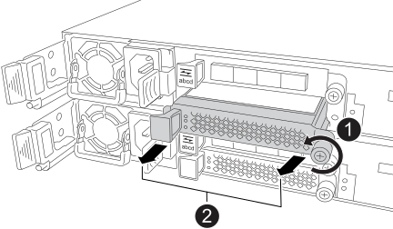

= 
:allow-uri-read: 

.Acerca de esta tarea
* Empiezas con un controlador y luego repites los pasos para el otro controlador.
* La ilustración muestra cómo extraer un módulo de E/S de la ranura 2. Dependiendo del tipo de módulo de E/S al que vayas a actualizar, la ranura puede ser diferente.

.Pasos
. Si usted no está ya conectado a tierra, correctamente tierra usted mismo.
. En uno de los controladores, desconecta el cableado del módulo de E/S que vas a retirar, a menos que sea un módulo ciego de E/S.
+
Puedes etiquetar los cables para saber de dónde vienen. Sin embargo, dependiendo del tipo de módulo de E/S al que estés actualizando, puede que no recables a los mismos puertos o que no puedas reutilizar los mismos cables.

. Quita el módulo de E/S o el módulo de supresión de E/S de la ranura de destino.
+
La siguiente ilustración muestra cómo se retira un módulo supresor de E/S.

+

+
[cols="1,4"]
|===

 a| 
image:../media/icon_round_1.png["Llamada número 1"]
 a| 
En el módulo de E/S o el módulo supresor de E/S, gira el tornillo de mariposa en sentido antihorario para aflojar.

 a| 
image:../media/icon_round_2.png["Llamada número 2"]
 a| 
Saca el módulo de E/S o el módulo ciego de E/S del controlador usando la lengüeta de la izquierda y el tornillo de mariposa.

|===
. Desempaqueta el nuevo módulo de E/S y colócalo sobre una superficie plana libre de estática cerca del sistema de almacenamiento.
. Instala el nuevo módulo de E/S:
+
.. Alinea el módulo de E/S con los bordes de la abertura de la ranura del controlador.
.. Empuja suavemente el módulo de E/S hasta el fondo de la ranura, asegurándote de asentar correctamente el módulo en el conector.
+
Puedes usar la lengüeta de la izquierda y el tornillo de mariposa para empujar el módulo de E/S.

.. Gira el tornillo en el sentido de las agujas del reloj para apretarlo.

. Conecta el módulo de E/S a la red del host o a la bandeja de expansión SAS.
+
** Para el cableado de la red del host, puedes usar la sección link:../install-hw-ef50-ef80/install-cable.html["Cablea el hardware"^] del contenido de instalación y configuración del sistema para el cableado de la red del host.
** Para el cableado de la bandeja de expansión SAS, puedes usar el procedimiento link:../install-hw-cabling/hotadd-drive-shelf-task.html["Incorpora en caliente una bandeja de discos en un sistema de almacenamiento E-Series"^].

. Repite estos pasos para actualizar un módulo de E/S en el otro controlador.

