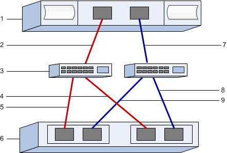

= Registre la configuración de FC
:allow-uri-read: 
:icons: font
:imagesdir: ../media/

[role="lead"]
Puede generar e imprimir un PDF de esta página y utilizar la siguiente hoja de datos para registrar la información de configuración del almacenamiento FC. Esta información es necesaria para ejecutar tareas de aprovisionamiento.

La ilustración muestra un host conectado a una cabina de almacenamiento E-Series en dos zonas. Una zona se indica mediante la línea azul; la otra se indica mediante la línea roja. Cualquier puerto tiene dos rutas al almacenamiento (de una a cada controladora).

== Identificadores de host

|===
| Número de llamada | Conexiones de puertos de host (iniciador) | WWPN 

 a| 
1
 a| 
Host
 a| 
_no aplicable_

 a| 
2
 a| 
Puerto de host 0 a zona 0 del switch FC
 a| 

 a| 
7
 a| 
Puerto de host 1 a zona 1 del switch FC
 a| 

|===

== Identificadores de destino

|===
| Número de llamada | Conexiones de puertos (objetivo) de la controladora de la cabina | WWPN 

 a| 
3
 a| 
Conmutador
 a| 
_no aplicable_

 a| 
6
 a| 
Controladora de cabina (objetivo)
 a| 
_no aplicable_

 a| 
5
 a| 
Controladora A, puerto 1 al switch FC 1
 a| 

 a| 
9
 a| 
Controladora A, puerto 2 al switch FC 2
 a| 

 a| 
4
 a| 
Controladora B, puerto 1 al switch FC 1
 a| 

 a| 
8
 a| 
Controladora B, puerto 2 al switch FC 2
 a| 

|===

== Host de asignación

|===

 a| 
Asignando el nombre de host
 a| 

 a| 
Tipo de SO de host
 a| 

|===