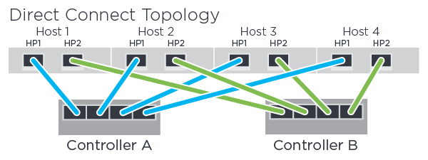

= Registre la configuración de NVMe over FC
:allow-uri-read: 
:icons: font
:imagesdir: ../media/

[role="lead"]
Puede generar e imprimir un PDF de esta página y utilizar la siguiente hoja de datos para registrar la información de configuración del almacenamiento NVMe over Fibre Channel. Esta información es necesaria para ejecutar tareas de aprovisionamiento.

== Topología de conexión directa

En una topología de conexión directa, uno o varios hosts están conectados directamente a la controladora.

* Host 1 Puerto HBA 1 y puerto de host de controladora A 1
* Host 1 Puerto HBA 2 y puerto de host de controladora B 1
* Host 2 Puerto de HBA 1 y puerto de host de controladora A 2
* Host 2 Puerto HBA 2 y puerto de host de controladora B 2
* Host 3 Puerto HBA 1 y puerto de host 3 de controladora A.
* Host 3 Puerto HBA 2 y puerto de host 3 de controladora B.
* Host 4 Puerto HBA 1 y puerto de host 4 de controladora A.
* Host 4 Puerto HBA 2 y puerto de host 4 de controladora B.

== Topología de la conexión del interruptor

En una topología de estructura, se utilizan uno o varios switches. Consulte https://mysupport.netapp.com/matrix["Herramienta de matriz de interoperabilidad de NetApp"^] si desea obtener una lista de switches compatibles.

image::../media/nvme_fc_fabric_topology.png[topología de la estructura nvme fc]

== Identificadores de host

Busque y documente el iniciador NQN de cada host.

|===
| Conexiones de puertos de host | NQN host 

 a| 
Host (iniciador) 1
 a| 

 a| 
Host (iniciador) 2
 a| 

|===

== NQN objetivo

Documente el NQN objetivo para la cabina de almacenamiento.

|===
| Nombre de cabina | NQN objetivo 

 a| 
Controladora de cabina (objetivo)
 a| 

|===

== NQN de destino

Documente los NQN que utilizarán los puertos de la matriz.

|===
| Conexiones de puertos (objetivo) de la controladora de la cabina | NQN 

 a| 
Controladora A, puerto 1
 a| 

 a| 
Controladora B, puerto 1
 a| 

 a| 
Controladora A, puerto 2
 a| 

 a| 
Controladora B, puerto 2
 a| 

|===

== Asignando el nombre de host

NOTE: El nombre del host de asignación se crea durante el flujo de trabajo.

|===

 a| 
Asignando el nombre de host
 a| 

 a| 
Tipo de SO de host
 a| 

|===