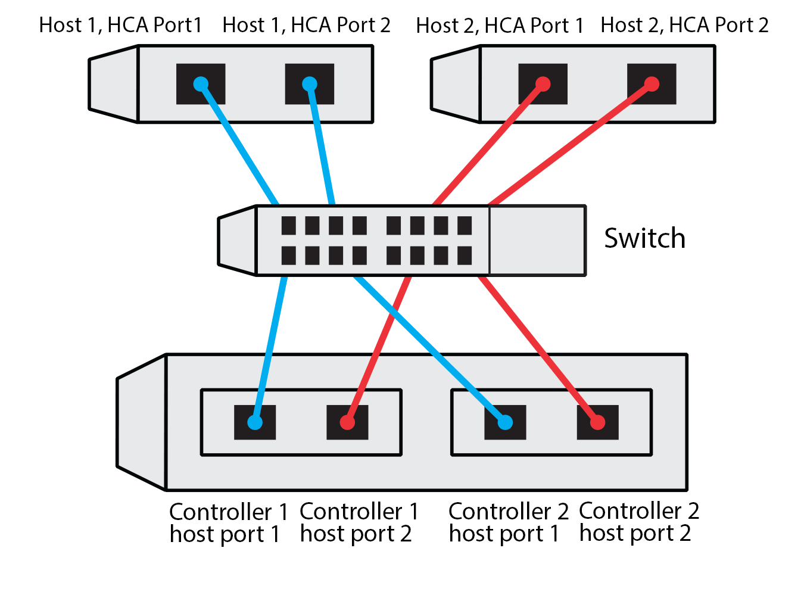

= Hoja de trabajo de configuración de NVMe sobre TCP para hosts Linux E-Series
:allow-uri-read: 
:icons: font
:imagesdir: ../media/

[role="lead"]
Puedes generar e imprimir un PDF de esta página y luego usar la siguiente hoja de trabajo para anotar la información de configuración del almacenamiento NVMe sobre TCP. Necesitas esta información para realizar tareas de aprovisionamiento.

[[direct-connect-topology]]
== Topología de conexión directa

En una topología de conexión directa, uno o más hosts están conectados directamente al subsistema. En la versión 11.50 del sistema operativo SANtricity, admitimos una única conexión desde cada host a un controlador del subsistema, como se muestra a continuación. En esta configuración, un puerto de la tarjeta de interfaz de red (NIC) de cada host debe estar en la misma subred que el puerto del controlador E-Series al que está conectado, pero en una subred diferente a la del otro puerto de la NIC.

image::../media/nvmeof_direct_connect.gif[Ejemplo de conexión directa NVMe sobre TCP]

Una configuración de ejemplo que satisface los requisitos consta de cuatro subredes de red como se indica a continuación:

* Subred 1: Host 1 NIC puerto 1 y controlador 1 puerto de host 1
* Subred 2: puerto 2 de la tarjeta de interfaz de red del Host 1 y puerto 1 del Host del controlador 2
* Subred 3: Host 2 NIC Port 1 y Controller 1 Host port 2
* Subred 4: puerto 2 de la tarjeta de red del host 2 y puerto 2 del host del controlador 2

[[switch-connect-topology]]
== Topología de la conexión del interruptor

En una topología de estructura, se utilizan uno o varios switches. Consulte https://mysupport.netapp.com/matrix["Herramienta de matriz de interoperabilidad de NetApp"^] si desea obtener una lista de switches compatibles.

[[host-identifiers]]
== Identificadores de host

Busque y documente el iniciador NQN de cada host.

|===
| Conexiones de puertos de host | NQN del iniciador de software 

 a| 
Host (iniciador) 1
 a| 
{nbsp}

 a| 
{nbsp}
 a| 
{nbsp}

 a| 
Host (iniciador) 2
 a| 
{nbsp}

 a| 
{nbsp}
 a| 
{nbsp}

 a| 
{nbsp}
 a| 
{nbsp}

|===

[[target-nqn]]
== NQN objetivo

Documente el NQN objetivo para la cabina de almacenamiento.

|===
| Nombre de cabina | NQN objetivo 

 a| 
Controladora de cabina (objetivo)
 a| 

|===

[[target-nqns]]
== NQN de destino

Documente los NQN que utilizarán los puertos de la matriz.

|===
| Conexiones de puertos (objetivo) de la controladora de la cabina | NQN 

 a| 
Controladora A, puerto 1
 a| 

 a| 
Controladora B, puerto 1
 a| 

 a| 
Controladora A, puerto 2
 a| 

 a| 
Controladora B, puerto 2
 a| 

|===

[[mapping-host-name]]
== Asignando el nombre de host

NOTE: El nombre del host de asignación se crea durante el flujo de trabajo.

|===

 a| 
Asignando el nombre de host
 a| 

 a| 
Tipo de SO de host
 a| 

|===