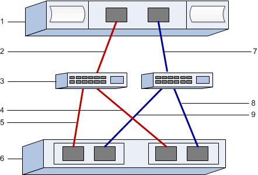

= Configura los switches FC e identificadores de host para VMware en E-Series
:allow-uri-read: 
:icons: font
:imagesdir: ../media/

[role="lead"]
Para el protocolo Fibre Channel (FCP), configuras los switches y determinas los identificadores de puerto de los hosts.

NOTE: Los volúmenes deben configurarse para utilizar la emulación de 512 bytes (512e) cuando se utilicen unidades de 4096 bytes para garantizar la compatibilidad con VMware. Consulta la ayuda en línea de SANtricity System Manager para obtener más información sobre cómo configurar un volumen para que utilice la emulación de 512 bytes (512e).

[[step-1-record-your-configuration]]
== Paso 1: registra tu configuración

Puedes generar e imprimir un PDF de esta página y luego usar la siguiente hoja de trabajo para registrar la información de configuración del almacenamiento FC. Necesitas esta información mientras realizas tareas de aprovisionamiento.

La ilustración muestra un host conectado a un almacenamiento E-Series en dos zonas. Una zona se indica con líneas rojas; la otra zona se indica con líneas azules. Cada zona contiene al menos un puerto iniciador y la mitad de todos los puertos de destino. El número de puertos de host y/o de controlador variará según la cantidad de adaptadores de bus de host y el modelo de controlador. Puedes tener más puertos disponibles (hasta 12 por controlador). Imprime archivos PDF adicionales según lo necesites.

[[host-identifiers]]
=== Identificadores de host

|===
| Número de llamada | Conexiones de puertos de host (iniciador) | WWPN 

 a| 
1
 a| 
Host
 a| 
_no aplicable_

 a| 
2
 a| 
Puerto de host 0 a zona 0 del switch FC
 a| 

 a| 
7
 a| 
Puerto de host 1 a zona 1 del switch FC
 a| 

|===

[[target-identifiers]]
=== Identificadores de destino

|===
| Número de llamada | Conexiones de puertos (objetivo) de la controladora de la cabina | WWPN 

 a| 
3
 a| 
Conmutador
 a| 
_no aplicable_

 a| 
6
 a| 
Controladora de cabina (objetivo)
 a| 
_no aplicable_

 a| 
5
 a| 
Controladora A, puerto 1 al switch FC 1
 a| 

 a| 
5
 a| 
Controlador A, puerto 2 al switch FC 1
 a| 

 a| 
9
 a| 
Controlador A, puerto 3 al switch FC 2
 a| 

 a| 
9
 a| 
Controlador A, puerto 4 al switch FC 2
 a| 

 a| 
4
 a| 
Controladora B, puerto 1 al switch FC 1
 a| 

 a| 
4
 a| 
Controlador B, puerto 2 al switch FC 1
 a| 

 a| 
8
 a| 
Controlador B, puerto 3 al switch FC 2
 a| 

 a| 
8
 a| 
Controlador B, puerto 4 al switch FC 2
 a| 

|===

[[host-mapping-information]]
=== Información de asignación de hosts

[cols="35h,~"]
|===
| Asignando el nombre de host |  

| Tipo de SO de host |  
|===

[[step-2-determine-the-host-port-wwpns]]
== Paso 2: determina los WWPN de los puertos del host

Para configurar la división en zonas de FC, debe determinar el nombre de puerto WWPN de cada puerto iniciador.

.Pasos
. Conéctate al host ESXi mediante SSH o el shell de ESXi. Para habilitar el shell de ESXi, consulta https://knowledge.broadcom.com/external/article/311213/using-esxi-shell-in-esxi.html["Uso de ESXi Shell en ESXi"^].
. Ejecute el siguiente comando:
+
[listing]
----
esxcli storage core adapter list
----
. Anota los identificadores WWPN del iniciador (UID en el formato - fc.WWNN:WWPN). El resultado será similar a este ejemplo:
+
[listing]
----
HBA Name  Driver    Link State  UID                                   Capabilities         Description
--------  --------  ----------  ------------------------------------  -------------------  -----------
vmhba4    lpfc      link-up     fc.200070b7e4395530:100070b7e4395530  Second Level Lun ID  (0000:5e:00.0) Emulex Corporation Emulex LPe35000/LPe36000 Fibre Channel Adapter
vmhba5    lpfc      link-up     fc.200070b7e4395531:100070b7e4395531  Second Level Lun ID  (0000:5e:00.1) Emulex Corporation Emulex LPe35000/LPe36000 Fibre Channel Adapter
vmhba64   lpfc      link-up     fc.200070b7e4395530:100070b7e4395530                       (0000:5e:00.0) Emulex Corporation Emulex LPe35000/LPe36000 Fibre Channel Adapter
vmhba65   lpfc      link-up     fc.200070b7e4395531:100070b7e4395531                       (0000:5e:00.1) Emulex Corporation Emulex LPe35000/LPe36000 Fibre Channel Adapter

----

En el ejemplo anterior, el UID de vmhba4 y vmhba64, así como el de vmhba5 y vmhba65, es idéntico. Esto es lo esperado para los adaptadores FC que admiten tanto FCP como NVMe sobre FC. Anota cada WWPN único.

NOTE: Otra opción del comando es  `esxcli storage san fc list`. Esto mostrará más detalles y el WWPN en formato hexadecimal separado por dos puntos.

[[step-3-configure-the-fc-switches]]
== Paso 3: configura los conmutadores FC

Configurar (dividir en zonas) los switches de Fibre Channel (FC) permite que los hosts se conecten a la cabina de almacenamiento y limita el número de rutas. Debe dividir los switches de mediante la interfaz de gestión de los switches de en zonas.

.Antes de empezar
Asegúrese de tener lo siguiente:

* Credenciales de administrador para los switches.
* La WWPN de cada puerto iniciador del host y de cada puerto objetivo del controlador conectado al conmutador.

NOTE: La utilidad HBA de un proveedor se puede utilizar para actualizar y obtener información específica acerca del HBA. Consulte la sección de soporte del sitio web del proveedor para obtener instrucciones sobre cómo obtener la utilidad HBA.

.Acerca de esta tarea
Cada puerto del iniciador debe estar en una zona separada con todos sus puertos de destino correspondientes. Para obtener detalles acerca de la división en zonas de los switches, consulte la documentación del proveedor del switch.

.Pasos
. Inicie sesión en el programa de administración del switch FC y, a continuación, seleccione la opción de configuración de división en zonas.
. Cree una nueva zona que incluya el primer puerto iniciador de host y que también incluya todos los puertos de destino que se conectan al mismo switch de FC que el iniciador.
. Cree zonas adicionales para cada puerto iniciador de host FC del switch.
. Guarde las zonas y, a continuación, active la nueva configuración de particiones.

Consulta la documentación del fabricante del conmutador para obtener instrucciones detalladas sobre cómo configurar las zonas.
