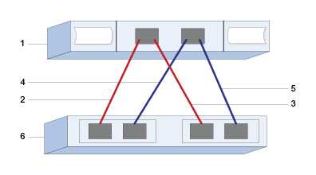

= Configura los puertos del host SAS y la configuración para VMware en E-Series
:allow-uri-read: 
:icons: font
:imagesdir: ../media/

[role="lead"]
Para el protocolo SAS, se determinan las direcciones de puerto de host y se realiza la configuración recomendada.

[[step-1-record-your-configuration]]
== Paso 1: registra tu configuración

Puedes generar e imprimir un PDF de esta página y luego usar la siguiente hoja de trabajo para anotar la información de configuración de almacenamiento específica de tu protocolo. Necesitas esta información mientras realizas tareas de aprovisionamiento.

La ilustración muestra un host conectado directamente a una matriz de almacenamiento E-Series con conexiones redundantes (suponiendo un HBA SAS de 4 puertos). La primera conexión redundante se indica con las líneas rojas; la segunda conexión redundante se indica con las líneas azules. El número de puertos depende del número de puertos del host. Puede que solo tengas 2 puertos de host. En este caso, se recomienda al menos la primera conexión redundante.

[[host-identifiers]]
=== Identificadores de host

|===
| Número de llamada | Conexiones de puertos de host (iniciador) | Dirección SAS 

 a| 
1
 a| 
Host
 a| 
_no aplicable_

 a| 
2
 a| 
Puerto de host (iniciador) 1 conectado a la controladora A, puerto 1
 a| 

 a| 
3
 a| 
Puerto de host (iniciador) 2 conectado a la controladora B, puerto 1
 a| 

 a| 
4
 a| 
Puerto 3 del host (iniciador) conectado al puerto 1 del controlador A
 a| 

 a| 
5
 a| 
Puerto 4 del host (iniciador) conectado al puerto 1 del controlador B
 a| 

|===

[[host-mapping-information]]
=== Información de asignación de hosts

[cols="35h,~"]
|===
| Asignando el nombre de host |  

| Tipo de SO de host |  
|===

[[step-2-determine-sas-host-identifiers]]
== Paso 2: Determina los identificadores de host SAS

Busca las direcciones SAS mediante esxcli o la utilidad HBA.

.Acerca de esta tarea
Consulte las directrices para las utilidades de HBA:

* La mayoría de los proveedores de HBA ofrecen una utilidad de HBA.

.Pasos
. Conéctate al host ESXi mediante SSH o el shell de ESXi. Para habilitar el shell de ESXi, consulta https://knowledge.broadcom.com/external/article/311213/using-esxi-shell-in-esxi.html["Uso de ESXi Shell en ESXi"^].
. Ejecute el siguiente comando:
+
[listing]
----
esxcli storage core adapter list
----
. Anota el identificador de la dirección SAS del iniciador (UID en el formato - sas.<SAS_Address>). El resultado será similar a este ejemplo:
+
[listing]
----
HBA Name  Driver       Link State  UID                   Capabilities         Description
--------  ----------   ----------  --------------------  -------------------  -----------
vmhba1    lsi_msgpt35  link-n/a    sas.5b083fe0ca0e7000                       (0000:03:00.0) Avago (LSI Logic) SAS3008 12Gbps SAS HBA external
----

En el ejemplo anterior, el UID solo mostrará la dirección SAS base. Para los otros puertos, los primeros 14 caracteres permanecen constantes y solo los dos últimos caracteres varían para representar diferentes puertos. Normalmente, el último dígito simplemente aumenta en 1 por cada puerto. Tener la dirección SAS base suele ser suficiente para identificar el adaptador de host durante la asignación de hosts, ya que la matriz E-Series detectará automáticamente y mostrará las otras direcciones SAS de los puertos para que puedas seleccionarlas. Usar una utilidad HBA del fabricante puede ayudarte a obtener la dirección SAS de cada puerto.

NOTE: Otra opción del comando es  `esxcli storage san sas list`. Esto mostrará más detalles y la dirección base de SAS en formato hexadecimal, separados por dos puntos.
