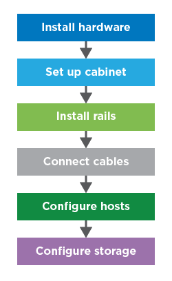

= Póngase en marcha con E-Series
:allow-uri-read: 
:icons: font
:imagesdir: ../media/

[role="lead"]
Para empezar a trabajar con sistemas E-Series, instala componentes de hardware, configura sistemas host y configura almacenamiento.

La implementación de la cabina de almacenamiento implica el siguiente flujo de trabajo:

== Paso 1: Instale el hardware

Para instalar el hardware E-Series, acceda a las instrucciones de instalación y configuración correspondientes al tipo de cabina de almacenamiento y bandeja:

* link:../install-hw-ef600/index.html["Serie EF600 o EF300 con bandeja de 24 unidades"^]
* https://library.netapp.com/ecm/ecm_download_file/ECMLP2842063["Serie E2800/EF280 o E5700/EF570 con bandejas de 12 o 24 unidades"^]
* https://library.netapp.com/ecm/ecm_download_file/ECMLP2842061["Serie E2800 o E5700 con bandeja de 60 unidades"^]

== Paso 2: Configure el armario

Si va a configurar un nuevo armario para la cabina de almacenamiento, debe mover el armario a su ubicación permanente, instalar el hardware y conectarlo a una fuente de alimentación. Para configurar el armario, acceda a las siguientes instrucciones:

* link:../install-hw-cabinet/index.html["Instale armarios 40U 3040"^]

== Paso 3: Instalar los rieles

Cuando se suministran, cada bandeja incluye hardware para montaje en rack. Para obtener instrucciones detalladas sobre la instalación de los rieles, seleccione sus tipos de rieles:

* https://mysupport.netapp.com/ecm/ecm_download_file/ECMP1652045["Instalar rieles de soporte ajustables"^]
* https://mysupport.netapp.com/ecm/ecm_download_file/ECMLP2484194["Instale un compartimento 2U en un rack de cuatro parantes"^]
* https://mysupport.netapp.com/ecm/ecm_download_file/ECMM1280302["Instale la bandeja DE224C en un rack de dos parantes"^]
* http://docs.netapp.com/platstor/topic/com.netapp.doc.hw-rail-superrail/home.html["Instalar SuperRail en un rack de cuatro puestos (bandejas DE224C/DE460C)"^]

== Paso 4: Conectar los cables

Las instrucciones de instalación y configuración (paso 1) incluyen instrucciones para conectar cables. Sin embargo, si necesita listas de cables y transceptores compatibles, prácticas recomendadas para cableado e información detallada sobre los puertos de host para la controladora, acceda a las siguientes instrucciones:

* link:../install-hw-cabling/index.html["Conecte el cable del hardware de E-Series"]

== Paso 5: Configure los hosts

Para que el almacenamiento esté disponible para un host, seleccione una guía para el tipo de sistema operativo del host:

* link:../config-linux/index.html["Configuración exprés de Linux"]
* link:../config-vmware/index.html["Configuración exprés de VMware"]
* link:../config-windows/index.html["Configuración exprés de Windows"]

== Paso 6: Configure el almacenamiento

Para configurar el almacenamiento, puede acceder a la interfaz web, System Manager, apuntando al explorador a la dirección IP de la controladora. Un asistente de configuración le ayuda a comenzar con la configuración del sistema. Como alternativa, también puede usar la interfaz de línea de comandos (CLI).

Seleccione la interfaz que desea utilizar:

* https://docs.netapp.com/us-en/e-series-santricity/system-manager/index.html["Ayuda del administrador del sistema de SANtricity para 11.7x"]
* https://docs.netapp.com/us-en/e-series-santricity-116/index.html["Ayuda de administrador del sistema de SANtricity para 11.6x"]

