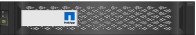

= Información general del hardware de E-Series
:allow-uri-read: 
:icons: font
:imagesdir: ../media/

[role="lead"]
Las cabinas de almacenamiento E-Series están disponibles en varias configuraciones y modelos.

Una cabina de almacenamiento comprende bandejas, controladoras, unidades, software y firmware. La cabina se puede instalar en un rack o armario, con hardware personalizable para una o dos controladoras, en una bandeja de 12, 24 o 60 unidades. Es posible conectar la cabina de almacenamiento a UNA SAN desde varios tipos de interfaz y a diversos sistemas operativos del host.

Las cabinas E-Series están disponibles en los siguientes modelos:

* Serie E2800: Híbrido de gama básica
* Serie EF280: All Flash de gama básica
* Serie EF300 -- All-NVMe, all-flash de gama básica
* Serie E5700: Híbrido de gama media
* Serie EF570: All-flash de rango medio
* Serie EF600: All-flash de rango medio, todo NVMe

== Modelos E2800

[cols="35h,~"]
|===
| Componente | Especificación 

 a| 
Tamaños de rack:
 a| 
* 2U12 (2 unidades de rack; 12 unidades)
* 2U24 (2 unidades de rack; 24 unidades)
+

* 4U60 (4 unidades rack; 60 unidades)
+
image::../media/e2860_front.gif[e2860 frontal]

 a| 
Unidades:
 a| 
Admite los siguientes tipos de unidad:

* NL-SAS de 3.5" (hasta 180)
* SSD SAS de 2.5" (hasta 120)
* HDD SAS de 2.5" (hasta 180)

 a| 
Interfaces:
 a| 
Disponible con las siguientes interfaces:

* SAS de 12 GB
* ISCSI de 10 GB o 25 GB
* Fibre Channel de 16 GB o 32 GB

|===

== Modelos EF280

[cols="35h,~"]
|===
| Componente | Especificación 

 a| 
Tamaños de rack:
 a| 
2U24 (2 unidades de rack; 24 unidades)image:../media/ef570_front.gif[""]

 a| 
Unidades:
 a| 
Admite hasta 96 unidades SSD de 2.5"

 a| 
Interfaces:
 a| 
Disponible con las siguientes interfaces:

* SAS de 12 GB
* ISCSI de 10 GB o 25 GB
* Fibre Channel de 16 GB o 32 GB

|===

== Modelos EF300

[cols="35h,~"]
|===
| Componente | Especificación 

 a| 
Tamaños de rack:
 a| 
2U24 (2 unidades de rack; 24 unidades)image:../media/ef570_front.gif[""]

 a| 
Unidades y HIC:
 a| 
Admite las siguientes unidades con una sola tarjeta de interfaz del host (HIC) por controladora:

* Unidades SSD de NVMe: Hasta 24 unidades SSD NVMe en la bandeja de controladoras.
* Unidades NL-SAS con bandejas de expansión: Cualquier combinación de bandejas DE460C y DE212C no debe superar un total de 240 ranuras de unidades NL-SAS y 4 bandejas de expansión a menos que solo se utilicen bandejas DE212C, se permiten las 8 bandejas DE212C. Por ejemplo, 4 bandejas DE460C, 8 bandejas DE212C, o 2 bandejas DE460C más 2 bandejas DE212.
* Unidades SSD SAS con bandejas de expansión: Cualquier combinación de bandejas DE212C, DE224C y DE460C no debe superar un total de 96 ranuras de unidad SSD SAS y 4 bandejas de expansión a menos que solo se utilicen bandejas DE212C, se permiten 8 bandejas. Por ejemplo, 1 bandeja DE460C más 1 bandeja DE224C más 1 bandeja DE212C, o 4 bandejas DE224C, o 8 bandejas DE212C.

 a| 
Interfaces:
 a| 
Disponible con las siguientes interfaces:

* ISCSI de 25 GB
* 32 GB NVMe/Fibre Channel
* 32 GB SCSI/Fibre Channel
* Iser/IB de 100 GB
* SRP / IB de 100 GB
* 100 GB NVMe/IB
* NVMe/roce de 100 GB

|===

== Modelos E5700

[cols="35h,~"]
|===
| Componente | Especificación 

 a| 
Tamaños de rack:
 a| 
* 2U24 (2 unidades de rack; 24 unidades)
+

* 4U60 (4 unidades rack; 60 unidades)
+
image::../media/e2860_front.gif[e2860 frontal]

 a| 
Unidades:
 a| 
Admite hasta 480 de los siguientes tipos de unidad:

* Unidades NL-SAS de 3.5 pulgadas
* Unidades SSD SAS de 2.5"
* Unidades HDD SAS de 2.5"

 a| 
Interfaces:
 a| 
Disponible con las siguientes interfaces:

* SAS de 12 GB
* ISCSI de 10 GB o 25 GB
* Fibre Channel de 16 GB o 32 GB
* 32 GB NVMe/Fibre Channel
* Iser/IB de 100 GB
* SRP / IB de 100 GB
* 100 GB NVMe/IB
* NVMe/roce de 100 GB

|===

== Modelos de EF570

[cols="35h,~"]
|===
| Componente | Especificación 

 a| 
Tamaños de rack:
 a| 
2U24 (2 unidades de rack; 24 unidades)image:../media/ef570_front.gif[""]

 a| 
Unidades:
 a| 
Admite hasta 120 unidades SSD de 2.5"

 a| 
Interfaces:
 a| 
Disponible con las siguientes interfaces:

* SAS de 12 GB
* ISCSI de 10 GB o 25 GB
* Fibre Channel de 16 GB o 32 GB
* 32 GB NVMe/Fibre Channel
* Iser/IB de 100 GB
* SRP / IB de 100 GB
* 100 GB NVMe/IB
* NVMe/roce de 100 GB

|===

== Modelos EF600

[cols="35h,~"]
|===
| Componente | Especificación 

 a| 
Tamaños de rack:
 a| 
2U24 (2 unidades de rack; 24 unidades)image:../media/ef570_front.gif[""]

 a| 
Unidades y HIC:
 a| 
Admite las siguientes unidades con una sola tarjeta de interfaz del host (HIC) por controladora:

* Unidades SSD de NVMe: Hasta 24 unidades SSD NVMe en la bandeja de controladoras.
* Unidades NL-SAS con bandejas de expansión: Cualquier combinación de bandejas DE460C y DE212C no debe superar un total de 420 ranuras de unidades NL-SAS y 7 bandejas de expansión a menos que solo se utilicen bandejas DE212C, se permiten las 8 bandejas DE212C. Por ejemplo, 7 bandejas DE460C o 8 bandejas DE212C, o 5 bandejas DE460C más 2 bandejas DE212.
* Unidades SSD SAS con bandejas de expansión: Cualquier combinación de bandejas DE212C, DE224C y DE460C no debe superar un total de 96 ranuras de unidad SSD SAS y 7 bandejas de expansión a menos que solo se utilicen bandejas DE212C, se permiten 8 bandejas. Por ejemplo, 1 bandeja DE460C más 1 bandeja DE224C más 1 bandeja DE212C, o 4 bandejas DE224C, o 8 bandejas DE212C.

 a| 
Interfaces:
 a| 
Disponible con las siguientes interfaces:

* ISCSI de 25 GB
* 32 GB NVMe/Fibre Channel
* 32 GB SCSI/Fibre Channel
* Iser/IB de 100 GB
* SRP / IB de 100 GB
* 100 GB NVMe/IB
* NVMe/roce de 100 GB
* Iser / IB de 200 GB
* 200 GB NVMe/IB
* NVMe/roce de 200 GB

|===