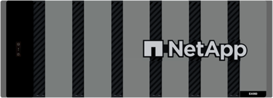

= Obtenga más información sobre el hardware E-Series
:allow-uri-read: 
:icons: font
:imagesdir: ../media/

[role="lead"]
Las cabinas de almacenamiento E-Series están disponibles en varias configuraciones y modelos.

Una cabina de almacenamiento comprende bandejas, controladoras, unidades, software y firmware. La cabina se puede instalar en un rack o armario, con hardware personalizable para una o dos controladoras, en una bandeja de 12, 24 o 60 unidades. Es posible conectar la cabina de almacenamiento a UNA SAN desde varios tipos de interfaz y a diversos sistemas operativos del host.

Las cabinas E-Series están disponibles en los siguientes modelos:

* Serie E2800: Híbrido de gama básica
* Serie EF280: All Flash de gama básica
* Serie EF300 -- All-NVMe, all-flash de gama básica
* Serie E4000: Híbrido de gama básica
* Serie E5700: Híbrido de gama media
* Serie EF570: All-flash de rango medio
* Serie EF600: All-flash de rango medio, todo NVMe
* Serie EF300C -- All-NVMe, all-flash de gama básica
* Serie EF600C: All-flash de rango medio, todo NVMe

NOTE: Para SANtricity OS 11,80GA y versiones posteriores, todos los puertos USB están deshabilitados en las cabinas E2800, EF280, E5700, EF570, EF600/EF600C y EF300/EF300C.

[role="tabbed-block"]
====
.Modelos E2800
--
Tamaños de rack::
+
--
* 2U12 (2 unidades de rack; 12 unidades)
* 2U24 (2 unidades de rack; 24 unidades)
+
image::../media/e2800_2u_front.gif[E2800 2U]

* 4U60 (4 unidades rack; 60 unidades)
+
image::../media/e2860_front.gif[«E2800 4U»]

--
Unidades::
+
--
Admite los siguientes tipos de unidad:

* NL-SAS de 3.5" (hasta 180)
* SSD SAS de 2.5" (hasta 120)
* HDD SAS de 2.5" (hasta 180)

--
Interfaces::
+
--
Disponible con las siguientes interfaces:

* SAS de 12 GB
* ISCSI de 10 GB o 25 GB
* Fibre Channel de 16 GB o 32 GB

--

--
.Modelos EF280
--
Tamaños de rack::
+
--
2U24 (2 unidades de rack; 24 unidades)

image:../media/ef570_front.gif["EF280 2U"]

--
Unidades::
+
--
Admite hasta 96 unidades SSD de 2.5"

--
Interfaces::
+
--
Disponible con las siguientes interfaces:

* SAS de 12 GB
* ISCSI de 10 GB o 25 GB
* Fibre Channel de 16 GB o 32 GB

--

--
.Modelos EF300
--
Tamaños de rack::
+
--
2U24 (2 unidades de rack; 24 unidades)

image:../media/ef570_front.gif["EF300 2U"]

--
Unidades::
+
--
* Unidades SSD de NVMe: Hasta 24 unidades SSD NVMe en la bandeja de controladoras.
* Unidades NL-SAS con bandejas de expansión: Cualquier combinación de bandejas DE460C y DE212C no debe superar un total de 240 ranuras de unidades NL-SAS y 4 bandejas de expansión a menos que solo se utilicen bandejas DE212C, se permiten las 8 bandejas DE212C. Por ejemplo, 4 bandejas DE460C, 8 bandejas DE212C, o 2 bandejas DE460C más 2 bandejas DE212.
* Unidades SSD SAS con bandejas de expansión: Cualquier combinación de bandejas DE212C, DE224C y DE460C no debe superar un total de 96 ranuras de unidad SSD SAS y 4 bandejas de expansión a menos que solo se utilicen bandejas DE212C, se permiten 8 bandejas. Por ejemplo, 1 bandeja DE460C más 1 bandeja DE224C más 1 bandeja DE212C, o 4 bandejas DE224C, o 8 bandejas DE212C.
* Compatibilidad con una tarjeta de ampliación SAS opcional, que permite conexiones de bandeja de ampliación SAS.
* Compatibilidad con una tarjeta de interfaz del host por controladora.

NOTE: Para el sistema operativo SANtricity 11,80GA y posteriores, EF300 admite configuraciones de bandeja de expansión sin unidades en el soporte base Cuando se utiliza esta configuración, asegúrese de que las unidades estén llenas dentro de la bandeja de expansión y conectadas correctamente a la bandeja base antes de encender el sistema.

--
Interfaces::
+
--
Disponible con las siguientes interfaces:

* ISCSI de 25 GB
* 32 GB NVMe/Fibre Channel
* 32 GB SCSI/Fibre Channel
* Iser/IB de 100 GB
* SRP / IB de 100 GB
* 100 GB NVMe/IB
* NVMe/roce de 100 GB

--

--
.Modelos de EF300C
--
Tamaños de rack::
+
--
2U24 (2 unidades de rack; 24 unidades)

image:../media/ef570_front.gif["EF300 2U"]

--
Unidades::
+
--
* Admite unidades SSD NVMe de 30TB TB o 60TB TB de capacidad.
+
** Compatible para uso exclusivo de pools de discos dinámicos sin compatibilidad con RAID heredada.

* Unidades SSD de NVMe: Hasta 24 unidades SSD NVMe en la bandeja de controladoras.
+
** No admite las configuraciones de bandeja de ampliación.

* Compatibilidad con una tarjeta de interfaz del host por controladora.
* Un único pool de discos se crea automáticamente si no hay suficientes unidades sin asignar durante el arranque del sistema.

--
Interfaces::
+
--
Disponible con las siguientes interfaces:

* ISCSI de 25 GB
* 32 GB NVMe/Fibre Channel
* 32 GB SCSI/Fibre Channel
* Iser/IB de 100 GB
* SRP / IB de 100 GB
* 100 GB NVMe/IB
* NVMe/roce de 100 GB

--

--
.Modelos E5700
--
Tamaños de rack::
+
--
* 2U24 (2 unidades de rack; 24 unidades)
+
image::../media/e2800_2u_front.gif[E5700 2U]

* 4U60 (4 unidades rack; 60 unidades)
+
image::../media/e2860_front.gif[E5700 4U]

--
Unidades::
+
--
Admite hasta 480 de los siguientes tipos de unidad:

* Unidades NL-SAS de 3.5 pulgadas
* Unidades SSD SAS de 2.5"
* Unidades HDD SAS de 2.5"

--
Interfaces::
+
--
Disponible con las siguientes interfaces:

* SAS de 12 GB
* ISCSI de 10 GB o 25 GB
* Fibre Channel de 16 GB o 32 GB
* 32 GB NVMe/Fibre Channel
* Iser/IB de 100 GB
* SRP / IB de 100 GB
* 100 GB NVMe/IB
* NVMe/roce de 100 GB

--

--
.Modelos de EF570
--
Tamaños de rack::
+
--
2U24 (2 unidades de rack; 24 unidades)

image:../media/ef570_front.gif["EF570 2U"]

--
Unidades::
+
--
Admite hasta 120 unidades SSD de 2.5"

--
Interfaces::
+
--
Disponible con las siguientes interfaces:

* SAS de 12 GB
* ISCSI de 10 GB o 25 GB
* Fibre Channel de 16 GB o 32 GB
* 32 GB NVMe/Fibre Channel
* Iser/IB de 100 GB
* SRP / IB de 100 GB
* 100 GB NVMe/IB
* NVMe/roce de 100 GB

--

--
.Modelos EF600
--
Tamaños de rack::
+
--
2U24 (2 unidades de rack; 24 unidades)

image:../media/ef570_front.gif["EF600 2U"]

--
Unidades::
+
--
* Unidades SSD de NVMe: Hasta 24 unidades SSD NVMe en la bandeja de controladoras.
* Unidades NL-SAS con bandejas de expansión: Cualquier combinación de bandejas DE460C y DE212C no debe superar un total de 420 ranuras de unidades NL-SAS y 7 bandejas de expansión a menos que solo se utilicen bandejas DE212C, se permiten las 8 bandejas DE212C. Por ejemplo, 7 bandejas DE460C o 8 bandejas DE212C, o 5 bandejas DE460C más 2 bandejas DE212.
* Unidades SSD SAS con bandejas de ampliación: Cualquier combinación de bandejas DE212C, DE224C y DE460C no debe superar un total de 96 ranuras de unidades SSD SAS y 7 bandejas de expansión, a menos que solo se utilicen DE212C bandejas y se permiten 8 DE212C bandejas. Por ejemplo, 1 bandeja DE460C más 1 bandeja DE224C más 1 bandeja DE212C, o 4 bandejas DE224C, o 8 bandejas DE212C.
* Compatibilidad con dos tarjetas de interfaz del host por controladora.
+
** Como alternativa, admite una tarjeta de interfaz de host IB de 200GB Gb por controladora.

* Compatibilidad con una tarjeta de ampliación SAS opcional, que permite conexiones de bandeja de ampliación SAS.
+
** La ampliación SAS solo se admite en configuraciones con una tarjeta de interfaz del host por controladora.

NOTE: Para el sistema operativo SANtricity 11,80GA y posteriores, EF600 admite configuraciones de bandeja de expansión sin unidades en el soporte base Cuando se utiliza esta configuración, asegúrese de que las unidades estén llenas dentro de la bandeja de expansión y conectadas correctamente a la bandeja base antes de encender el sistema.

--
Interfaces::
+
--
Disponible con las siguientes interfaces:

* ISCSI de 25 GB
* 32 GB NVMe/Fibre Channel
* 32 GB SCSI/Fibre Channel
* Iser/IB de 100 GB
* SRP / IB de 100 GB
* 100 GB NVMe/IB
* NVMe/roce de 100 GB
* Iser / IB de 200 GB
* 200 GB NVMe/IB
* NVMe/roce de 200 GB

--

--
.Modelos de EF600C
--
Tamaños de rack::
+
--
2U24 (2 unidades de rack; 24 unidades)

image:../media/ef570_front.gif["EF600 2U"]

--
Unidades::
+
--
* Admite unidades SSD NVMe de 30TB TB o 60TB TB de capacidad.
+
** Compatible para uso exclusivo de pools de discos dinámicos sin compatibilidad con RAID heredada.

* Unidades SSD de NVMe: Hasta 24 unidades SSD NVMe en la bandeja de controladoras.
* Compatibilidad con dos tarjetas de interfaz del host por controladora.
+
** Como alternativa, admite una tarjeta de interfaz de host IB de 200GB Gb por controladora.
** No admite las configuraciones de bandeja de ampliación.

* Un único pool de discos se crea automáticamente si no hay suficientes unidades sin asignar durante el arranque del sistema.

--
Interfaces::
+
--
Disponible con las siguientes interfaces:

* ISCSI de 25 GB
* 32 GB NVMe/Fibre Channel
* 32 GB SCSI/Fibre Channel
* Iser/IB de 100 GB
* SRP / IB de 100 GB
* 100 GB NVMe/IB
* NVMe/roce de 100 GB
* Iser / IB de 200 GB
* 200 GB NVMe/IB
* NVMe/roce de 200 GB

--

--
.Modelos de E4000
--
Tamaños de rack::
+
--
* 2U12 (2 unidades de rack; 12 unidades)
+
image::../media/e4000_2u_front.png[E4000 2U]

* 4U60 (4 unidades rack; 60 unidades)
+

--
Unidades::
+
--
Admite los siguientes tipos de unidad:

* NL-SAS de 3.5" (hasta 300)
* SSD SAS de 2.5" (hasta 120)

--
Interfaces::
+
--
Disponible con las siguientes interfaces:

* SAS de 12 GB
* 1 GB o 10GBASE-T iSCSI
* ISCSI de 1GB, 10Gb o 25GB Gb
* 8GB GbE, 16GB GbE o 32GB Gb FC
* 12gb SAS

--

--
====