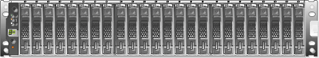

= Tipos de bandeja E-Series
:allow-uri-read: 
:icons: font
:imagesdir: ../media/

[role="lead"]
Los sistemas E-Series están disponibles en diferentes tamaños de bandeja.

|===
| Tipo de bandeja | Ilustración 

 a| 
*DE212C:*

* 2u12 (2 unidades rack; 12 unidades)
* HDD de 3.5" y/o SSD de 2.5" (con adaptador)
* Solo controladoras E4000 y E2800

 a| 
image:../media/e2812_front.gif["DE212C"]

 a| 
*DE224C:*

* 2u24 (2 unidades rack; 24 unidades)
* Unidades HDD de 2.5" o SSD de 2.5"
* Controladoras E2800, EF280, E5700 y EF570

 a| 

 a| 
*DE460C:*

* 4u60 (4 unidades rack; 60 unidades)
* Unidades de 3.5 y 2.5 pulgadas (NL-SAS, SAS y SSD)
* Controladoras E4000, E2800 y E5700

 a| 
image:../media/de460c.gif["DE460C"]

 a| 
*NE224:*

* 2u24 (2 unidades rack; 24 unidades)
* Unidades SSD NVMe de 2.5"
* EF300, EF600 Controladoras EF300C y EF600C

 a| 
image:../media/ne224.gif["NE224"]

|===