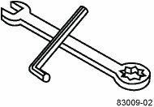

= Reúna las herramientas y el equipo necesarios
:allow-uri-read: 
:icons: font
:imagesdir: ../media/

[role="lead"]
Antes de instalar el armario 40U 3040, asegúrese de que necesita herramientas y equipo.

.Paso
. Reúna todos los elementos enumerados en la siguiente tabla.
+
|===
|  | Elemento | Incluido con el armario 

 a| 

 a| 
*3/4 pulg. Llave* (suministrada en la caja de despacho) -- para levantar y bajar las patas de nivelación debajo del armario.

*1/4 pulg. Llave Allen* -- para levantar y bajar el pie de estabilidad en la parte delantera del armario.
 a| 
image:../media/77037_11.gif[""]

 a| 
* NEMA L6-30*

image:../media/73121_01_dwg_nema_l6_30_power_cord.gif[""]
 a| 
*Cables de alimentación de CA* -- para conectar el armario a fuentes de alimentación externas (enchufes de pared).

** Los conectores NEMA L6-30 se utilizan en EE.UU. Y Canadá.
** Los conectores IEC-60309 se utilizan en todo el mundo, excepto en EE. UU. Y Canadá.

NOTE: Cada PDU debe estar conectada a una fuente de alimentación independiente.
 a| 
image:../media/77037_11.gif[""]

 a| 
**IEC-60309**

image:../media/73122_01_dwg_iec_60309_power_cord.gif[""]

 a| 
image:../media/78038_21.png[""]
 a| 
**Cables SAS** (opcional) – se incluyen dos cables con cada bandeja de unidades, mientras que los cables del lado del host deben adquirirse por separado.

**Cables de comunicación** (opcional) – para conectar la bandeja al host.

Consulte la guía de instalación del soporte de controladora-unidad correspondiente para conocer los elementos requeridos adicionales.
 a| 

 a| 
image:../media/77038_06.gif[""]
 a| 
**Instalación de bobinas de cable** – instalación a lo largo de ambos lados de las tomas de distribución de alimentación vertical para acomodar el exceso de longitud de cable y disposición de cable. Se incluyen dos bobinas de cable con cada bandeja de controladora-unidad Las bobinas de cable también se envían con bandejas de unidades independientes.
 a| 
image:../media/77037_11.gif[""]

 a| 
 a| 
**Shears** – para cortar las bandas metálicas en la caja de embarque.
 a| 

 a| 
 a| 
**Forklift** (opcional) – para retirar el armario del palé de transporte.
 a| 

 a| 
 a| 
**Juegos de panel frontal** (opcional) – para cubrir los compartimientos vacíos en la parte delantera del armario.
 a| 

 a| 
 a| 
**Bolsas antiestáticas** (opcional) – para proteger los componentes que se quitan durante el procedimiento de instalación del armario.
 a| 

|===

