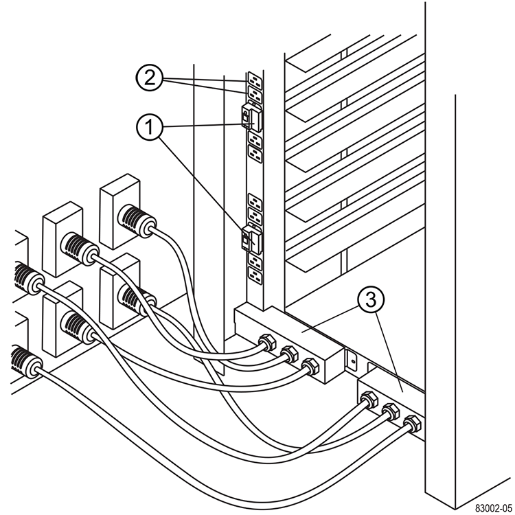

= Instalación completa del armario
:allow-uri-read: 
:icons: font
:imagesdir: ../media/

[role="lead"]
Después de mover el armario, baje los pies de nivelación y el pie de estabilidad, vuelva a instalar los componentes que retiró, instale otros componentes necesarios y conecte el armario a la alimentación.

== Paso 1: Baje los pies de nivelación y la base de estabilidad

Para estabilizar el armario, ajuste sus pies. Las patas de nivelación soportan el armario fuera de las ruedas. El pie de estabilidad evita que el armario se caiga después de colocarse en su posición permanente.

.Pasos
. Baje las patas de nivelación para sostener el armario fuera de las ruedas.
+
Las patas de nivelación están situadas cerca de cada esquina inferior del armario.

. Asegúrese de que el armario esté lo más nivelado posible.
+
La siguiente figura proporciona una vista de cerca de la base de estabilidad y de los pies de nivelación.

+
image::../media/83000_08.gif[Patas de nivelación y estabilidad]

+
|===

 a| 
1.
 a| 
Patas de nivelación

 a| 
2.
 a| 
Pie de estabilidad

|===

== Paso 2: Vuelva a instalar las bandejas

Después de mover el armario, puede volver a instalar las bandejas en sus ubicaciones originales.

CAUTION: _No_ instale las siguientes bandejas en la parte superior del armario sobre la cabeza. Cuando se llena completamente, cada una de estas bandejas pesa más de 100 kg (220 lb). Si se instala en la parte superior del armario, estos soportes crean un armario con una carga superior que se puede desequilibrar fácilmente: E2660, E2760, E5460, E5560, Y los soportes de unidades de controladoras E5660, como el soporte de unidades DE6600

.Pasos
. Vuelva a instalar todas las bandejas en sus ubicaciones originales en el armario.
+

CAUTION: *Riesgo de lesiones corporales* -- una bandeja vacía pesa aproximadamente 56.7 kg (125 lb). Se necesitan tres personas para mover con seguridad una bandeja vacía Si la bandeja está llena de componentes, es necesario un elevador mecánico para mover la bandeja de forma segura

. Vuelva a instalar todos los componentes en sus ubicaciones originales en las bandejas.
+
Para evitar conflictos de dirección y pérdida del acceso a los datos, reemplace todos los componentes de la misma bandeja y en la misma ubicación de la bandeja

. Vuelva a instalar todos los cables en sus ubicaciones originales en las bandejas.
. Dirija los cables de interfaz hacia el armario.
. Dirija los cables de alimentación principales desde el armario a las dos fuentes de alimentación externas. _No_ enchufe los cables de alimentación en este momento.

== Paso 3: Instalar las bobinas de cable y las bridas

Después de volver a instalar las bandejas, instale las bobinas de cable y las bridas. Las bobinas de cable y las bridas admiten la longitud excesiva del cable y el tendido del cable para los controladores y las bandejas.

.Paso
. Instale los carretes de cable y los tirantes a lo largo de ambos lados de las salidas de distribución de alimentación vertical.
+
image::../media/83003_01_dwg_3040_cable_spools.gif[Envoltura de amarre y corredera de cable]

+
|===

 a| 
1.
 a| 
Ubicación de la envoltura de amarre

 a| 
2.
 a| 
Carrete de cable

|===

== Paso 4: Instalar bandejas adicionales

Si es necesario, puede instalar bandejas adicionales. Debe cubrir las posiciones no utilizadas de las bandejas para garantizar un flujo de aire correcto.

.Pasos
. Si tiene bandejas adicionales que se deben instalar, instale el hardware de montaje para estas bandejas.
. Si la parte frontal del armario no está completamente llena de bandejas, utilice los kits del panel frontal para cubrir los espacios vacíos por encima o debajo de las bandejas instaladas.
+
Es necesario cubrir los espacios vacíos para mantener el flujo de aire correcto a través del armario.

. Encienda las bandejas.

== Paso 5: Instale rieles de montaje adicionales

Si va a instalar soportes de controladoras-unidades o soportes de unidades que se enviaron por separado (no están instalados ya en el armario), puede que deba instalar rieles de montaje adicionales en el armario.

.Pasos
. Determine la ubicación de los rieles de montaje.
+
** *Por encima de una bandeja existente* -- coloque los raíles de montaje justo encima de la bandeja superior del armario.
** *Debajo de una bandeja existente* -- colocar los raíles de montaje con suficiente espacio para sujetar la bandeja que se está instalando:
+
*** 8.9 cm (3.5 pulg.) Para los soportes de unidades o soportes de unidades de controladora 2U
*** 17.8 cm (7 pulg.) Para soportes de unidades o controladoras de 4U

. Utilice los marcadores de medición de los soportes verticales delanteros derecho e izquierdo para fijar los raíles de montaje a la misma posición en cada lado del armario.
+
image::../media/92042_06.gif[Montaje en carril]

+
|===

 a| 
1.
 a| 
Raíl ajustable delantero

 a| 
2.
 a| 
Raíl ajustable trasero

 a| 
3.
 a| 
Placa de ajuste y tornillos

 a| 
4.
 a| 
Tornillos M5×10 mm de montaje en raíl

 a| 
5.
 a| 
Tuercas de sujeción

 a| 
6.
 a| 
Soporte de sujeción trasero

 a| 
7.
 a| 
Soporte vertical

|===
+

NOTE: Las tuercas de la pinza y el soporte de sujeción trasero no se utilizan cuando los rieles se instalan en un armario 3040.

. Coloque el raíl ajustable trasero en el soporte vertical.
. En el raíl ajustable trasero, alinee los orificios del raíl ajustable delante de los orificios del soporte vertical.
. Coloque dos tornillos M5×10 mm.
+
.. Fije los tornillos a través del riel de soporte vertical y el riel ajustable trasero.
.. Apriete los tornillos.

. Coloque el raíl ajustable delantero en el soporte vertical.
. En el raíl ajustable delantero, alinee los orificios del raíl ajustable delante de los orificios del soporte vertical.
. Coloque dos tornillos M5×10 mm.
+
.. Fije un tornillo a través del riel de soporte vertical y el orificio inferior del riel ajustable delantero.
.. Fije un tornillo a través del riel de soporte vertical y el centro de los tres orificios superiores del riel ajustable delantero.
.. Apriete los tornillos.

+

NOTE: Los dos orificios de tornillo restantes se utilizan para montar la bandeja

. Repita del paso 3 al paso 8 para fijar el segundo riel en el otro lado del armario.
. Instale cada bandeja con las instrucciones de instalación correspondientes.
. Seleccione una de las siguientes opciones:
+
** Si todas las posiciones de las bandejas están llenas, encienda las bandejas.
** Si no todas las posiciones de las bandejas están llenas, utilice los kits del panel frontal para cubrir los espacios vacíos por encima o debajo de las bandejas instaladas.

== Paso 6: Conecte el armario a la alimentación

Para completar la instalación del armario, encienda los componentes del armario.

.Acerca de esta tarea
Mientras las bandejas realizan el procedimiento de encendido, los LED de la parte frontal y posterior de las bandejas parpadean. Según la configuración, puede tardar varios minutos en completar el procedimiento de encendido.

.Pasos
. Apague la alimentación de todos los componentes del armario.
. Gire los 12 disyuntores a su posición OFF (abajo).
. Enchufe cada uno de los seis conectores NEMA L6-30 (EE.UU. Y Canadá) o los seis conectores IEC 60309 (en todo el mundo, excepto EE.UU. Y Canadá) a una toma eléctrica disponible.
+

NOTE: Debe conectar cada PDU a una fuente de alimentación independiente fuera del armario.

. Gire los 12 disyuntores a su posición on (arriba).
+

+
|===

 a| 
1.
 a| 
Disyuntores

 a| 
2.
 a| 
Tomas eléctricas

 a| 
3.
 a| 
Cajas de entrada de alimentación

|===
. Encienda todas las bandejas de unidades del armario.
+

NOTE: Espere 60 segundos después de encender las bandejas de unidades antes de encender la alimentación a los soportes de controladoras-unidades.

. Espere 60 segundos después de encender las bandejas de unidades y, a continuación, encienda todos los soportes de controladoras-unidades del armario.

.Resultado
Se ha completado la instalación del armario. Es posible reanudar las operaciones normales.
