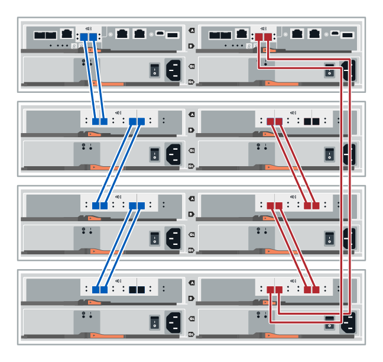

= Conectar el cable de la bandeja de controladoras a la bandeja de unidades (E-Series)
:allow-uri-read: 
:icons: font
:imagesdir: ../media/

[role="lead"]
Debe conectar cada controladora de la bandeja de controladoras a un módulo de I/o (IOM) de una bandeja de unidades.

Este procedimiento se aplica a los estantes de unidades IOM12, IOM12B e IOM12C.

NOTE: Los módulos IOM12C sólo se admiten en SANtricity OS 11.70.2 en adelante. Asegúrese de que el firmware de la controladora se haya actualizado antes de instalar o actualizar a un IOM12C.

NOTE: Este procedimiento se aplica a intercambios o sustituciones similares de IOM en caliente. Esto significa que sólo puede sustituir un módulo IOM12 por otro módulo IOM12 o sustituir un módulo IOM12C por otro módulo IOM12C. (Su bandeja puede tener dos módulos IOM12 o dos IOM12C).

Si va a cablear una bandeja de controladoras anterior a DE212C, DE224C o DE460, consulte https://mysupport.netapp.com/ecm/ecm_download_file/ECMLP2859057["Adición de bandejas de unidades IOM a una bandeja de controladoras E27XX, Safari o EF560 existente"^].

== Cableado de E2800 y E5700

La siguiente información se aplica al cableado de un E2800, E2800B, EF280, E5700, EF5700B, O bandeja de controladoras EF570 a una bandeja de unidades DE212C, DE224C o DE460.

[role="tabbed-block"]
====
.bandeja de 12 o 24 unidades
--
Es posible cablear la bandeja de controladoras a una o varias bandejas de 12 o 24 unidades.

En la siguiente imagen, se muestra una representación de la bandeja de controladoras y las bandejas de unidades. Para localizar los puertos del modelo, consulte https://hwu.netapp.com/Controller/Index?platformTypeId=2357027["Hardware Universe"^].

--
.bandeja de 60 unidades
--
Puede cablear la bandeja de controladoras a una o varias bandejas de 60 unidades.

En la siguiente imagen, se muestra una representación de la bandeja de controladoras y las bandejas de unidades. Para localizar los puertos del modelo, consulte https://hwu.netapp.com/Controller/Index?platformTypeId=2357027["Hardware Universe"^].

image::../media/60_cabling.png[Una bandeja de controladoras y bandejas de 60 unidades]

--
====

== Cableado EF300 y EF600

La siguiente información se aplica al cableado de una bandeja de controladoras EF300, EF600, EF300C o EF600C a una bandeja de unidades DE212C, DE224C o DE460.

.Antes de empezar
Antes de cablear un EF300 o EF600, asegúrese de que el firmware se actualiza a la versión más reciente. Para actualizar el firmware, siga las instrucciones de link:../upgrade-santricity/index.html["Actualizar el sistema operativo SANtricity"^].

[role="tabbed-block"]
====
.bandeja de 12 o 24 unidades
--
Es posible cablear la bandeja de controladoras a una o varias bandejas de 12 o 24 unidades.

En la siguiente imagen, se muestra una representación de la bandeja de controladoras y las bandejas de unidades. Para localizar los puertos del modelo, consulte https://hwu.netapp.com/Controller/Index?platformTypeId=2357027["Hardware Universe"^].

image::../media/ef_to_de224c_four_shelves.png[Una bandeja de controladoras y bandejas de 12 o 24 unidades]

--
.bandeja de 60 unidades
--
Puede cablear la bandeja de controladoras a una o varias bandejas de 60 unidades.

En la siguiente imagen, se muestra una representación de la bandeja de controladoras y las bandejas de unidades. Para localizar los puertos del modelo, consulte https://hwu.netapp.com/Controller/Index?platformTypeId=2357027["Hardware Universe"^].

image::../media/ef_to_de460c.png[Una bandeja de controladoras y bandejas de 60 unidades]

--
====

== Cableado E4000

La siguiente información se aplica al cableado de una bandeja de controladoras E4000 a una bandeja de unidades DE212C, DE224C o DE460.

[role="tabbed-block"]
====
.bandeja de 12 unidades
--
Puede cablear la bandeja de controladoras a una o varias bandejas de 12 unidades.

image::../media/e4012_cabling.png[Una bandeja de controladoras y 12 unidades]

--
.bandeja de 60 unidades
--
Puede cablear la bandeja de controladoras a una o varias bandejas de 60 unidades.

image::../media/e4060_cabling.png[Una bandeja de controladoras y bandejas de 60 unidades]

--
====