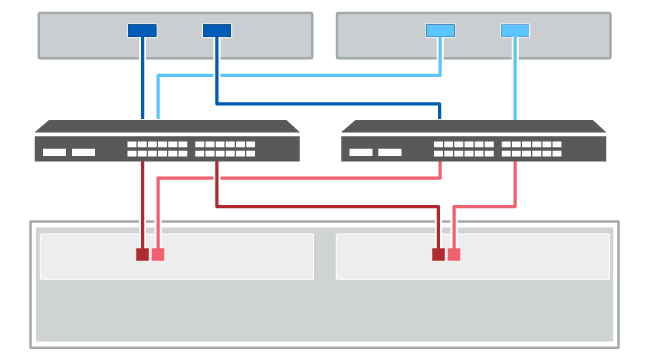

= Cableado de host
:allow-uri-read: 
:icons: font
:imagesdir: ../media/

[role="lead"]
Es posible conectar un host directamente a una controladora (topología de conexión directa) o utilizar switches (topología de switch) para conectar un host a una controladora.

== Cableado para una topología de conexión directa

Una topología de conexión directa conecta los adaptadores de host directamente a las controladoras del sistema de almacenamiento.

Para garantizar el máximo rendimiento, se deben usar todos los puertos de adaptador de host disponibles.

.Un host con dos HBA
La siguiente figura muestra un ejemplo de un host con dos HBA instalados.

image::../media/1host_2hbas_ieops-2145.svg[Un host/dos HBA y dos controladoras de cableado]

.Un host con dos HBA (cableado alternativo)
La siguiente figura muestra un ejemplo de un host con dos HBA instalados.

image::../media/1host_2hbas_alternate_wkflw_ieops-2147.svg[Un host/dos HBA y dos controladoras de cableado (cableado alternativo)]

.Dos hosts con dos HBA por host
En la siguiente figura, se muestra un ejemplo de dos hosts cada uno con dos HBA instalados.

image::../media/2hosts_4hbas_ieops-2146.svg[Dos cables de host/cuatro HBA y dos controladoras]

== Cableado para una topología de switch

Una topología de switch utiliza switches para conectar hosts a las controladoras en el sistema de almacenamiento. El switch debe admitir el tipo de conexión utilizada entre el host y la controladora.

La figura siguiente muestra un ejemplo de conexión. En el caso de los switches que proporcionan funcionalidad de aprovisionamiento, debe aislar cada iniciador y cada pareja de objetivos.

.Dos hosts y dos switches

*(1)* _Conecte cada adaptador de host directamente al conmutador._

*(2)* _Conecte cada switch directamente a los puertos de host de los controladores. Para ayudar a garantizar el máximo rendimiento, se deben utilizar todos los puertos de adaptador de host disponibles._
