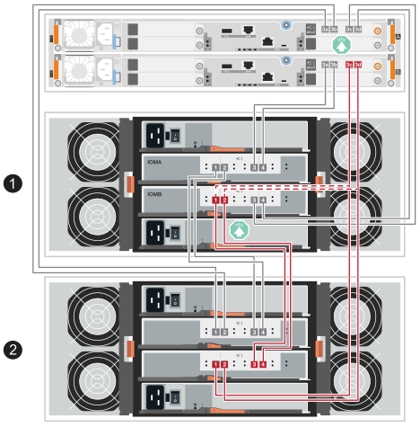
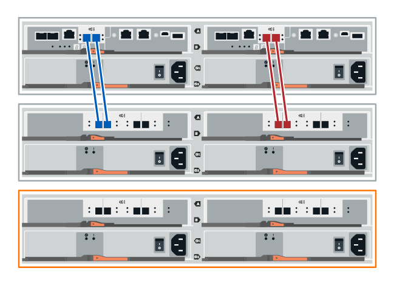
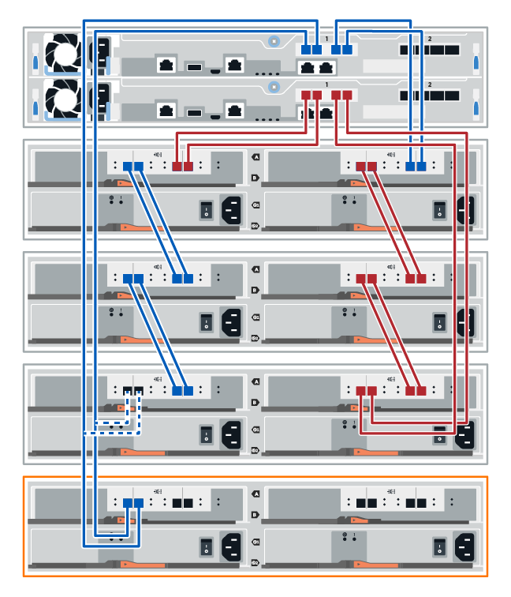
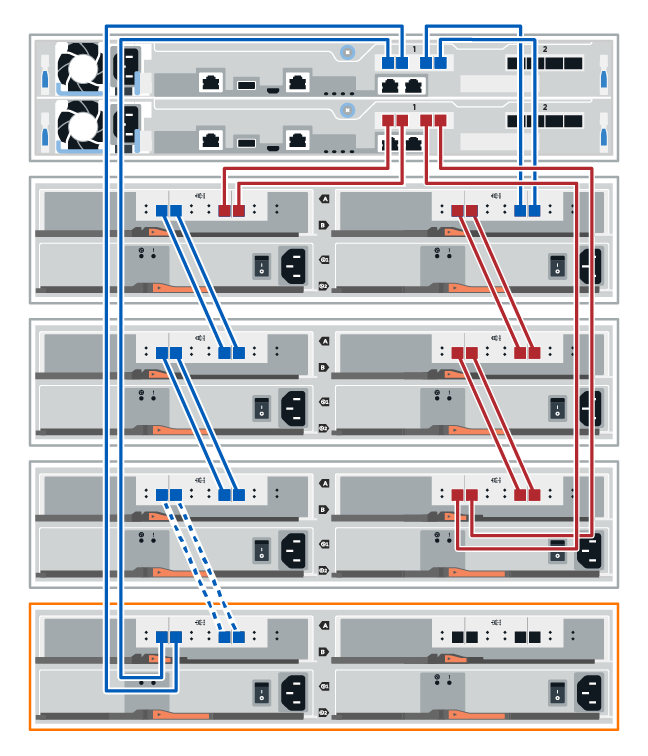
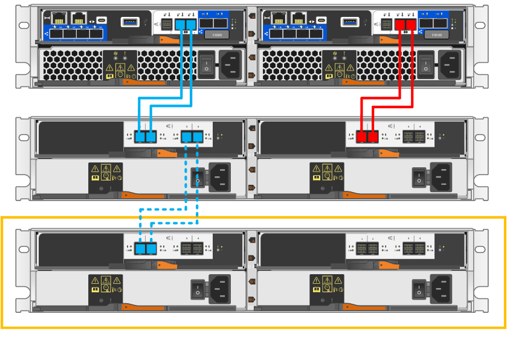
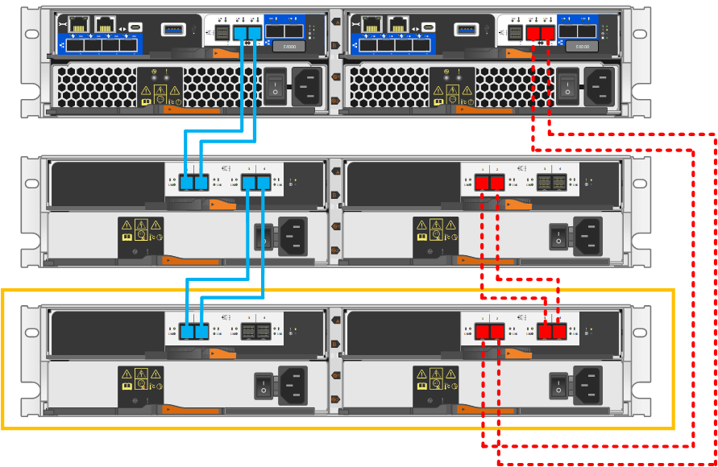

= Incorpora en caliente una bandeja de discos en un sistema de almacenamiento E-Series
:allow-uri-read: 
:icons: font
:imagesdir: ../media/

[role="lead"]
Puedes añadir una nueva bandeja de unidades sin desconectar la alimentación de los demás componentes del sistema de almacenamiento cuando los controladores de tu sistema de almacenamiento ya tengan puertos SAS disponibles. Puedes configurar, reconfigurar, añadir o reubicar la capacidad del sistema de almacenamiento sin interrumpir el acceso de los usuarios a los datos.

.Antes de empezar
* Dada la complejidad de este procedimiento, lee todos los pasos antes de comenzar el procedimiento.
+
Cuando añades una bandeja en caliente a una o más bandejas existentes, para mantener la integridad del sistema durante el procedimiento, siempre debes mantener una ruta activa. Debes seguir el procedimiento exactamente en el orden presentado.

+
Para cablear la nueva bandeja, vuelve a cablear las conexiones del controlador a la bandeja del lado A (shelf IOM A) y añade las conexiones entre bandejas, verifica que la ruta del lado A está activa, vuelve a cablear las conexiones del controlador a la bandeja del lado B (shelf IOMB) y añade las conexiones entre bandejas, y luego verifica que la redundancia se ha restablecido.

+

NOTE: Si vas a instalar una bandeja de unidades que ya se ha instalado anteriormente en un sistema de almacenamiento, este procedimiento incluye pasos adicionales que debes seguir.

* Compruebe que la función de adición de una bandeja de unidades en caliente es el procedimiento necesario.
* Comprueba que tu sistema de almacenamiento utilice una versión de SANtricity compatible con las bandejas de expansión SAS y que no superes el número máximo de bandejas SAS admitidas.
+
Para obtener información sobre las versiones compatibles de SANtricity y el número máximo de bandejas de expansión SAS compatibles con tu sistema de almacenamiento, consulta el NetApp Hardware Universe: https://hwu.netapp.com/Controller/Index?platformTypeId=2357027["Hardware Universe"^].

+

NOTE: Los sistemas de almacenamiento EF50 y EF80 que ejecutan SANtricity 12.10 o una versión posterior son compatibles con las bandejas de expansión SAS.

* Tu sistema de almacenamiento debe disponer de puertos SAS. Esto significa que los módulos de E/S SAS ya deben estar instalados. Si no es así, sigue el procedimiento correspondiente para instalar los módulos de E/S SAS y luego vuelve a este procedimiento para añadir en caliente la bandeja de unidades.
+
** Para los sistemas de almacenamiento EF50 y EF80, usa el procedimiento de link:../maintenance-ef50-ef80/io-module-upgrade.html["Actualizar los módulos de E/S"^].
** Para los sistemas de almacenamiento más antiguos, usa el procedimiento _SAS expansion cards_ para el modelo de tu sistema de almacenamiento en la sección _Maintain systems_.

.Acerca de esta tarea
* Este procedimiento se aplica a una bandeja de controladoras E2800, E2800B, EF280, E5700, E5700B, EF570, EF300, EF600, EF300C, EF600C, E4000, EF50 o EF80.
+

NOTE: Si vas a realizar el cableado de un bastidor de controlador antiguo, consulta https://mysupport.netapp.com/ecm/ecm_download_file/ECMLP2859057["Adición de bandejas de unidades IOM a una bandeja de controladoras E27XX, Safari o EF560 existente"^].

* Este procedimiento se aplica a la incorporación en caliente de bandejas de unidades DE212C, DE224C o DE460C con módulos IOM12, IOM12B o IOM12C.
+

NOTE: Los módulos IOM12C solo son compatibles con SANtricity OS 11.90R3 en adelante. Asegúrese de que el firmware de la controladora se haya actualizado antes de instalar o actualizar a un IOM12C.

[[step-1-prepare-to-add-the-drive-shelf]]
== Paso 1: Prepárese para añadir la bandeja de unidades

Para prepararse para añadir una bandeja de unidades en caliente, debe comprobar los eventos críticos y comprobar el estado de los IOM.

.Antes de empezar
* La fuente de alimentación del sistema de almacenamiento debe poder adaptarse a los requisitos de alimentación de la nueva bandeja de unidades. Para conocer las especificaciones de alimentación de la bandeja de unidades, consulte https://hwu.netapp.com/Controller/Index?platformTypeId=2357027["Hardware Universe"^].
* El patrón de cableado del sistema de almacenamiento existente debe coincidir con una de las combinaciones aplicables que se muestran en este procedimiento.

.Pasos
. En el Administrador del sistema de SANtricity, seleccione *Soporte* > *Centro de soporte* > *Diagnóstico*.
. Seleccione *recopilar datos de soporte*.
+
Se muestra el cuadro de diálogo recoger datos de soporte.

. Haga clic en *recoger*.
+
El archivo se guarda en la carpeta de descargas del explorador con el nombre support-data.7z. Los datos no se envían automáticamente al soporte técnico.

. Seleccione *Soporte* > *Registro de sucesos*.
+
La página Event Log muestra los datos de eventos.

. Seleccione el encabezado de la columna *prioridad* para ordenar los eventos críticos al principio de la lista.
. Revise los eventos críticos del sistema para ver si se han producido en las últimas dos o tres semanas, y compruebe que se han resuelto o tratado cualquier evento crítico reciente.
+

NOTE: Si se han producido eventos críticos sin resolver en las dos o tres semanas anteriores, detenga el procedimiento y póngase en contacto con el soporte técnico. Continúe el procedimiento solo cuando se resuelva el problema.

. Si tiene IOM conectados al hardware, lleve a cabo los siguientes pasos. De lo contrario, vaya a. <<step2_install_drive_shelf,Paso 2: Instale la bandeja de unidades y aplique energía.>>
+
.. Selecciona el menú:Hardware[Controllers and components].
.. Seleccione el icono *IOM (ESM)*.
+
image::../media/sam1130_ss_hardware_iom_icon.gif[Icono de IOM (ESM)]

+
Aparece el cuadro de diálogo Configuración de componentes de bandeja con la ficha *IOM (ESM)* seleccionada.

.. Asegúrese de que el estado mostrado para cada IOM/ESM sea _Optimal_.
.. Haga clic en *Mostrar más valores*.
.. Confirme que existen las siguientes condiciones:
+
*** La cantidad de ESM/IOM detectados coincide con la cantidad de ESM/IOM instalados en el sistema y con la de cada bandeja de unidades.
*** Los dos ESM/IOM muestran que la comunicación está bien.
*** La velocidad de datos es de 12 GB/s para bandejas de unidades DE212C, DE224C y DE460C, o de 6 GB/s para otras bandejas de unidades.

[[step-2-install-the-drive-shelf-and-apply-power]]
[[step2_install_drive_shelf]]
== Paso 2: Instale la bandeja de unidades y aplique alimentación

Debe instalar una bandeja de unidades nueva o una bandeja de unidades instalada previamente, encender la alimentación y comprobar si existen LED que requieran atención.

.Pasos
. Si va a instalar una bandeja de unidades que se instaló anteriormente en un sistema de almacenamiento, quite las unidades. Se deben instalar las unidades de una en una versión posterior de este procedimiento.
+
Si el historial de instalación de la bandeja de unidades que va a instalar es desconocido, debe suponer que se ha instalado previamente en un sistema de almacenamiento.

. Instale la bandeja de unidades en el rack que contiene los componentes del sistema de almacenamiento.
+

NOTE: Consulte las instrucciones de instalación de su modelo para obtener el procedimiento completo para la instalación física y el cableado de alimentación. Las instrucciones de instalación de su modelo incluyen notas y advertencias que debe tener en cuenta para instalar una bandeja de unidades de forma segura.

. Encienda la bandeja de unidades nueva y confirme que no se ilumina ningún LED de atención ámbar en la bandeja de unidades. Si es posible, resuelva cualquier condición de falla antes de continuar con este procedimiento.

[[step-3-cable-the-drive-shelf]]
== Paso 3: Cablea la bandeja de unidades

Para cablear la bandeja a tu sistema de almacenamiento, conecta cada controlador para que tengan una ruta del lado A (IOMA) y una ruta del lado B (IOMB) hacia la única bandeja o la pila de bandejas (según corresponda). Y si tienes una pila de bandejas, entonces conectas las bandejas entre sí (conexiones de bandeja a bandeja) a través de la ruta del lado A y la ruta del lado B.

Siempre tienes que cablear los controladores y una o más bandejas de manera que haya dos conexiones de cable para la ruta del lado A (IOMA) y la ruta del lado B (IOMB), como se muestra en las ilustraciones de cableado.

[role="tabbed-block"]
====
.Conecta la bandeja de unidades para EF50 o EF80
--
Este procedimiento te explica cómo realizar la incorporación en caliente de la primera bandeja de expansión SAS a tu sistema de almacenamiento EF50 o EF80 y cómo volver a cablear la bandeja inicial para incorporar en caliente una segunda bandeja; sin embargo, este procedimiento también puede aplicarse al añadir bandejas adicionales.

.Antes de empezar
Ha actualizado el firmware a la última versión. Para actualizar el firmware, siga las instrucciones de link:../upgrade-santricity/index.html["Actualizar el sistema operativo SANtricity"].

.Acerca de esta tarea
* Si vas a añadir una bandeja adicional en caliente a una o varias bandejas ya existentes, se aplica lo siguiente:
+
** Este procedimiento consiste en volver a cablear las conexiones entre el controlador y la bandeja, de modo que siempre mantengas una ruta activa hacia la bandeja del controlador.
+
Para mantener una ruta activa durante este procedimiento, vuelves a cablear las conexiones del controlador al bastidor del lado A (IOMA del bastidor) y añades conexiones entre bastidores, verificas que la ruta del lado A está activa, vuelves a cablear las conexiones del controlador al bastidor del lado B (IOMB del bastidor) y añades conexiones entre bastidores, y luego verificas que la redundancia se ha restablecido.

** Siempre tienes que mover los cables del último shelf de la pila a los mismos IOM y puertos IOM en el nuevo shelf, y luego conectar el nuevo shelf al anterior último shelf de la pila (conexiones de shelf a shelf).

* Este procedimiento describe los pasos para añadir en caliente hasta dos bandejas. No obstante, si vas a añadir una bandeja adicional en caliente, empieza por el paso 2 y aplica los pasos a la bandeja adicional.
* Este procedimiento muestra los controladores que cuentan con un módulo de E/S SAS en la ranura 3. Para ver todas las configuraciones de módulos de E/S SAS compatibles, consulta link:https://hwu.netapp.com["Hardware Universe de NetApp"^].
* En las ilustraciones de cableado, las conexiones del controlador A se muestran en azul y las del controlador B se muestran en rojo. Las líneas discontinuas (azul y rojo) representan el cableado existente que vas a mover para realizar los pasos de cableado. Los puertos y líneas grises representan el cableado existente que permanece en su lugar mientras realizas los pasos de cableado.

.Pasos
. Para agregar en caliente una bandeja SAS que será la bandeja de expansión SAS inicial, completa los siguientes subpasos; de lo contrario, ve al siguiente paso.
+
.. Conecta el puerto 3a del controlador A al puerto 1 del IOMA de la bandeja.
.. Conecta el puerto 3b del controlador A al puerto 2 del IOMA de la bandeja.
.. Conecta el puerto 3c del controlador A al puerto 3 del IOMB de la bandeja.
.. Conecta el puerto 3d del controlador A al puerto 4 del IOMB de la bandeja.
.. Conecta el puerto 3a del controlador B al puerto 3 del IOMA de la bandeja.
.. Conecta el puerto 3b del controlador B al puerto 4 del IOMA de la bandeja.
.. Conecta el puerto 3c del controlador B al puerto 1 del IOMB de la bandeja.
.. Conecta el puerto 3d del controlador B al puerto 2 del IOMB de la bandeja.
+
Cuando hayas terminado de cablear la estantería, el cableado debería tener el siguiente aspecto:

+
image::../media/drw_ef50-ef80_1_de460c_cabling_ieops-2981.svg[cablear la bandeja inicial]

. Para realizar la incorporación en caliente de una segunda bandeja de expansión SAS (bandeja 2), vuelve a cablear las conexiones entre el controlador y la bandeja del lado A y añade las conexiones entre las bandejas del lado A, como se indica a continuación; de lo contrario, ve al siguiente paso.
+
.. Desconecta el cable del puerto 1 del IOMA de la bandeja 1 y vuelve a conectarlo al puerto 1 del IOMA de la bandeja 2.
.. Desconecta el cable del puerto 2 del IOMA de la bandeja 1 y vuelve a conectarlo al puerto 2 del IOMA de la bandeja 2.
.. Conecta el puerto IOMA 1 de la bandeja 1 al puerto IOMA 4 de la bandeja 2.
.. Conecta el puerto IOMA 2 del shelf 1 al puerto IOMA 3 del shelf 2.
+
Cuando hayas terminado de volver a cablear las conexiones del lado A, el cableado debería tener el siguiente aspecto:

+
image::../media/drw_ef50-ef80_2nd_de460c_cabling_hotadd_a-side_ieops-2998.svg[Agrega una segunda bandeja y vuelve a cablear las conexiones del lado A]

. En SANtricity System Manager, haz clic en menú:Hardware[Controllers and components].
+

NOTE: Si vas a añadir una segunda bandeja de expansión SAS, en este punto del procedimiento solo tienes una ruta activa hacia la bandeja del controlador.

. Desplácese hacia abajo, según sea necesario, para ver todas las bandejas de unidades del nuevo sistema de almacenamiento. Si no se muestra la nueva bandeja de unidades, resuelva el problema de conexión.
. Seleccione el icono *ESM/IOM* de la nueva bandeja de unidades.
+
image::../media/sam1130_ss_hardware_iom_icon.gif[Icono de ESM/IOM]

+
Aparece el cuadro de diálogo *Configuración de componentes de bandeja*.

. Seleccione la ficha *ESM/IOM* del cuadro de diálogo *Configuración de componentes de bandeja*.
. Seleccione *Mostrar más opciones* y compruebe lo siguiente:
+
** Si vas a añadir la primera bandeja de expansión SAS, aparecerán en la lista IOM/ESM A e IOM/ESM B. Si vas a añadir una segunda bandeja de expansión SAS, aparecerá en la lista IOM/ESM A.
** La tasa de datos actual es de 12 Gbps para una bandeja de unidades SAS-3.
** Comunicaciones de tarjeta OK.

. Si vas a añadir una segunda bandeja de expansión SAS, vuelve a cablear las conexiones entre el controlador y la bandeja del lado B y añade las conexiones entre bandejas del lado B, como se indica a continuación; de lo contrario, pasa al paso 10.
+
.. Desconecta el cable del puerto 1 del IOMB de la bandeja 1 y vuelve a conectarlo al puerto 1 del IOMB de la bandeja 2.
.. Desconecta el cable del puerto 2 del IOMB de la bandeja 1 y vuelve a conectarlo al puerto 2 del IOMB de la bandeja 2.
.. Conecta el puerto IOMB 1 de la bandeja 1 al puerto IOMB 3 de la bandeja 2.
.. Conecta el puerto IOMB 2 del shelf 1 al puerto IOMB 4 del shelf 2.
+
Cuando hayas terminado de volver a cablear las conexiones del lado B, el cableado debería tener el siguiente aspecto:

+

. Si vas a añadir una segunda bandeja de expansión SAS, una vez que hayas terminado de volver a cablear las dos bandejas, el cableado debería tener el siguiente aspecto:
+

NOTE: Si vas a añadir en caliente un tercer módulo a una pila de dos módulos, el cableado debe verse como en la ilustración en el link:../install-hw-ef50-ef80/install-cable.html#step-3-cable-the-sas-shelf-connections["Opción 2: pestaña de tres bandejas DE460C"^] de la sección _Cablear las conexiones del módulo SAS_ para instalaciones de sistemas nuevos.

+
image::../media/drw_ef50-ef80_2nd_de460c_cabling_hotadd_final_ieops-3012.svg[Ejemplo de cableado para dos bandejas añadidas en caliente]

. Si aún no está seleccionada, seleccione la ficha *ESM/IOM* en el cuadro de diálogo *Configuración de componente de bandeja* y, a continuación, seleccione *Mostrar más opciones*. Compruebe que las comunicaciones con la tarjeta son *SÍ*.
+

NOTE: El estado óptima indica que se resolvió la pérdida de error de redundancia asociada con la bandeja de unidades nueva y el sistema de almacenamiento está estabilizado.

--
.Conecte la bandeja de unidades de E2800 o E5700
--
La bandeja de unidades se conecta a la controladora A, confirme el estado del IOM y luego conecte la bandeja de unidades a la controladora B.

.Pasos
. Conecte la bandeja de unidades a la controladora A.
+
En la siguiente figura, se muestra un ejemplo de conexión entre una bandeja de unidades adicional y una controladora A. Para localizar los puertos del modelo, consulte https://hwu.netapp.com/Controller/Index?platformTypeId=2357027["Hardware Universe"^].

+

+
image::../media/hot_e5700_1.png[Conecte la bandeja de unidades a la controladora]

. En el Administrador del sistema de SANtricity, haga clic en *hardware*.
+

NOTE: En este punto del procedimiento, solo hay una ruta activa a la bandeja de controladoras.

. Desplácese hacia abajo, según sea necesario, para ver todas las bandejas de unidades del nuevo sistema de almacenamiento. Si no se muestra la nueva bandeja de unidades, resuelva el problema de conexión.
. Seleccione el icono *ESM/IOM* de la nueva bandeja de unidades.
+
image::../media/sam1130_ss_hardware_iom_icon.gif[Icono de ESM/IOM]

+
Aparece el cuadro de diálogo *Configuración de componentes de bandeja*.

. Seleccione la ficha *ESM/IOM* del cuadro de diálogo *Configuración de componentes de bandeja*.
. Seleccione *Mostrar más opciones* y compruebe lo siguiente:
+
** El IOM/ESM a aparece en la lista.
** La tasa de datos actual es de 12 Gbps para una bandeja de unidades SAS-3.
** Comunicaciones de tarjeta OK.

. Desconecte todos los cables de expansión de la controladora B.
. Conecte la bandeja de unidades a la controladora B.
+
La siguiente figura muestra un ejemplo de conexión entre una bandeja de unidades adicional y una controladora B. Para localizar los puertos del modelo, consulte https://hwu.netapp.com/Controller/Index?platformTypeId=2357027["Hardware Universe"^].

+
image::../media/hot_e5700_2.png[Ejemplo de conexión de bandeja de unidades]

. Si aún no está seleccionada, seleccione la ficha *ESM/IOM* en el cuadro de diálogo *Configuración de componente de bandeja* y, a continuación, seleccione *Mostrar más opciones*. Compruebe que las comunicaciones con la tarjeta son *SÍ*.
+

NOTE: El estado óptima indica que se resolvió la pérdida de error de redundancia asociada con la bandeja de unidades nueva y el sistema de almacenamiento está estabilizado.

--
.Conecte la bandeja de unidades de EF300 o EF600
--
La bandeja de unidades se conecta a la controladora A, confirme el estado del IOM y luego conecte la bandeja de unidades a la controladora B.

.Antes de empezar
* Ha actualizado el firmware a la última versión. Para actualizar el firmware, siga las instrucciones de link:../upgrade-santricity/index.html["Actualizar el sistema operativo SANtricity"].

.Pasos
. Desconecte los dos cables de la controladora del lado A de los puertos IOM12 uno y dos de la última bandeja anterior del paquete y, a continuación, conéctelos a los puertos IOM12 de la nueva bandeja uno y dos.
+
image::../media/de224c_sides.png[Desconecte los cables de la controladora A y conéctelos a la nueva bandeja]

. Conecte los cables a los puertos IOM12 Del lado A tres y cuatro de la nueva bandeja a los últimos puertos IOM12 de la bandeja anterior uno y dos.
+
En la siguiente figura, se muestra un ejemplo de conexión para un lado entre una bandeja de unidades adicional y la última bandeja anterior. Para localizar los puertos del modelo, consulte https://hwu.netapp.com/Controller/Index?platformTypeId=2357027["Hardware Universe"^].

+

+

. En SANtricity System Manager, haz clic en menú:Hardware[Controllers and components].
+

NOTE: En este punto del procedimiento, solo hay una ruta activa a la bandeja de controladoras.

. Desplácese hacia abajo, según sea necesario, para ver todas las bandejas de unidades del nuevo sistema de almacenamiento. Si no se muestra la nueva bandeja de unidades, resuelva el problema de conexión.
. Seleccione el icono *ESM/IOM* de la nueva bandeja de unidades.
+
image::../media/sam1130_ss_hardware_iom_icon.gif[Icono de ESM/IOM]

+
Aparece el cuadro de diálogo *Configuración de componentes de bandeja*.

. Seleccione la ficha *ESM/IOM* del cuadro de diálogo *Configuración de componentes de bandeja*.
. Seleccione *Mostrar más opciones* y compruebe lo siguiente:
+
** El IOM/ESM a aparece en la lista.
** La tasa de datos actual es de 12 Gbps para una bandeja de unidades SAS-3.
** Comunicaciones de tarjeta OK.

. Desconecte los cables de la controladora B de los puertos IOM12 uno y dos de la última bandeja anterior del paquete y, a continuación, conéctelos a los puertos IOM12 de la nueva bandeja.
. Conecte los cables a los puertos IOM12 del lado B tres y cuatro de la nueva bandeja a los puertos IOM12 de la última bandeja anterior uno y dos.
+
En la siguiente figura, se muestra un ejemplo de conexión para el lado B entre una bandeja de unidades adicional y la última bandeja anterior. Para localizar los puertos del modelo, consulte https://hwu.netapp.com/Controller/Index?platformTypeId=2357027["Hardware Universe"^].

+
image::../media/hot_ef_2.png[Ejemplo de cableado de la bandeja de unidades]

. Si aún no está seleccionada, seleccione la ficha *ESM/IOM* en el cuadro de diálogo *Configuración de componente de bandeja* y, a continuación, seleccione *Mostrar más opciones*. Compruebe que las comunicaciones con la tarjeta son *SÍ*.
+

NOTE: El estado óptima indica que se resolvió la pérdida de error de redundancia asociada con la bandeja de unidades nueva y el sistema de almacenamiento está estabilizado.

--
.Conecte la bandeja de unidades de E4000
--
La bandeja de unidades se conecta a la controladora A, confirme el estado del IOM y luego conecte la bandeja de unidades a la controladora B.

.Pasos
. Conecte la bandeja de unidades a la controladora A.
+

. En SANtricity System Manager, haz clic en menú:Hardware[Controllers and components].
+

NOTE: En este punto del procedimiento, solo hay una ruta activa a la bandeja de controladoras.

. Desplácese hacia abajo, según sea necesario, para ver todas las bandejas de unidades del nuevo sistema de almacenamiento. Si no se muestra la nueva bandeja de unidades, resuelva el problema de conexión.
. Seleccione el icono *ESM/IOM* de la nueva bandeja de unidades.
+
image::../media/sam1130_ss_hardware_iom_icon.gif[Icono de hardware IOM]

+
Aparece el cuadro de diálogo *Configuración de componentes de bandeja*.

. Seleccione la ficha *ESM/IOM* del cuadro de diálogo *Configuración de componentes de bandeja*.
. Seleccione *Mostrar más opciones* y compruebe lo siguiente:
+
** El IOM/ESM a aparece en la lista.
** La tasa de datos actual es de 12 Gbps para una bandeja de unidades SAS-3.
** Comunicaciones de tarjeta OK.

. Desconecte todos los cables de expansión de la controladora B.
. Conecte la bandeja de unidades a la controladora B.
+

. Si aún no está seleccionada, seleccione la ficha *ESM/IOM* en el cuadro de diálogo *Configuración de componente de bandeja* y, a continuación, seleccione *Mostrar más opciones*. Compruebe que las comunicaciones con la tarjeta son *SÍ*.
+

NOTE: El estado óptima indica que se resolvió la pérdida de error de redundancia asociada con la bandeja de unidades nueva y el sistema de almacenamiento está estabilizado.

--
====

[[step-4-assign-drive-shelf-ids]]
== Paso 4: asignar identificadores a las bandejas de unidades

Enciende las bandejas y luego asigna un identificador único a cada bandeja.

.Acerca de esta tarea
* Asignar un identificador único a cada bandeja garantiza que la bandeja sea distinta dentro de tu sistema de almacenamiento.
+
Un ID de bandeja válido es del 01 al 99.

+
A los estantes internos (de almacenamiento), que están integrados en los controladores, se les asigna un identificador de estante fijo de 00.

* Debes reiniciar la bandeja (apaga el interruptor de alimentación de cada una de las fuentes de alimentación de la bandeja SAS, espera al menos 10 segundos y luego vuelve a encenderla) para que el ID de la bandeja surta efecto.

.Pasos
. Retira la tapa del extremo izquierdo para acceder al botón naranja de identificación del estante situado en la placa frontal.
+
image::../media/drw_shelf_id_sas_ieops-2187.svg[Cambiar el ID de shelf SAS]

+
[cols="20%,80%"]
|===

 a| 
image::../media/icon_round_1.png[Llamada número 1]
 a| 
Tapa de extremo de la bandeja

 a| 

 a| 
Placa frontal del estante

 a| 
image::../media/icon_round_3.png[[Nota al pie n.º 3]
 a| 
Botón de identificación de estante

 a| 
image::../media/icon_round_4.png[[Nota al pie n.º 4]
 a| 
Número de identificación de la bandeja

|===
. Cambia el primer número del identificador de bandeja:
+
.. Mantén pulsado el botón de identificación del estante hasta que parpadee el primer número de la pantalla digital y luego suelta el botón.
+
El número puede tardar hasta 15 segundos en parpadear. Esto activa el modo de programación del shelf ID.

+

NOTE: Si el ID tarda más de 15 segundos en parpadear, mantén presionado el botón de identificación de la bandeja nuevamente, asegurándote de presionarlo hasta el fondo.

.. Pulsa y suelta el botón de identificación del estante para que el número vaya cambiando hasta que llegues al número deseado, del 0 al 9.
+
Cada pulsación y cada liberación pueden durar tan solo un segundo.

+
El primer número sigue parpadeando.

. Cambia el segundo número del identificador de shelf:
+
.. Mantén pulsado el botón hasta que el segundo número de la pantalla digital parpadee.
+
El número puede tardar hasta tres segundos en parpadear.

+
El primer número de la pantalla digital deja de parpadear.

.. Pulsa y suelta el botón de identificación del estante para que el número vaya cambiando hasta que llegues al número deseado, del 0 al 9.
+
El segundo número sigue parpadeando.

. Fija el número deseado y sal del modo de programación manteniendo pulsado el botón de identificación del estante hasta que el segundo número deje de parpadear.
+
El número puede tardar hasta tres segundos en dejar de parpadear.

+
Ambos números de la pantalla digital empiezan a parpadear y el LED ámbar se enciende al cabo de unos cinco segundos, alertándote de que el identificador de bandeja pendiente aún no ha entrado en vigor.

. Apaga y vuelve a encender la bandeja durante al menos 10 segundos para que el identificador de la bandeja surta efecto.
+
.. Apaga el interruptor de encendido de cada una de las fuentes de alimentación.
.. Espera 10 segundos.
.. Enciende el interruptor de encendido de cada una de las fuentes de alimentación para completar el ciclo de encendido.
+
Cuando se enciende una fuente de alimentación, el LED bicolor debería iluminarse en verde.

. Vuelve a colocar la tapa del extremo izquierdo.

[[step-5-complete-the-hot-add]]
== Paso 5: Completa la incorporación en caliente

La función de adición de activos se completa comprobando si hay errores y confirmando que la bandeja de unidades recién añadida utiliza el firmware más reciente.

.Pasos
. En el Administrador del sistema de SANtricity, haga clic en *Inicio*.
. Si el enlace con la etiqueta *recuperar de problemas* aparece en la parte superior central de la página, haga clic en el vínculo y resuelva cualquier problema que se indique en Recovery Guru.
. En SANtricity System Manager, haz clic en menu:Hardware[Controllers and components] y desplázate hacia abajo, si es necesario, para ver la nueva estantería de unidades que agregaste.
. En el caso de las unidades que se hayan instalado previamente en otro sistema de almacenamiento, añada una unidad a la bandeja de unidades recién instalada. Espere a que se reconozca cada unidad antes de insertar la siguiente unidad.
+
Cuando el sistema de almacenamiento reconoce una unidad, la representación de la ranura de la unidad en la página *hardware* se muestra como un rectángulo azul.

. Seleccione *Soporte* > *Centro de soporte* > *ficha Recursos de soporte*.
. Haga clic en el enlace *Inventario de software y firmware* y compruebe qué versiones del firmware de IOM/ESM y de la unidad están instaladas en la nueva bandeja de unidades.
+

NOTE: Puede que deba desplazarse hacia abajo por la página para localizar este enlace.

. Si es necesario, actualice el firmware de la unidad.
+
El firmware de IOM/ESM se actualiza automáticamente a la versión más reciente a menos que se haya deshabilitado la función de actualización.

.El futuro
El procedimiento de adición en caliente ha finalizado. Es posible reanudar las operaciones normales.
