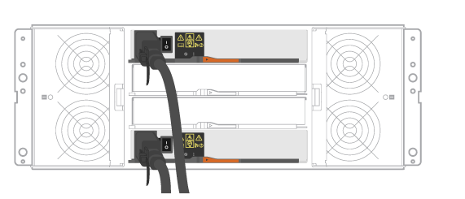

= Conecte los cables de alimentación: E5724, EF570, EF280, E2812, E2824, DE212C y DE224C
:allow-uri-read: 
:icons: font
:imagesdir: ../media/

[role="lead"]
Aprenda a conectar los cables de alimentación y a encender las bandejas de unidades.

.Antes de empezar
* Instale el hardware.
* Tome precauciones antiestáticas.

Este procedimiento se aplica a los estantes de unidades IOM12, IOM12B e IOM12C.

NOTE: Los módulos IOM12C solo son compatibles con SANtricity OS 11.90R3 en adelante. Asegúrese de que el firmware de la controladora se haya actualizado antes de instalar o actualizar a un IOM12C.

NOTE: Este procedimiento se aplica a intercambios o sustituciones similares de IOM en caliente. Esto significa que sólo puede sustituir un módulo IOM12 por otro módulo IOM12 o sustituir un módulo IOM12C por otro módulo IOM12C. (Su bandeja puede tener dos módulos IOM12 o dos IOM12C).

.Pasos
. Conecte el cable de las bandejas.
+
Conecte los cables del sistema según su configuración. Si necesita más opciones de cableado que los ejemplos mostrados, consulte link:../install-hw-cabling/index.html["Cableado"].

+
Para los ejemplos mostrados, necesita los siguientes cables:

+
|===

 a| 
image:../media/sas_cable.png["Cable SAS"]
 a| 
*Cables SAS*

|===
+
.Ejemplo A: Bandeja de controladoras E5700 con tres bandejas de discos DE212C/DE224 en una configuración SAS estándar.
image:../media/example_a_28_57.png["Controlador E5700 en una configuración SAS"]

+
.. Conecte la controladora A al IOM A de la primera bandeja de unidades.
.. Conecte el cable IOM A de la primera bandeja de unidades al IOM A de la segunda bandeja de unidades.
.. Cablee IOM A de la segunda bandeja de unidades con el IOM A de la tercera bandeja de unidades.
.. Conecte la controladora B al IOM B de la tercera bandeja de unidades.
.. Cablee el IOM B de la segunda bandeja de unidades con el IOM B de la tercera bandeja de unidades.
.. Conecte el cable IOM B de la primera bandeja de unidades al IOM B de la segunda bandeja de unidades.

+
.Ejemplo B: Una bandeja de controladoras E5700 con una bandeja de discos DE212C/DE224 en una configuración SAS estándar.

+
.. Conecte el cable de la controladora A al IOM A.
.. Conecte el cable de la controladora B al IOM B.

. Encienda las bandejas de unidades.
+
Necesita los siguientes cables:

+
|===

 a| 
image:../media/power_cable_inst-hw-e2800-e5700.png["Cables de alimentación"]
 a| 
*Cables de alimentación*

|===
+

CAUTION: Confirme que los interruptores de alimentación de la bandeja de unidades están apagados.

+
.. Conecte los dos cables de alimentación de cada bandeja a diferentes unidades de distribución de alimentación (PDU) en el armario o rack.
.. Si tiene bandejas de unidades, encienda primero sus dos switches de alimentación. Espere 2 minutos antes de aplicar alimentación a la bandeja de controladoras.
.. Encienda los dos switches de alimentación de la bandeja de controladoras.
.. Compruebe los LED y la pantalla de siete segmentos de cada controladora.
+
Durante el arranque, la pantalla de siete segmentos muestra la secuencia de repetición del SO, SD, en blanco para indicar que el controlador está realizando el procesamiento de comienzo del día. Una vez arrancada la controladora, se muestra el ID de bandeja.

+
|===

 a| 
*Ejemplo: Las conexiones de alimentación están en la parte trasera del estante.* image:../media/trafford_power.png["Conexiones de alimentación de la bandeja"]

|===

