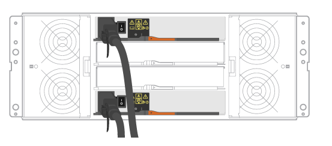

= Conecte el cable de las bandejas
:allow-uri-read: 
:icons: font
:imagesdir: ../media/

[role="lead"]
Aprenda a conectar los cables de alimentación y a encender las bandejas de unidades.

.Antes de empezar
* Instale el hardware.
* Tome precauciones antiestáticas.

Este procedimiento se aplica a las bandejas de mando IOM12 e IOM12B.

NOTE: Los módulos IOM12B sólo se admiten en SANtricity OS 11.70.2 en adelante. Asegúrese de que el firmware de la controladora se haya actualizado antes de instalar o actualizar a un IOM12B.

NOTE: Este procedimiento se aplica a intercambios o sustituciones similares de IOM en caliente. Esto significa que sólo puede sustituir un módulo IOM12 por otro módulo IOM12 o sustituir un módulo IOM12B por otro módulo IOM12B. (Su bandeja puede tener dos módulos IOM12 o dos IOM12B).

.Pasos
. Conecte el cable de las bandejas.
+
Conecte los cables del sistema según su configuración. Si necesita más opciones de cableado que los ejemplos que se muestran en esta sección, consulte link:../install-hw-cabling/index.html["Cableado"].

+
Para los ejemplos que se muestran en esta sección, necesita los siguientes cables:

+
|===

 a| 
image:../media/sas_cable.png[""]
 a| 
*Cables SAS*

|===
+
.Ejemplo A: Una bandeja de controladoras E2860 con dos bandejas de discos DE460C en una configuración SAS estándar.

+
.. Conecte la controladora A al IOM A de la primera bandeja de unidades.
.. Conecte el cable IOM A de la primera bandeja de unidades al IOM A de la segunda bandeja de unidades.
.. Conecte el cable IOM B de la primera bandeja de unidades al IOM B de la segunda bandeja de unidades.
.. Conecte la controladora B al IOM B de la segunda bandeja de unidades.

+
.Ejemplo B: Una bandeja de controladoras E2860 con una bandeja de discos DE460C en una configuración SAS estándar.
image:../media/example_b_2860.png[""]

+
.. Conecte el cable de la controladora A al IOM A.
.. Conecte el cable de la controladora B al IOM B.

. Encienda las bandejas de unidades.
+
Necesita los siguientes cables:

+
|===

 a| 
image:../media/power_cable_inst-hw-e2800-e5700.png[""]
 a| 
*Cables de alimentación*

|===
+

CAUTION: Confirme que los interruptores de alimentación de la bandeja de unidades están apagados.

+
.. Conecte los dos cables de alimentación de cada bandeja a diferentes unidades de distribución de alimentación (PDU) en el armario o rack.
.. Si tiene bandejas de unidades, encienda primero sus dos switches de alimentación. Espere 2 minutos antes de aplicar alimentación a la bandeja de controladoras.
.. Encienda los dos switches de alimentación de la bandeja de controladoras.
.. Compruebe los LED y la pantalla de siete segmentos de cada controladora.
+
Durante el arranque, la pantalla de siete segmentos muestra la secuencia de repetición del SO, SD, en blanco para indicar que el controlador está realizando el procesamiento de comienzo del día. Una vez arrancada la controladora, se muestra el ID de bandeja.

+
|===

 a| 
*Ejemplo: Las conexiones de alimentación se encuentran en la parte posterior del estante.*image:../media/trafford_power.png[""]

|===

