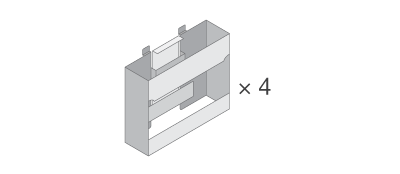

= Preparación de la instalación
:allow-uri-read: 
:icons: font
:imagesdir: ../media/

[role="lead"]
Aprenda a preparar la instalación de su sistema de almacenamiento serie E2860, E5760 o DE460.

.Pasos
. Cree una cuenta y registre su hardware en http://mysupport.netapp.com/["Soporte de NetApp"^].
. Asegúrese de que los siguientes elementos están en la caja que ha recibido.
+
|===

 a| 
image:../media/trafford_overview.png["Bandeja con unidades instaladas y panel frontal"]
 a| 
Hardware para estante, bisel y montaje en rack

 a| 

 a| 
Asas de bandeja x4

|===
+
En la siguiente tabla se identifican los tipos de cables que pueden recibir. Si recibe un cable que no aparece en la tabla, consulte https://hwu.netapp.com/["Hardware Universe"^] para localizar el cable e identificar su uso.

+
|===
| Tipo de conector | Tipo de cable | Uso 

 a| 

 a| 
Cables Ethernet

(si se solicita)
 a| 
Conexión de gestión

 a| 
image:../media/cable_io_inst-hw-e2800-e5700.png["Cables I/O."]
 a| 
Cables I/O.

(si se solicita)
 a| 
Cableado de los hosts de datos

 a| 
image:../media/cable_power_inst-hw-e2800-e5700.png["Cables de alimentación"]
 a| 
Cables de alimentación

x2 por bandeja

(si se solicita)
 a| 
Encienda el sistema de almacenamiento

 a| 
image:../media/sas_cable.png["Cables SAS"]
 a| 
Cables SAS (incluidos solo con las bandejas de unidades)
 a| 
Cableado de las bandejas

|===
. Asegúrese de proporcionar los siguientes elementos.
+
|===

 a| 
image:../media/screwdriver_inst-hw-e2800-e5700.png["Destornillador Phillips número 2"]
 a| 
Destornillador Phillips número 2

 a| 
image:../media/flashlight_inst-hw-e2800-e5700.png["Linterna"]
 a| 
Linterna

 a| 
image:../media/wrist_strap_inst-hw-e2800-e5700.png["Correa ESD"]
 a| 
Correa ESD

 a| 
image:../media/4u_dummy.png["Rack 4U"]
 a| 
Espacio en rack de 4 U: Un espacio estándar de 19 pulgadas (48.30 cm) rack para montar bandejas 4U con las siguientes dimensiones.

*Profundidad*: 38.25 pulg. (97.16 cm)

*Anchura*: 17.66 pulg. (44.86 cm)

* Altura*: 6.87 pulg. (17.46 cm)

* Peso máximo*: 113 kg (250 lb)

 a| 
image:../media/management_station_inst-hw-e2800-e5700_g60b3.png["Estación de gestión con explorador compatible para software de gestión"]
 a| 
Un navegador compatible para el software de gestión:

** Google Chrome (versión 89 y posteriores)
** Microsoft Edge (versión 90 y posteriores)
** Mozilla Firefox (versión 80 y posteriores)
** Safari (versión 14 y posteriores)

|===

