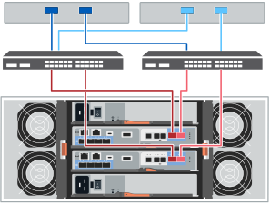

= Configuración completa del sistema de almacenamiento (E4060)
:allow-uri-read: 
:icons: font
:imagesdir: ../media/

[role="lead"]
Aprenda a conectar las controladoras a la red y a completar la instalación y la configuración del sistema de almacenamiento.

== Paso 1: Conectar los hosts de datos

Conecte los cables del sistema según la topología de red.

[role="tabbed-block"]
====
.Opción 1: Topología de conexión directa
--
El siguiente ejemplo muestra el cableado hacia los hosts de datos mediante una topología de conexión directa.

image:../media/drw_e4060_direct_topology_ieops-2048.svg["E4060 Topología directa, width=1000px"]

. Conecte cada adaptador de host directamente a los puertos de host e0a y e0b de las controladoras.

--
.Opción 2: Topología de estructura
--
El siguiente ejemplo muestra el cableado hacia los hosts de datos mediante una topología de estructura.

. Conecte cada adaptador de host directamente al conmutador.
. Conecte cada switch directamente a los puertos de host e0a y e0b de las controladoras.

--
====

== Paso 2: Conecte y configure la conexión de administración

Es posible configurar los puertos de gestión de la controladora con un servidor DHCP o una dirección IP estática.

[role="tabbed-block"]
====
.Opción 1: Servidor DHCP
--
Aprenda a configurar los puertos de gestión con un servidor DHCP.

.Antes de empezar
* Configure el servidor DHCP para asociar una dirección IP, una máscara de subred y la dirección de puerta de enlace como arrendamiento permanente para cada controladora.
* Obtenga las direcciones IP asignadas para conectarse con el sistema de almacenamiento del administrador de la red.

.Pasos
. Conecte un cable Ethernet al puerto de gestión de cada controladora y conecte el otro extremo a la red.
+
Las siguientes figuras muestran ejemplos de la ubicación del puerto de gestión de la controladora:

+
image:../media/e4000_management_port.png["Puerto de gestión de la controladora E4000"]

. Abra un explorador y conéctese al sistema de almacenamiento mediante una de las direcciones IP de controladora que proporcionó el administrador de red.

--
.Opción 2: Dirección IP estática
--
Aprenda a configurar los puertos de gestión de forma manual. Para ello, introduzca la dirección IP y la máscara de subred.

.Antes de empezar
* Obtenga del administrador de red la dirección IP, la máscara de subred, la dirección de puerta de enlace y la información del servidor DNS y NTP.
* Asegúrese de que el portátil que está utilizando no está recibiendo la configuración de red de un servidor DHCP.

.Pasos
. Utilice un cable Ethernet para conectar el puerto de gestión De la controladora A al puerto Ethernet de un portátil.
+
image:../media/e4000_management_port.png["Puerto de gestión de la controladora E4000"]

. Abra un explorador y utilice la dirección IP predeterminada (169.254.128.101) para establecer una conexión con la controladora. La controladora envía de nuevo un certificado autofirmado. El explorador le informa de que la conexión no es segura.
. Siga las instrucciones del navegador para continuar e iniciar SANtricity System Manager. Si no puede establecer una conexión, compruebe que no esté recibiendo la configuración de red de un servidor DHCP.
. Defina la contraseña del sistema de almacenamiento para iniciar sesión.
. Utilice los ajustes de red proporcionados por el administrador de red en el asistente *Configurar configuración de red* para configurar los ajustes de red del controlador A y, a continuación, seleccione *Finalizar*.
+

NOTE: Debido al restablecimiento de la dirección IP, System Manager pierde la conexión con la controladora.

. Desconecte el cable ethernet del sistema de almacenamiento y conecte el puerto de gestión de la controladora A a la red.
. Abra un explorador en un equipo conectado a la red e introduzca la dirección IP recientemente configurada de la controladora A.
+

NOTE: Si pierde la conexión a la controladora A, puede conectar un cable ethernet a la controladora B para restablecer la conexión a la controladora A a través de la controladora B (169.254.128.102).

. Inicie sesión con la contraseña que ha configurado anteriormente.
+
Se mostrará el asistente Configure Network Settings.

. Utilice los ajustes de red proporcionados por el administrador de red en el asistente *Configurar configuración de red* para configurar los ajustes de red del controlador B y, a continuación, seleccione *Finalizar*.
. Conecte el controlador B a la red.
. Valide la configuración de red de la controladora B introduciendo la dirección IP recientemente configurada de la controladora B en un explorador.
+

NOTE: Si se pierde la conexión con la controladora B, puede utilizar la conexión validada previamente a la controladora A para restablecer la conexión a la controladora B a través de la controladora A.

--
====

== Paso 3: Configure y gestione el sistema de almacenamiento

Después de instalar el hardware, use el software SANtricity para configurar y gestionar el sistema de almacenamiento.

.Antes de empezar
* Configure los puertos de gestión.
* Verifique y registre su contraseña y direcciones IP.

.Pasos
. Use el software SANtricity para configurar y gestionar las cabinas de almacenamiento.
. En la configuración de red más simple, conecte la controladora a un explorador web y utilice el administrador del sistema de SANtricity para gestionar una sola cabina de almacenamiento serie E4000. Para acceder a System Manager, utilice las mismas direcciones IP que se usaron para configurar los puertos de gestión.

