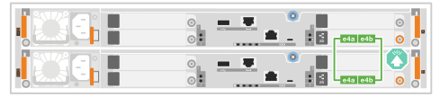
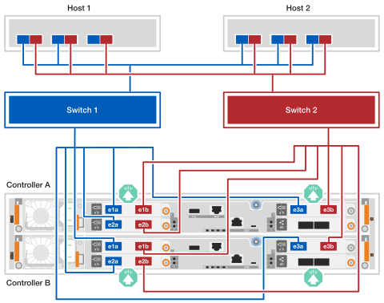

= Cablea el hardware - EF50 y EF80
:allow-uri-read: 
:icons: font
:imagesdir: ../media/

[role="lead"]
Después de instalar el hardware de tu sistema de almacenamiento EF50 o EF80, conecta el cableado para la replicación entre controladores y las conexiones de red del host. (Los puertos de administración se cablean más adelante, en la sección de configuración completa del sistema de almacenamiento.)

.Acerca de esta tarea
* El término _I/O module_ se utiliza para referirse a las tarjetas de interfaz del host (HIC) en este procedimiento.
* Los gráficos de cableado tienen iconos de flechas que muestran la orientación correcta (arriba o abajo) de la lengüeta del conector del cable al insertar un conector en un puerto.
+
Al insertar el conector, deberías sentir que encaja en su sitio; si no lo sientes, retíralo, dale la vuelta e inténtalo de nuevo.

+
image:../media/drw_cable_pull_tab_direction_ieops-1699.svg["Dirección de la lengüeta de tracción del cable"]

== Paso 1: cablea las conexiones de duplicación entre controladores

Conecta los controladores entre sí para habilitar la duplicación entre controladores. Las conexiones de duplicación entre controladores aseguran la redundancia total del sistema y se usan para la duplicación de caché y el envío de I/O. El cableado es el mismo para los sistemas de almacenamiento EF50 y EF80.

NOTE: No importa la velocidad de los módulos de E/S de duplicación entre controladores instalados en tu sistema de almacenamiento (100 GbE o 200 GbE, según lo admita tu sistema de almacenamiento), usas los cables de 200 GbE incluidos. Si la velocidad de los módulos de E/S de duplicación entre controladores es 100 GbE, la conexión funciona a la velocidad más baja (100 GbE).

.Pasos
. Conecta los controladores entre sí:
+
.. Cablea el puerto e4a del controlador A al puerto e4a del controlador B.
.. Cablea el puerto e4b del controlador A al puerto e4b del controlador B.
+
*cables Ethernet de 200 GbE*

+
image::../media/oie_cable100_gbe_qsfp28.png[cable ethernet 100 gbe usado para conexiones de mirroring]

+

== Paso 2: Cablea las conexiones del host

Conecta las conexiones del host de tu sistema de almacenamiento según tu topología de red: conexión directa o conexión en red.

.Acerca de esta tarea
* Dependiendo del modelo de tu sistema de almacenamiento, el tipo de módulos de E/S de host instalados en el sistema de almacenamiento puede ser Ethernet o Fibre Channel (FC). Los ejemplos de cableado en este procedimiento muestran ambos tipos de módulos de E/S de host como los admiten los modelos de sistemas de almacenamiento.
* Los ejemplos de cableado no muestran los HBA FC de 64 Gb y 4 puertos en el host 1 y el host 2; sin embargo, si tienes estos instalados, conecta cada puerto alterno de la misma manera que se muestra para los HBA de 2 puertos.

[role="tabbed-block"]
====
.Topología de conexión directa
--
Los siguientes ejemplos muestran cómo cablear un sistema de almacenamiento a los hosts usando una topología de conexión directa.

.EF50 con dos módulos de E/S FC de 64Gb y 4 puertos
[%collapsible]
=====
.Acerca de esta tarea
* El ejemplo de cableado muestra módulos de E/S de host en las ranuras 1 y 2. Este es el número máximo de módulos de E/S de host admitidos para el sistema de almacenamiento EF50. Sin embargo, solo es necesario el módulo de E/S de host en la ranura 1; el módulo de E/S de host en la ranura 2 es opcional.
+
Si tu sistema de almacenamiento tiene un módulo de E/S de host instalado, puedes ignorar el cableado al módulo de E/S de host adicional y solo cablear al módulo de E/S de host instalado.

* Un sistema de almacenamiento de conexión directa tiene dos rutas separadas para la redundancia: ruta A y ruta B.
+
** La conectividad de la ruta A se muestra con cableado azul y puertos azules en los hosts y controladores. Conecta los puertos HBA de cada host a los puertos a y c del controlador A.
** La conectividad de la ruta B se muestra con cableado rojo y puertos rojos en los hosts y controladores. Conecta los puertos HBA de cada host a los puertos a y c del controlador B.

* Aunque el ejemplo de cableado muestra los puertos a y c del módulo de E/S conectados a los hosts, puedes usar los puertos a y b o los puertos c y d.

.Pasos
. Cablea los hosts a los controladores:
+
.. Cablea los puertos HBA de la ruta A (azul) del host 1 a los puertos a (1a y 2a) del controlador A.
.. Cablea los puertos HBA de la ruta B (roja) del host 1 a los puertos a (1a y 2a) del controlador B.
.. Cablea los puertos HBA de la ruta A (azul) del host 2 a los puertos c (1c y 2c) del controlador A.
.. Cablea los puertos HBA de la ruta B (roja) del host 2 a los puertos c (1c y 2c) del controlador B.
+
*cables FC de 64 Gb/s*

+
image:../media/oie_cable_sfp_gbe_copper.png["cable fc de 64 Gb"]

+
image:../media/drw_ef50_4p_64gb_fc_2hic_direct_ieops-2670.svg["EF50 topología de conexión directa a hosts usando dos módulos fc io de 4 puertos y 64gb"]

=====
.EF80 con tres módulos de E/S de 2 puertos 200 GbE
[%collapsible]
=====
.Acerca de esta tarea
* El ejemplo de cableado muestra módulos de E/S de host en las ranuras 1, 2 y 3. Este es el número máximo de módulos de E/S de host admitidos para el sistema de almacenamiento EF80. Sin embargo, solo es necesario el módulo de E/S de host en la ranura 1; los módulos de E/S de host en la ranura 2 y la ranura 3 son opcionales.
+
Si tu sistema de almacenamiento tiene menos módulos de E/S de host instalados, puedes ignorar el cableado a los módulos de E/S de host adicionales y solo cablear a los módulos de E/S de host instalados.

* Un sistema de almacenamiento de conexión directa tiene dos rutas separadas para la redundancia: ruta A y ruta B.
+
** La conectividad de la ruta A se muestra con cableado azul y puertos azules en los hosts y controladores. Conecta los puertos HBA de cada host a los puertos a y b del controlador A.
** La conectividad de la ruta B se muestra con cableado rojo y puertos rojos en los hosts y controladores. Conecta los puertos HBA de cada host a los puertos a y b del controlador B.

.Pasos
. Cablea los hosts a los controladores:
+
.. Cablea los puertos HBA de la ruta A (azul) del host 1 a los puertos a del controlador A (e1a, e2a y e3a).
.. Cablea los puertos HBA de la ruta B (roja) del host 1 a los puertos a del controlador B (e1a, e2a y e3a).
.. Cablea los puertos HBA de la ruta A (azul) del host 2 a los puertos b del controlador A (e1b, e2b y e3b).
.. Cablea los puertos HBA de la ruta B (roja) del host 2 a los puertos b del controlador B (e1b, e2b y e3b).
+
*cables de 200 GbE*

+
image::../media/oie_cable_sfp_gbe_copper.png[cable de 200 GbE]

+
image:../media/drw_ef80_2p_200gbe_ib_3hic_direct_ieops-2680.svg["EF80 topología de conexión directa a hosts usando tres módulos ib io de 2 puertos 200gbe"]

=====
.EF80 con tres módulos de E/S FC de 64Gb y 4 puertos
[%collapsible]
=====
.Acerca de esta tarea
* El ejemplo de cableado muestra módulos de E/S de host en las ranuras 1, 2 y 3. Este es el número máximo de módulos de E/S de host admitidos para el sistema de almacenamiento EF80. Sin embargo, solo es necesario el módulo de E/S de host en la ranura 1; los módulos de E/S de host en la ranura 2 y la ranura 3 son opcionales.
+
Si tu sistema de almacenamiento tiene menos módulos de E/S de host instalados, puedes ignorar el cableado a los módulos de E/S de host adicionales y solo cablear a los módulos de E/S de host instalados.

* Un sistema de almacenamiento de conexión directa tiene dos rutas separadas para la redundancia: ruta A y ruta B.
+
** La conectividad de la ruta A se muestra con cableado azul y puertos azules en los hosts y controladores. Conecta los puertos HBA de cada host a los puertos a y c del controlador A.
** La conectividad de la ruta B se muestra con cableado rojo y puertos rojos en los hosts y controladores. Conecta los puertos HBA de cada host a los puertos a y c del controlador B.

* Aunque el ejemplo de cableado muestra los puertos a y c del módulo de E/S conectados a los hosts, puedes usar los puertos a y b o los puertos c y d.

.Pasos
. Cablea los hosts a los controladores:
+
.. Cablea los puertos HBA de la ruta A (azul) del host 1 a los puertos a del controlador A (1a, 2a y 3a).
.. Cablea los puertos HBA de la ruta B (roja) del host 1 a los puertos a del controlador B (1a, 2a y 3a).
.. Cablea los puertos HBA de la ruta A (azul) del host 2 a los puertos c del controlador A (1c, 2c y 3c).
.. Cablea los puertos HBA de la ruta B (roja) del host 2 a los puertos c del controlador B (1c, 2c y 3c).
+
*cables FC de 64 Gb/s*

+
image:../media/oie_cable_sfp_gbe_copper.png["cable fc de 64 Gb"]

+
image:../media/drw_ef80_4p_64gb_fc_3hic_direct_ieops-2674.svg["EF80 topología de conexión directa a hosts usando tres módulos fc io de 4 puertos y 64gb"]

=====
--
.Topología conectada a la estructura
--
Los siguientes ejemplos muestran el cableado de un sistema de almacenamiento a los hosts usando una topología conectada a la estructura.

.EF50 con dos módulos de E/S FC de 64Gb y 4 puertos
[%collapsible]
=====
.Acerca de esta tarea
* El ejemplo de cableado muestra módulos de E/S de host en las ranuras 1 y 2. Este es el número máximo de módulos de E/S de host admitidos para el sistema de almacenamiento EF50. Sin embargo, solo es necesario el módulo de E/S de host en la ranura 1; el módulo de E/S de host en la ranura 2 es opcional.
+
Si tu sistema de almacenamiento tiene un módulo de E/S de host instalado, puedes ignorar el cableado al módulo de E/S de host adicional y solo cablear al módulo de E/S de host instalado.

* Un sistema de almacenamiento conectado a una estructura tiene dos rutas de conmutación separadas para redundancia: switch 1 path y switch 2 path.
+
** La conectividad de la ruta del switch 1 se muestra con cableado azul y puertos azules en los hosts y controladores. Conecta los puertos HBA de cada host a través del switch 1 a los puertos a y c de controller A y de controller B.
** La conectividad de la ruta del switch 2 se muestra con cableado rojo y puertos rojos en los hosts y controladores. Conecta los puertos HBA de cada host a través del switch 2 a los puertos b y d de controller A y controller B.

.Pasos
. Conecta los hosts a los conmutadores.
+
Puedes usar cualquier puerto en los switches.

+
.. Cablea los puertos HBA de la ruta del switch 1 (azul) del host 1 y del host 2 al switch 1.
.. Cablea los puertos HBA de la ruta (roja) del host 1 y del host 2 al switch 2.

. Conecta los switches a los controladores:
+
.. Cablea el switch 1 (azul) a los puertos a y c del controlador A (1a, 2a, 1c y 2c).
.. Cablea el switch 1 (azul) a los puertos a y c del controlador B (1a, 2a, 1c y 2c).
.. Conecta el switch 2 (rojo) a los puertos b y d del controlador A (1b, 2b, 1d y 2d).
.. Cablea el switch 2 (rojo) a los puertos b y d del controlador B (1b, 2b, 1d y 2d).
+
*cables FC de 64 Gb/s*

+
image:../media/oie_cable_sfp_gbe_copper.png["cable fc de 64 Gb"]

+
image:../media/drw_ef50_4p_64gb_fc_2hic_fabric_ieops-2673.svg["Topología EF50 conectada al fabric usando dos módulos fc io de 4 puertos y 64gb"]

=====
.EF80 con tres módulos de E/S de 2 puertos 200 GbE
[%collapsible]
=====
.Acerca de esta tarea
* El ejemplo de cableado muestra módulos de E/S de host en las ranuras 1, 2 y 3. Este es el número máximo de módulos de E/S de host admitidos para el sistema de almacenamiento EF80. Sin embargo, solo es necesario el módulo de E/S de host en la ranura 1; los módulos de E/S de host en la ranura 2 y la ranura 3 son opcionales.
+
Si tu sistema de almacenamiento tiene menos módulos de E/S de host instalados, puedes ignorar el cableado a los módulos de E/S de host adicionales y solo cablear a los módulos de E/S de host instalados.

* El ejemplo de cableado muestra tres HBAs en cada host. Si tus hosts tienen menos de tres HBAs, puedes ignorar el cableado a los HBAs adicionales y solo cablear a los HBAs instalados.
* Un sistema de almacenamiento conectado a una estructura tiene dos rutas de conmutación separadas para redundancia: switch 1 path y switch 2 path.
+
** La conectividad de la ruta del switch 1 se muestra con cableado azul y puertos azules en los hosts y controladores. Conecta los puertos HBA de cada host a través del switch 1 a los puertos a de los controladores A y B.
** La conectividad de la ruta del switch 2 se muestra con cableado rojo y puertos rojos en los hosts y controladores. Conecta los puertos HBA de cada host a través del switch 2 a los puertos b del controlador A y del controlador B.

.Pasos
. Conecta los hosts a los conmutadores:
+
Puedes usar cualquier puerto en los switches.

+
.. Cablea los puertos HBA de la ruta del switch 1 (azul) del host 1 y del host 2 al switch 1.
.. Cablea los puertos HBA de la ruta (roja) del host 1 y del host 2 al switch 2.

. Conecta los switches a los controladores:
+
.. Cablea el switch 1 (azul) a los puertos a del controlador A (e1a, e2a y e3a).
.. Conecta el switch 1 (azul) a los puertos a del controlador B (e1a, e2a y e3a).
.. Cablea el switch 2 (rojo) a los puertos b del controlador A (e1b, e2b y e3b).
.. Cablea el switch 2 (rojo) a los puertos b del controlador B (e1b, e2b y e3b).
+
*cables de 200 GbE*

+
image::../media/oie_cable_sfp_gbe_copper.png[cable de 200 GbE]

+

=====
.EF80 con tres módulos de E/S FC de 64Gb y 4 puertos
[%collapsible]
=====
.Acerca de esta tarea
* El ejemplo de cableado muestra módulos de E/S de host en las ranuras 1, 2 y 3. Este es el número máximo de módulos de E/S de host admitidos para el sistema de almacenamiento EF80. Sin embargo, solo es necesario el módulo de E/S de host en la ranura 1; los módulos de E/S de host en la ranura 2 y la ranura 3 son opcionales.
+
Si tu sistema de almacenamiento tiene menos módulos de E/S de host instalados, puedes ignorar el cableado a los módulos de E/S de host adicionales y solo cablear a los módulos de E/S de host instalados.

* El ejemplo de cableado muestra tres HBAs en cada host. Si tus hosts tienen menos de tres HBAs, puedes ignorar el cableado a los HBAs adicionales y solo cablear a los HBAs instalados.
* Un sistema de almacenamiento conectado a una estructura tiene dos rutas de conmutación separadas para redundancia: switch 1 path y switch 2 path.
+
** La conectividad de la ruta del switch 1 se muestra con cableado azul y puertos azules en los hosts y controladores. Conecta los puertos HBA de cada host a través del switch 1 a los puertos a y c de controller A y de controller B.
** La conectividad de la ruta del switch 2 se muestra con cableado rojo y puertos rojos en los hosts y controladores. Conecta los puertos HBA de cada host a través del switch 2 a los puertos b y d de controller A y controller B.

.Pasos
. Conecta los hosts a los conmutadores:
+
Puedes usar cualquier puerto en los switches.

+
.. Cablea los puertos HBA de la ruta del switch 1 (azul) del host 1 y del host 2 al switch 1.
.. Cablea los puertos HBA de la ruta (roja) del host 1 y del host 2 al switch 2.

. Conecta los switches a los controladores:
+
.. Cablea el switch 1 (azul) a los puertos a y c del controlador A (1a, 2a, 3a, 1c, 2c y 3c).
.. Cablea el switch 1 (azul) a los puertos a y c del controlador B (1a, 2a, 3a, 1c, 2c y 3c).
.. Cablea el switch 2 (rojo) a los puertos b y d del controlador A (1b, 2b, 3b, 1d, 2d y 3d).
.. Cablea el switch 2 (rojo) a los puertos b y d del controlador B (1b, 2b, 3b, 1d, 2d y 3d).
+
*cables FC de 64 Gb/s*

+
image:../media/oie_cable_sfp_gbe_copper.png["cable fc de 64 Gb"]

+
image:../media/drw_ef80_4p_64gb_fc_3hic_fabric_ieops-2675.svg["Topología EF80 fabric-attached usando tres módulos fc io de 4 puertos y 64gb"]

=====
--
====
.El futuro
Después de cablear la duplicación entre controladores y las conexiones de host para tu sistema de almacenamiento, link:install-power-hardware.html["enciende tu sistema de almacenamiento"].
