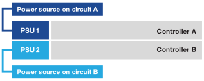

= Enciende el hardware de los sistemas de almacenamiento EF50 y EF80
:allow-uri-read: 
:icons: font
:imagesdir: ../media/

[role="lead"]
Después de cablear tu sistema de almacenamiento EF50 o EF80, enciende los bastidores, asigna los identificadores de bastidor (si corresponde) y enciende los controladores.

.Antes de empezar
Tome precauciones antiestáticas.

[[step-1-power-on-the-shelves-and-assign-shelf-ids]]
== Paso 1: Enciende las estanterías y asigna los IDs de estantería

Enciende las bandejas y luego asigna un identificador único a cada bandeja.

.Acerca de esta tarea
* Asignar un identificador único a cada bandeja garantiza que la bandeja sea distinta dentro de tu sistema de almacenamiento.
+
Un ID de bandeja válido es del 01 al 99.

+
A los estantes internos (de almacenamiento), que están integrados en los controladores, se les asigna un identificador de estante fijo de 00.

* Debes reiniciar la bandeja (apaga el interruptor de alimentación de cada una de las fuentes de alimentación de la bandeja SAS, espera al menos 10 segundos y luego vuelve a encenderla) para que el ID de la bandeja surta efecto.

.Pasos
. Enciende el armario conectando primero los cables de alimentación al armario, asegurándolos en su lugar con el sujetacables, conectando los cables de alimentación a fuentes de energía en circuitos diferentes y luego encendiendo el interruptor de encendido de cada una de las fuentes de alimentación (en la parte trasera del armario).
+
La estantería se enciende y arranca automáticamente cuando se enciende.

. Retira la tapa del extremo izquierdo para acceder al botón naranja de identificación del estante situado en la placa frontal.
+
image::../media/drw_shelf_id_sas_ieops-2187.svg[Cambiar el ID de shelf SAS]

+
[cols="20%,80%"]
|===

 a| 
image::../media/icon_round_1.png[Llamada número 1]
 a| 
Tapa de extremo de la bandeja

 a| 
image::../media/icon_round_2.png[Llamada número 2]
 a| 
Placa frontal del estante

 a| 
image::../media/icon_round_3.png[[Nota al pie n.º 3]
 a| 
Botón de identificación de estante

 a| 
image::../media/icon_round_4.png[[Nota al pie n.º 4]
 a| 
Número de identificación de la bandeja

|===
. Cambia el primer número del identificador de bandeja:
+
.. Mantén pulsado el botón de identificación del estante hasta que parpadee el primer número de la pantalla digital y luego suelta el botón.
+
El número puede tardar hasta 15 segundos en parpadear. Esto activa el modo de programación del shelf ID.

+

NOTE: Si el ID tarda más de 15 segundos en parpadear, mantén presionado el botón de identificación de la bandeja nuevamente, asegurándote de presionarlo hasta el fondo.

.. Pulsa y suelta el botón de identificación del estante para que el número vaya cambiando hasta que llegues al número deseado, del 0 al 9.
+
Cada pulsación y cada liberación pueden durar tan solo un segundo.

+
El primer número sigue parpadeando.

. Cambia el segundo número del identificador de shelf:
+
.. Mantén pulsado el botón hasta que el segundo número de la pantalla digital parpadee.
+
El número puede tardar hasta tres segundos en parpadear.

+
El primer número de la pantalla digital deja de parpadear.

.. Pulsa y suelta el botón de identificación del estante para que el número vaya cambiando hasta que llegues al número deseado, del 0 al 9.
+
El segundo número sigue parpadeando.

. Fija el número deseado y sal del modo de programación manteniendo pulsado el botón de identificación del estante hasta que el segundo número deje de parpadear.
+
El número puede tardar hasta tres segundos en dejar de parpadear.

+
Ambos números de la pantalla digital empiezan a parpadear y el LED ámbar se enciende al cabo de unos cinco segundos, alertándote de que el identificador de bandeja pendiente aún no ha entrado en vigor.

. Apaga y vuelve a encender la bandeja durante al menos 10 segundos para que el identificador de la bandeja surta efecto.
+
.. Apaga el interruptor de encendido de cada una de las fuentes de alimentación.
.. Espera 10 segundos.
.. Enciende el interruptor de encendido de cada una de las fuentes de alimentación para completar el ciclo de encendido.
+
Cuando se enciende una fuente de alimentación, el LED bicolor debería iluminarse en verde.

. Vuelve a colocar la tapa del extremo izquierdo.

[[step-2-power-on-the-controllers]]
== Paso 2: enciende los controladores

Una vez que hayas encendido las estanterías y les hayas asignado identificadores únicos, enciende los controladores.

. Enchufa un cable de alimentación en cada fuente de alimentación del controlador y luego conéctalos a fuentes de alimentación en circuitos diferentes.
+

NOTE: Si estás usando unidades de distribución de alimentación (PDU) de terceros, no uses tomas de corriente directamente detrás de los controladores porque podrías bloquear el acceso a los controladores.

+
*Cables de alimentación*

+

+

+
** El sistema comienza a arrancar. El arranque inicial puede tardar hasta ocho minutos.
** Los LED del chasis del sistema parpadean y los ventiladores se ponen en marcha, lo que indica que los controladores se están encendiendo.
+
Durante el arranque es normal que los ventiladores sean muy ruidosos.

** La pantalla digital en la parte frontal del chasis del sistema (detrás del frontal) no se ilumina.

. Asegura los cables de alimentación usando el dispositivo de sujeción de cada fuente de alimentación.

.El futuro
Después de encender tu sistema de almacenamiento, link:install-complete-setup.html["configuración completa del sistema de almacenamiento"].
