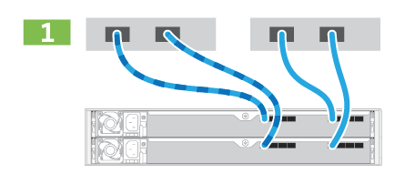

= Completar la instalación y la configuración del sistema de almacenamiento
:allow-uri-read: 
:icons: font
:imagesdir: ../media/

[role="lead"]
Descubra cómo conectar los cables de la controladora a la red y después completar la instalación y la configuración.

== Paso 1: Conectar los hosts de datos

Conecte los cables del sistema de almacenamiento según la topología de red.

=== Opción 1: Topología de conexión directa

El siguiente ejemplo muestra el cableado hacia los hosts de datos mediante una topología de conexión directa.

|===

 a| 

 a| 
. Conecte cada adaptador de host directamente a los puertos de host de las controladoras.

|===

=== Opción 2: Topología de estructura

El siguiente ejemplo muestra el cableado hacia los hosts de datos mediante una topología de estructura.

|===

 a| 
image:../media/fabric_topo.png[""]
 a| 
. Conecte cada adaptador de host directamente al conmutador.
. Conecte cada switch directamente a los puertos de host de las controladoras.

|===

== Paso 2: Conecte y configure la conexión de administración

Es posible configurar los puertos de gestión de la controladora con un servidor DHCP o una dirección IP estática.

=== Opción 1: Servidor DHCP

Aprenda a configurar los puertos de gestión con un servidor DHCP.

.Antes de empezar
* Configure el servidor DHCP para asociar una dirección IP, una máscara de subred y la dirección de puerta de enlace como arrendamiento permanente para cada controladora.
* Obtenga las direcciones IP asignadas que usará para conectarse con el sistema de almacenamiento del administrador de red.

.Pasos
. Conecte un cable Ethernet al puerto de gestión de cada controladora y conecte el otro extremo a la red.
+
|===

 a| 
image:../media/cable_ethernet_inst-hw-ef600.png[""]
 a| 
Cables Ethernet RJ-45 (si se solicita)

|===
+
|===

 a| 
En la siguiente figura, se muestra un ejemplo de la ubicación del puerto de gestión de la controladora (se muestra EF600):

 a| 
image:../media/ethernet_callout.png[""]

|===
. Abra un explorador y conéctese al sistema de almacenamiento mediante una de las direcciones IP de controladora que proporcionó el administrador de red.

=== Opción 2: Dirección IP estática

Aprenda a configurar los puertos de gestión de forma manual. Para ello, introduzca la dirección IP y la máscara de subred.

.Antes de empezar
* Obtenga al administrador de red la dirección IP, la máscara de subred, la dirección de puerta de enlace y la información del servidor DNS y NTP de las controladoras.
* Asegúrese de que el portátil que está utilizando no está recibiendo la configuración de red de un servidor DHCP.

.Pasos
. Utilice un cable Ethernet para conectar el puerto de gestión De la controladora A al puerto Ethernet de un portátil.
+

NOTE: La controladora A es el compartimento de controladoras superior y la controladora B es el compartimento inferior de controladoras.

+
|===

 a| 
image:../media/cable_ethernet_inst-hw-ef600.png[""]
 a| 
Cables Ethernet RJ-45 (si se solicita)

|===
+
|===

 a| 
En la siguiente figura, se muestra un ejemplo de la ubicación del puerto de gestión de la controladora (se muestra EF600):

 a| 
image:../media/ethernet_callout.png[""]

|===
. Abra un explorador y utilice la dirección IP predeterminada (169.254.128.101) para establecer una conexión con la controladora. La controladora envía de nuevo un certificado autofirmado. El explorador le informa de que la conexión no es segura.
+

NOTE: Para las plataformas que ejecutan SANtricity 11,60 y posterior, la máscara de subred predeterminada es 255.255.0.0.

. Siga las instrucciones del navegador para continuar e iniciar SANtricity System Manager.
+

NOTE: Si no puede establecer una conexión, compruebe que no esté recibiendo la configuración de red de un servidor DHCP.

. Defina la contraseña del sistema de almacenamiento para iniciar sesión.
. Utilice los ajustes de red proporcionados por el administrador de red en el asistente *Configurar configuración de red* para configurar los ajustes de red del controlador A y, a continuación, seleccione *Finalizar*.
+

NOTE: Debido al restablecimiento de la dirección IP, System Manager pierde la conexión con la controladora.

. Desconecte su portátil del sistema de almacenamiento y conecte el puerto De gestión de la controladora A a a su red.
. Abra un explorador en un equipo conectado a la red e introduzca la dirección IP recientemente configurada de la controladora A.
+

NOTE: Si pierde la conexión a la controladora A, puede conectar un cable ethernet a la controladora B para restablecer la conexión a la controladora A a través de la controladora B (169.254.128.102).

. Inicie sesión con la contraseña que ha configurado anteriormente.
+
Se mostrará el asistente Configure Network Settings.

. Utilice los ajustes de red proporcionados por el administrador de red en el asistente *Configurar configuración de red* para configurar los ajustes de red del controlador B y, a continuación, seleccione *Finalizar*.
. Conecte el controlador B a la red.
. Valide la configuración de red de la controladora B introduciendo la dirección IP configurada de la controladora B en un explorador.
+

NOTE: Si se pierde la conexión con la controladora B, puede utilizar la conexión validada previamente a la controladora A para restablecer la conexión a la controladora B a través de la controladora A.

== Paso 3: Configure el sistema de almacenamiento

Después de instalar el hardware EF300 o EF600, utilice el software SANtricity para configurar y gestionar el sistema de almacenamiento.

.Antes de empezar
* Configure los puertos de gestión.
* Verifique y registre su contraseña y direcciones IP.

.Pasos
. Conecte la controladora a un explorador web.
. Use el administrador del sistema de SANtricity para gestionar el sistema de almacenamiento de las series EF300 o EF600. Consulte la ayuda en línea incluida con System Manager.
+
|===

 a| 
image:../media/management_station_inst-hw-ef600_g2285.png[""]
 a| 
Para acceder a System Manager, utilice las mismas direcciones IP que se usaron para configurar los puertos de gestión.

|===

Si está cableando el EF300 para la expansión SAS, consulte link:../maintenance-ef600/index.html["Mantenimiento de hardware de EF600"] Para la instalación de la tarjeta de expansión SAS y el link:../install-hw-cabling/index.html["Cableado de hardware E-Series"] Para cableado de ampliación SAS.
