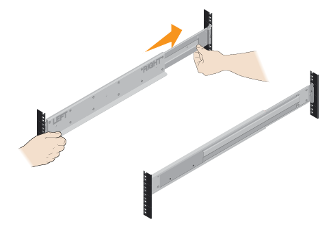

= Instale el hardware
:allow-uri-read: 
:icons: font
:imagesdir: ../media/

[role="lead"]
Puede instalar un sistema de almacenamiento EF300, EF600, EF300C o EF600C en un rack de dos puestos o un armario de sistema NetApp.

.Antes de empezar
Asegúrese de hacer lo siguiente:

* Registre su hardware en http://mysupport.netapp.com/["Soporte de NetApp"^].
* Prepare un área de trabajo plana y sin estática.
* Tome precauciones antiestáticas.

.Pasos
. Desembale el hardware.
+
.. Extraiga el contenido e haga un inventario del hardware incluido contra el recibo del embalaje.
.. Antes de continuar, lea todas las instrucciones.

. Instale los rieles.
+

NOTE: Para evitar que el equipo se caiga, instale la tornillería desde la parte inferior del bastidor o armario hasta la parte superior.

+
|===

 a| 
Si se incluyeron instrucciones con el hardware para montaje en rack, consulte ellos para aprender cómo instalar los rieles. Para obtener instrucciones adicionales para el montaje en rack, consulte link:../rackmount-hardware.html["Hardware para montaje en rack"].

 a| 

|===
. Instale la bandeja.
+
|===

 a| 
.. Si va a instalar varias bandejas, comience la instalación desde la parte inferior hasta la parte superior del armario. Coloque la parte posterior de la estantería sobre los rieles.
+

CAUTION: Al instalar la estantería, utilice un elevador de equipo con dos personas.

.. Apoye la estantería desde la parte inferior y deslícela en el armario.

 a| 
image:../media/install_ef600.png["Instale el estante en el gabinete con dos personas"]

|===
. Asegure la bandeja.
+
|===

 a| 
Para obtener más información, consulte link:../rackmount-hardware.html["Hardware para montaje en rack"].

 a| 
image:../media/secure_shelf_inst-hw-ef600.png["Fije la bandeja"]

|===
. Instale la placa frontal.
+
|===

 a| 
.. Alinee la placa frontal con el estante y encaje en su sitio.

 a| 
image:../media/install_faceplate_2_0_inst-hw-ef600.png["Instale la placa frontal"]

|===

