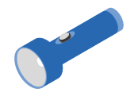

= Preparación de la instalación
:allow-uri-read: 
:icons: font
:imagesdir: ../media/

[role="lead"]
Descubra cómo preparar la instalación de su sistema de almacenamiento de las series EF300 o EF600.

.Antes de empezar
Si está realizando el cableado del EF300 para la expansión SAS, revise la siguiente información:

* link:../maintenance-ef600/sas-add-supertask-task.html["Añada tarjetas de expansión SAS"^] Para la instalación de la tarjeta de expansión SAS.
* link:../install-hw-cabling/index.html["Información general sobre el cableado"] Para cableado de ampliación SAS.

.Pasos
. Cree una cuenta y registre su hardware en http://mysupport.netapp.com/["mysupport.netapp.com"^].
. Asegúrese de que los siguientes elementos están en la caja que ha recibido.
+
|===

 a| 
image:../media/ef600_w_faceplate.png[""]
 a| 
Bandeja con unidades instaladas (bisel y tapas de cierre que se agrupan por separado)

 a| 
image:../media/superrails_inst-hw-ef600.png[""]
 a| 
Hardware para montaje en rack

|===
+
En la siguiente tabla se identifican los tipos de cables que pueden recibir. Si recibe un cable que no aparece en la tabla, consulte https://hwu.netapp.com/["Hardware Universe"] para localizar el cable e identificar su uso.

+
|===
| Tipo de conector | Tipo de cable | Uso 

 a| 
image:../media/cable_ethernet_inst-hw-ef600.png[""]
 a| 
Cables Ethernet RJ-45 (si se solicita)
 a| 
Conexión de gestión

 a| 
image:../media/cable_io_inst-hw-ef600.png[""]
 a| 
Cables de I/o (si se solicitan)
 a| 
Cableado de los hosts de datos

 a| 

 a| 
Cables de alimentación (si se solicitan)
 a| 
Encienda el sistema de almacenamiento

|===
. Asegúrese de proporcionar los siguientes elementos.
+
|===

 a| 
image:../media/screwdriver_inst-hw-ef600.png[""]
 a| 
Destornillador Phillips número 2

 a| 

 a| 
Linterna

 a| 
image:../media/wrist_strap_inst-hw-ef600.png[""]
 a| 
Correa ESD

 a| 
image:../media/2u_rackspace_inst-hw-ef600.png[""]
 a| 
Espacio en rack 2U: Un espacio estándar de 19 pulgadas (48.30 cm) en rack para colocar estanterías 2U de las siguientes dimensiones.

*Profundidad*: 19.0 pulg. (48.3 cm)

*Anchura*: 17.6 pulg. (44.7 cm)

* Altura*: 3.34 pulg. (8.48 cm)

*Bandeja*: 24 unidades

* Peso máximo*: 27.4 kg (60.5 lb)

NOTE: El uso de armarios de terceros puede provocar que los cables de alimentación restrinjan el acceso a la controladora.

 a| 
image:../media/management_station_inst-hw-ef600_g60b3.png[""]
 a| 
Un navegador compatible para el software de gestión:

** Google Chrome (versión 78 y posteriores)
** Microsoft Internet Explorer (versión 11 y posterior)
** Microsoft Edge (88 y posteriores)
** Mozilla Firefox (versión 70 y posteriores)
** Safari (versión 12 y posteriores)

|===

