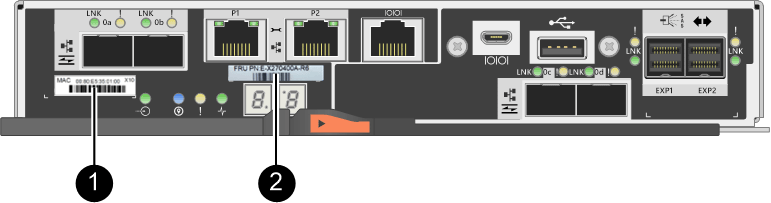

= Añada un segundo contenedor de controladora en E2800
:allow-uri-read: 
:experimental: 
:icons: font
:imagesdir: ../media/

[role="lead"]
Es posible añadir un segundo compartimento de controladoras en la cabina E2800.

.Acerca de esta tarea
En esta tarea, se describe cómo añadir un segundo contenedor de controladora a la versión simple de una bandeja de controladoras E2812, una bandeja de controladoras E2824 o una cabina flash EF280. Este procedimiento también se denomina conversión simple a doble cara, que es un procedimiento en línea. Puede acceder a los datos de la cabina de almacenamiento mientras realiza este procedimiento.

.Antes de empezar
Asegúrese de tener lo siguiente:

* Un contenedor de controladora nuevo con el mismo número de pieza que el contenedor de controladora instalado actualmente. (Consulte el paso 1 para verificar el número de pieza.)
* Una nueva HIC que es idéntica a la HIC en el contenedor de controladora instalado actualmente (solo es necesario si el contenedor de controladora instalado actualmente incluye una tarjeta de interfaz del host).
* Una muñequera ESD o tome otras precauciones antiestáticas.
* Un destornillador Phillips número 1.
* Etiquetas para identificar los cables nuevos. Para obtener información acerca del hardware compatible, consulte https://mysupport.netapp.com/NOW/products/interoperability["Matriz de interoperabilidad de NetApp"^] o la http://hwu.netapp.com/home.aspx["Hardware Universe de NetApp"^].
* Todos los cables, transceptores, switches y adaptadores de bus de host (HBA) necesarios para conectar los nuevos puertos de controladora.
* Una estación de gestión con un explorador que puede acceder a System Manager de SANtricity para la controladora. (Para abrir la interfaz de System Manager, apunte el explorador al nombre de dominio o la dirección IP de la controladora.)

== Paso 1: Verifique el número de pieza de la nueva controladora

Confirme que la nueva controladora tiene el mismo número de pieza que la controladora instalada actualmente.

.Pasos
. Desembale el nuevo contenedor del controlador y configúrelo en una superficie plana y sin estática.
. Localice las etiquetas de dirección MAC y número de pieza de FRU en la parte posterior del compartimento de controladoras.
+

+
*(1)* _Dirección MAC:_ la dirección MAC del puerto de administración 1 ("'P1'"). Si utilizó DHCP para obtener la dirección IP de la controladora original, necesitará esta dirección para conectarse a la nueva controladora.

+
*(2)* _FRU número de pieza:_ este número debe coincidir con el número de pieza de repuesto del controlador instalado actualmente.

. En SANtricity System Manager, busque el número de pieza de repuesto para el compartimento de controladoras instalado.
+
.. Seleccione *hardware*.
.. Localice la bandeja de controladoras, que se marca con el icono de controladora image:../media/sam1130_ss_hardware_controller_icon_maint-e2800.gif["Icono de controlador"].
.. Haga clic en el icono de la controladora.
.. Seleccione el controlador y haga clic en *Siguiente*.
.. En la pestaña *base*, anote el *número de pieza de repuesto* del controlador.

. Confirmar que el número de pieza de repuesto de la controladora instalada es el mismo que el número de pieza de FRU de la nueva controladora.
+

CAUTION: *Posible pérdida de acceso a datos* -- Si los dos números de pieza no son los mismos, no intente este procedimiento. Además, si el contenedor de controladora original incluye una tarjeta de interfaz del host (HIC), debe instalar una HIC idéntica en el nuevo contenedor de controladoras. La presencia de controladoras o HIC no coincidentes hará que la nueva controladora se bloquee cuando lo coloque en línea.

== Paso 2: Instalar la tarjeta de interfaz del host

Si la controladora instalada actualmente incluye una HIC, debe instalar el mismo modelo de tarjeta de interfaz del host (HIC) en el segundo contenedor de controladora.

.Pasos
. Desembale la nueva HIC y confirme que es idéntica a la HIC existente.
+

CAUTION: *Posible pérdida de acceso a datos* -- las HIC instaladas en los dos contenedores del controlador deben ser idénticas. Si la HIC de reemplazo no es idéntica a la HIC que desea reemplazar, no intente este procedimiento. La presencia de HIC no coincidentes hará que la controladora nueva se bloquee cuando se encuentre en línea.

. Gire el nuevo compartimento de la controladora de manera que la cubierta quede hacia arriba.
. Presione el botón de la cubierta y deslice la cubierta hacia fuera.
. Con un destornillador Phillips del número 1, quite los cuatro tornillos que fijan la placa frontal vacía al compartimento de la controladora y quite la placa frontal.
. Alinee los tres tornillos de ajuste manual de la HIC con los orificios correspondientes de la controladora y alinee el conector de la parte inferior de la HIC con el conector de la interfaz HIC de la tarjeta controladora.
+
Tenga cuidado de no arañar ni golpear los componentes en la parte inferior de la HIC o en la parte superior de la tarjeta de la controladora.

. Baje con cuidado la HIC en su lugar y coloque el conector de la HIC presionando suavemente en la HIC.
+

CAUTION: *Posible daño en el equipo* -- tenga mucho cuidado de no pellizcar el conector de la cinta de oro para los LED del controlador entre la HIC y los tornillos de mariposa.

+
image::../media/28_dwg_e2800_hic_thumbscrews_maint-e2800.gif[Instale HIC en la controladora]

+
*(1)* _Tarjeta de interfaz del host_

+
*(2)* _thumbtornillos_

. Apriete a mano los tornillos de mariposa HIC.
+
No utilice un destornillador, o puede apretar los tornillos en exceso.

. Con un destornillador Phillips del número 1, conecte la nueva placa frontal de la HIC al compartimento de la controladora con los cuatro tornillos que quitó anteriormente.
+
image::../media/28_dwg_e2800_hic_faceplace_screws_maint-e2800.gif[Instale la placa frontal]

. Vuelva a instalar la cubierta en el contenedor del controlador deslizando la cubierta de atrás hacia delante hasta que el botón haga clic.
. Coloque el compartimento de la controladora a un lado hasta que esté listo para instalarlo.

== Paso 3: Recoger datos de soporte

Recoger datos de soporte antes y después de reemplazar un componente para garantizar que pueda enviar un conjunto completo de registros al soporte técnico en caso de que el reemplazo no resuelva el problema.

.Pasos
. En la página Inicio de SANtricity System Manager, asegúrese de que la cabina de almacenamiento tenga el estado Optimal.
+
Si el estado no es óptimo, use Recovery Guru o póngase en contacto con el soporte técnico para resolver el problema. No continúe con este procedimiento.

. Recoja datos de soporte para la cabina de almacenamiento mediante SANtricity System Manager.
+
.. Seleccione menú:Soporte[Centro de soporte > Diagnóstico].
.. Seleccione *recopilar datos de soporte*.
.. Haga clic en *recoger*.
+
El archivo se guarda en la carpeta de descargas del explorador con el nombre *support-data.7z*.

. Asegúrese de que no se producen operaciones de I/o entre la cabina de almacenamiento y todos los hosts conectados. Por ejemplo, puede realizar estos pasos:
+
** Detenga todos los procesos que implican las LUN asignadas del almacenamiento a los hosts.
** Asegúrese de que no hay aplicaciones que escriban datos en ninguna LUN asignada del almacenamiento a los hosts.
** Desmonte todos los sistemas de archivos asociados con volúmenes en la cabina.
+

NOTE: Los pasos exactos para detener las operaciones de I/o del host dependen del sistema operativo del host y de la configuración, que están más allá del alcance de estas instrucciones. Si no está seguro de cómo detener las operaciones de I/o del host en el entorno, considere apagar el host.

+

CAUTION: *Posible pérdida de datos* -- Si continúa este procedimiento mientras se realizan operaciones de E/S, puede perder datos.

== Paso 4: Cambie la configuración a dúplex

Antes de añadir una segunda controladora a la bandeja de controladoras, debe cambiar la configuración a doble. Para ello, instale un nuevo archivo NVSRAM y utilice la interfaz de línea de comandos para configurar la cabina de almacenamiento en doble. La versión doble del archivo NVSRAM se incluye con el archivo de descarga del software de sistema operativo SANtricity (firmware de la controladora).

.Pasos
. Descargue el archivo de NVSRAM más reciente del sitio de soporte de NetApp en el cliente de gestión.
+
.. En SANtricity System Manager, seleccione MENU:Support[Centro de actualización]. En el área etiquetada como “actualización de software de sistema operativo SANtricity”, haga clic en *Descargas de sistema operativo SANtricity* de NetApp.
.. En el sitio de soporte de NetApp, seleccione *Software de controladora de sistema operativo SANtricity E-Series*.
.. Siga las instrucciones en línea para seleccionar la versión de NVSRAM que desea instalar y, a continuación, completar la descarga del archivo. Asegúrese de seleccionar la versión dúplex de la NVSRAM (el archivo tiene «D» cerca del final de su nombre).
+
El nombre del archivo será similar a: *N290X-830834-D01.dlp*

. Actualice los archivos con System Manager de SANtricity.
+

CAUTION: *Riesgo de pérdida de datos o riesgo de daños a la matriz de almacenamiento* -- no haga cambios en la matriz de almacenamiento mientras se realiza la actualización. Mantenga encendida la cabina de almacenamiento.

+
Es posible cancelar la operación durante la comprobación del estado previa a la actualización, pero no durante la transferencia o la activación.

+
** Desde SANtricity System Manager:
+
... En *actualización del software del sistema operativo SANtricity*, haga clic en *Iniciar actualización*.
... Junto a *Seleccionar archivo NVSRAM del controlador*, haga clic en *examinar* y, a continuación, seleccione el archivo NVSRAM que descargó.
... Haga clic en *Inicio* y confirme que desea realizar la operación.
+
Se inicia la actualización y se produce lo siguiente:

+
**** Se inicia la comprobación del estado previa a la actualización. Si la comprobación del estado previa a la actualización tiene errores, use Recovery Guru o póngase en contacto con el soporte técnico para resolver el problema.
**** Los archivos de la controladora se transfieren y activan. El tiempo requerido depende de la configuración de la cabina de almacenamiento.
**** La controladora se reinicia automáticamente para aplicar la nueva configuración.

** Como alternativa, es posible usar el siguiente comando de CLI para realizar la actualización:
+
[listing]
----
download storageArray NVSRAM file="filename" healthCheckMelOverride=FALSE;
----
+
En este comando, `filename` Es la ruta y el nombre del archivo de la versión dúplex del archivo NVSRAM de la controladora (el archivo con «D» en su nombre). Escriba la ruta de acceso y el nombre del archivo entre comillas dobles (" "). Por ejemplo:

+
[listing]
----
file="C:\downloads\N290X-830834-D01.dlp"
----

. (Opcional) para ver una lista de los elementos actualizados, haga clic en *Guardar registro*.
+
El archivo se guarda en la carpeta Descargas del explorador con el nombre *latest-upgrade-log-timestamp.txt*.

+
** Después de actualizar NVSRAM de controladora, verifique lo siguiente en SANtricity System Manager:
+
*** Vaya a la página hardware y compruebe que todos los componentes aparecen.
*** Vaya al cuadro de diálogo Inventario de software y firmware (vaya al menú:Soporte[Centro de actualización] y, a continuación, haga clic en el enlace *Inventario de software y firmware*). Verifique las nuevas versiones de software y firmware.

** Cuando se actualiza NVSRAM de controladora, toda la configuración personalizada aplicada a la NVSRAM existente se pierde durante el proceso de activación. Se debe volver a aplicar la configuración personalizada a la NVSRAM una vez que finaliza el proceso de activación.

. Cambie la configuración de la cabina de almacenamiento a doble con comandos de la CLI. Para usar la CLI, puede abrir un símbolo del sistema si ha descargado el paquete de CLI o puede abrir Enterprise Management Window (EMW) si tiene instalado Storage Manager.
+
** Desde un símbolo del sistema:
+
... Use el siguiente comando para cambiar la cabina de una simple a doble:
+
[listing]
----
set storageArray redundancyMode=duplex;
----
... Utilice el siguiente comando para restablecer la controladora.
+
[listing]
----
reset controller [a];
----

** Desde la interfaz de EMW:
+
... Seleccione la cabina de almacenamiento.
... Seleccione MENU:Tools[Execute Script].
... Escriba el siguiente comando en el cuadro de texto.
+
[listing]
----
set storageArray redundancyMode=duplex;
----
... Seleccione MENU:Tools[Verify and Execute].
... Escriba el siguiente comando en el cuadro de texto.
+
[listing]
----
reset controller [a];
----
... Seleccione MENU:Tools[Verify and Execute].

Cuando el controlador se haya reiniciado, se mostrará un mensaje de error "'falta la controladora alternativa'". Este mensaje indica que la controladora A se ha convertido correctamente en modo doble. Este mensaje permanece hasta que se instala la segunda controladora y se conectan los cables del host.

== Paso 5: Retire el espacio en blanco de la controladora

Quite el blanco de la controladora antes de instalar la segunda controladora. Se instala una controladora vacía en las bandejas de controladoras que solo tienen una controladora.

.Pasos
. Apriete el pestillo del tirador de la leva del controlador hasta que se suelte y, a continuación, abra la palanca de leva hacia la derecha.
. Deslice el contenedor de la controladora vacío para sacarlo de la bandeja y déjelo a un lado.
+
Al retirar el controlador en blanco, una solapa se balancea en su lugar para bloquear el compartimiento vacío.

== Paso 6: Instale el segundo compartimento de controladoras

Instale un segundo contenedor de controladora para cambiar una configuración simple a una configuración doble.

.Pasos
. Gire el contenedor del controlador de manera que la cubierta extraíble quede orientada hacia abajo.
. Con el asa de leva en la posición abierta, deslice completamente el contenedor del controlador en la bandeja del controlador.
+
image::../media/28_dwg_e2824_add_controller_canister.gif[Instale el segundo compartimento de controladora]

+
*(1)* _Controller canister_

+
*(2)* _Cam handle_

. Mueva la palanca de leva hacia la izquierda para bloquear el contenedor del controlador en su lugar.
. Inserte cualquier transceptor SFP+ y conecte los cables a la nueva controladora.

== Paso 7: Complete la adición de una segunda controladora

Complete el proceso de añadir una segunda controladora confirmando que funciona correctamente, reinstale el archivo NVSRAM dúplex, distribuya volúmenes entre las controladoras y recoja datos de soporte.

.Pasos
. Cuando se arranque la controladora, compruebe los LED de la controladora y la pantalla de siete segmentos.
+
Cuando se restablece la comunicación con otra controladora:

+
** La pantalla de siete segmentos muestra la secuencia de repetición *OS*, *OL*, *_blank_* para indicar que el controlador está sin conexión.
** El LED de atención ámbar permanece encendido.
** Los LED Host Link pueden estar encendidos, parpadeando o apagados, según la interfaz del host. image:../media/28_dwg_attn_led_7s_display_maint-e2800.gif["E2800 LED de la controladora"]
+
*(1)* _LED de atención (ámbar)_

+
*(2)* _pantalla de siete segmentos_

+
*(3)* _Host Link LEDs_

. Compruebe los códigos de la pantalla de siete segmentos del controlador a medida que está en línea. Si la pantalla muestra una de las siguientes secuencias de repetición, extraiga inmediatamente el controlador.
+
** *OE*, *L0*, *_blank_* (controladores que no coinciden)
** *OE*, *L6*, *_blank_* (HIC no admitida)
+

CAUTION: *Posible pérdida de acceso a datos* -- Si el controlador que acaba de instalar muestra uno de estos códigos, y el otro controlador se restablece por cualquier razón, el segundo controlador también podría bloquearse.

. Actualice la configuración de la cabina de una simple a doble cara con el siguiente comando CLI:
+
`set storageArray redundancyMode=duplex;`

. En SANtricity System Manager, confirme que el estado de la controladora es óptimo.
+
Si el estado no es óptimo o si alguno de los LED de atención está encendido, confirme que todos los cables están conectados correctamente y compruebe que el compartimento de la controladora esté instalado correctamente. Si es necesario, quite y vuelva a instalar el compartimento de controladoras.

+

NOTE: Si no puede resolver el problema, póngase en contacto con el soporte técnico.

. Vuelva a instalar la versión doble del archivo NVSRAM con System Manager de SANtricity.
+
Este paso garantiza que ambas controladoras tengan la misma versión de este archivo.

+

CAUTION: *Riesgo de pérdida de datos o riesgo de daños a la matriz de almacenamiento* -- no haga cambios en la matriz de almacenamiento mientras se realiza la actualización. Mantenga encendida la cabina de almacenamiento.

+

NOTE: Debe instalar el software de sistema operativo SANtricity cuando instale un nuevo archivo de NVSRAM con SANtricity System Manager. Si ya tiene la última versión del software SANtricity OS, debe reinstalar esa versión.

+
.. Si es necesario, descargue la versión más reciente del software de sistema operativo SANtricity desde el sitio de soporte de NetApp.
.. En System Manager, vaya al centro de actualización.
.. En *actualización del software del sistema operativo SANtricity*, haga clic en *Iniciar actualización*.
.. Haga clic en *examinar* y seleccione el archivo de software SANtricity OS.
.. Haga clic en *examinar* y seleccione el archivo NVSRAM de la controladora.
.. Haga clic en *Inicio* y confirme que desea realizar la operación.
+
Comienza la operación de transferencia de control.

. Después de reiniciar las controladoras, opcionalmente, distribuya los volúmenes entre la controladora A y la nueva controladora B.
+
.. Seleccione MENU:Storage[Volumes].
.. En la pestaña todos los volúmenes, seleccione menu:more[Cambiar propiedad].
.. Escriba el siguiente comando en el cuadro de texto: `change ownership`
+
El botón Cambiar propiedad está activado.

.. Para cada volumen que desee redistribuir, seleccione *controlador B* en la lista *propietario preferido*.
+
image::../media/sam1130_ss_change_volume_ownership.gif[Pantalla de System Manager para Cambiar propiedad del volumen]

.. Haga clic en *Cambiar propiedad*.
+
Una vez completado el proceso, el cuadro de diálogo Cambiar propiedad de volumen muestra los nuevos valores de *propietario preferido* y *propietario actual*.

. Recoja datos de soporte para la cabina de almacenamiento mediante SANtricity System Manager.
+
.. Seleccione menú:Soporte[Centro de soporte > Diagnóstico].
.. Haga clic en *recoger*.
+
El archivo se guarda en la carpeta de descargas del explorador con el nombre *support-data.7z*.

.El futuro
Se completa el proceso de adición de una segunda controladora. Es posible reanudar las operaciones normales.
