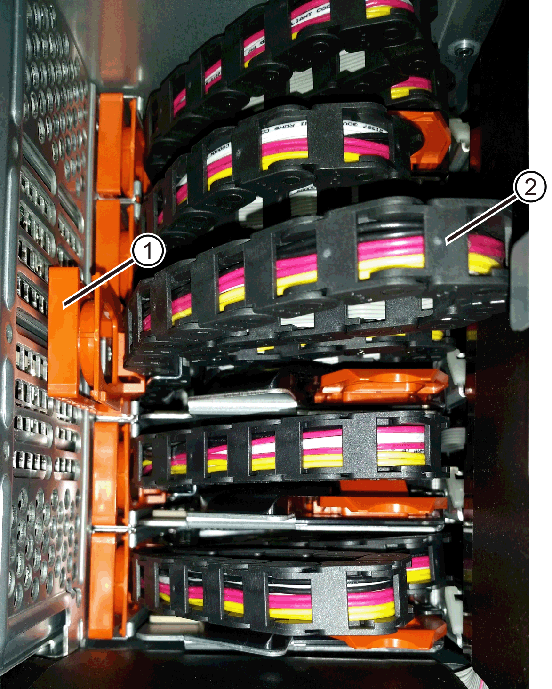
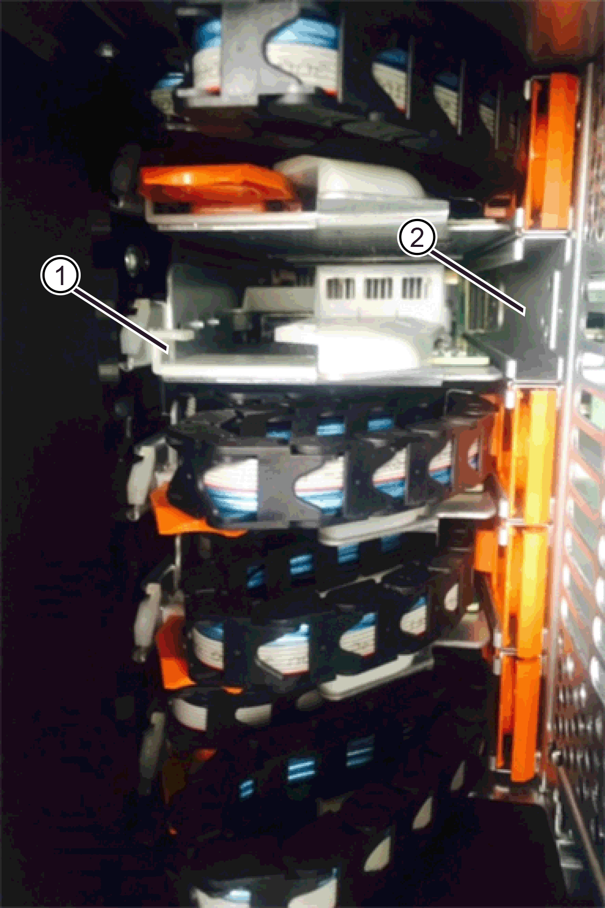

= Reemplazar un cajón de unidades: E2800 (bandeja de 60 unidades)
:allow-uri-read: 
:experimental: 
:icons: font
:imagesdir: ../media/

[role="lead"]
Es posible sustituir un cajón de unidades en una bandeja de controladoras E2860 o una bandeja de unidades DE460C.

.Acerca de esta tarea
Los pasos para reemplazar un cajón de unidades con error en una bandeja de controladoras E2860 o una bandeja de unidades DE460C dependen de si los volúmenes del cajón están protegidos por la protección contra pérdida de cajón. Si todos los volúmenes del cajón de la unidad están en pools de discos o grupos de volúmenes con protección contra pérdida de cajón, puede realizar este procedimiento en línea. De lo contrario, se debe detener toda la actividad de I/o del host y apagar la bandeja antes de sustituir el cajón de la unidad.

.Antes de empezar
* Revise los requisitos de cajón de la unidad en link:drives-overview-supertask-concept.html["Requisitos para reemplazar unidades E2800"].
* Asegúrese de que la bandeja de unidades cumpla todas las siguientes condiciones:
+
** La bandeja de unidades no debe tener una temperatura excesiva.
** Ambos ventiladores deben estar instalados y presentar el estado óptima.
** Todos los componentes de la bandeja de unidades deben estar en su lugar.
** Los volúmenes en el cajón de la unidad no pueden estar en el estado degradado.
+

CAUTION: *Posible pérdida de acceso a los datos* -- Si un volumen ya está en estado degradado y se quitan las unidades del cajón de la unidad, el volumen puede fallar.

* Asegúrese de tener lo siguiente:
+
** Un cajón de unidades de reemplazo.
** Una muñequera ESD, o usted ha tomado otras precauciones antiestáticas.
** Una linterna.
** Un marcador permanente para anotar la ubicación exacta de cada unidad mientras se quita la unidad del cajón.
** Acceso a la interfaz de línea de comandos (CLI) de la cabina de almacenamiento. Si no tiene acceso a la CLI, puede realizar una de las siguientes acciones:
+
*** *Para SANtricity System Manager (versión 11.60 y posteriores)* -- Descargue el paquete CLI (archivo zip) desde System Manager. Vaya a MENU:Settings[System > Add-ons > Command Line Interface]. Luego, puede emitir comandos de la CLI a partir de una solicitud del sistema operativo, como dos C: Prompt.

NOTE: Si necesita información sobre cómo reemplazar una bandeja de expansión E-Series DE460c, consulte https://kb.netapp.com/on-prem/E-Series/Hardware-KBs/How_to_replace_an_E_Series_DE460c_controller_expansion_shelf["Base de conocimientos de NetApp"^] el .

== Paso 1: Preparar la sustitución del cajón de la unidad

Determine si puede realizar el procedimiento de reemplazo mientras la bandeja de unidades está en línea o si necesita detener la actividad de I/o del host y apagar cualquiera de las bandejas que se encuentran encendidas.

Si va a sustituir un cajón en una bandeja con protección contra pérdida de cajón, no es necesario detener la actividad de I/o del host y apagar cualquiera de las bandejas.

.Pasos
. Determine si la bandeja de unidades está encendida.
+
** Si la alimentación está apagada, no necesita ejecutar el comando de la CLI. Vaya a. <<Paso 2: Quitar las cadenas para cables>>.
** Si la alimentación está encendida, pasar al siguiente paso.

. Acceda a la CLI y, a continuación, escriba el comando siguiente:
+
[listing]
----
SMcli <ctlr_IP1\> -p "array_password" -c "set tray [trayID] drawer [drawerID]
serviceAllowedIndicator=on;"
----
+
donde:

+
** `<ctlr_IP1>` es el identificador de la controladora.
**  `array_password` es la contraseña de la cabina de almacenamiento. Debe escribir el valor entre sí `array_password` entre comillas dobles ("").
** `[trayID]` es el identificador de la bandeja de unidades que contiene el cajón de unidades que se desea reemplazar. Los valores de ID de bandeja de unidades abarcan de 0 a 99. Debe escribir el valor entre sí `trayID` entre corchetes.
** `[drawerID]` es el identificador del cajón de la unidad que se desea reemplazar. Los valores de ID de cajón abarcan de 1 (cajón superior) a 5 (cajón inferior). Debe escribir el valor entre sí `drawerID` entre corchetes.
+
Este comando garantiza quitar el cajón más alto de la bandeja de unidades 10:

+
[listing]
----
SMcli <ctlr_IP1\> -p "safety-1" -c "set tray [10] drawer [1]
serviceAllowedIndicator=forceOnWarning;"
----
. Determine si necesita detener la actividad de I/o del host, de la siguiente manera:
+
** Si el comando se realiza correctamente, no es necesario detener la actividad de I/o del host. Todas las unidades del cajón están en pools o grupos de volúmenes con protección contra pérdida de cajón. Vaya a. <<Paso 2: Quitar las cadenas para cables>>.
+

CAUTION: *Posible daño a las unidades* -- espere 60 segundos después de que el comando finalice antes de abrir el cajón de la unidad. Esperar 60 segundos permite reducir la velocidad de giro de las unidades para evitar posibles daños en el hardware.

** Si se muestra una advertencia que indica que este comando no pudo completarse, debe detener la actividad de I/o del host antes de quitar el cajón. Se muestra la advertencia debido a que una o varias unidades del cajón afectado están en pools o grupos de volúmenes sin protección contra pérdida de cajón. Para evitar la pérdida de datos, debe completar los siguientes pasos para detener la actividad de I/o del host y apagar la bandeja de unidades y la bandeja de controladoras.

. Asegúrese de que no se producen operaciones de I/o entre la cabina de almacenamiento y todos los hosts conectados. Por ejemplo, puede realizar estos pasos:
+
** Detenga todos los procesos que implican las LUN asignadas del almacenamiento a los hosts.
** Asegúrese de que no hay aplicaciones que escriban datos en ninguna LUN asignada del almacenamiento a los hosts.
** Desmonte todos los sistemas de archivos asociados con volúmenes en la cabina.
+

NOTE: Los pasos exactos para detener las operaciones de I/o del host dependen del sistema operativo del host y de la configuración, que están más allá del alcance de estas instrucciones. Si no está seguro de cómo detener las operaciones de I/o del host en el entorno, considere apagar el host.

. Si la cabina de almacenamiento participa en una relación de mirroring, detenga todas las operaciones de I/o del host en la cabina de almacenamiento secundaria.
+

CAUTION: *Posible pérdida de datos* -- Si continúa este procedimiento mientras se realizan operaciones de E/S, la aplicación host podría perder datos porque no se podrá acceder a la matriz de almacenamiento.

. Espere a que se escriban en las unidades todos los datos de la memoria caché.
+
El LED verde de caché activa de la parte posterior de cada controladora está encendido cuando los datos en caché deben escribirse en las unidades. Debe esperar a que se apague este LED.

+
image::../media/28_dwg_2800_controller_attn_led_maint-e2800.gif[LED activo de caché en el controlador E2800]

+
*(1)* _Cache Active LED_

. En la página Inicio del Administrador del sistema de SANtricity, seleccione *Ver operaciones en curso*.
. Espere a que se completen todas las operaciones antes de continuar con el siguiente paso.
. Apague las bandejas mediante uno de los siguientes procedimientos:
+
** _Si va a sustituir un cajón en una estantería *con* Protección contra pérdida de cajón_: NO es necesario apagar ninguno de los estantes. Puede realizar el procedimiento de sustitución mientras el cajón de la unidad está en línea, ya que el comando CLI del indicador de permiso de acción de servicio del cajón se ha completado correctamente.
** _Si va a sustituir un cajón en una bandeja *controladora* *sin* Protección contra pérdida de cajón_:
+
... Apague ambos switches de alimentación de la bandeja de controladoras.
... Espere a que todos los LED de la bandeja de controladoras se apagen.

** _Si va a sustituir un cajón en una bandeja de unidades *expansión* *sin* Protección contra pérdida de cajón_:
+
... Apague ambos switches de alimentación de la bandeja de controladoras.
... Espere a que todos los LED de la bandeja de controladoras se apagen.
... Apague ambos interruptores de alimentación de la bandeja de unidades.
... Espere dos minutos para que se detenga la actividad de la unidad.

== Paso 2: Quitar las cadenas para cables

Quite ambas cadenas para cables de manera que pueda quitar y reemplazar un cajón de unidades con errores.

.Acerca de esta tarea
Cada cajón de unidades tiene cadenas para cables izquierda y derecha. Las cadenas para cables izquierda y derecha permiten que los cajones se deslizen hacia adentro y hacia afuera.

Los extremos metálicos de las cadenas para cables se deslizan en los rieles guía verticales y horizontales correspondientes dentro de la carcasa, de la siguiente manera:

* Los rieles guía verticales izquierdo y derecho conectan la cadena de cables al plano medio del gabinete.
* Los rieles guía horizontales izquierdo y derecho conectan la cadena de cables con el cajón individual.

CAUTION: *Posible daño de hardware* -- Si la bandeja de la unidad está encendida, la cadena del cable se activa hasta que ambos extremos se desenchufan. Para evitar cortocircuitos en el equipo, no permita que el conector de la cadena de cables desenchufado toque el chasis metálico si el otro extremo de la cadena de cables sigue enchufado.

.Pasos
. Asegúrese de que la bandeja de unidades y la bandeja de controladoras ya no tengan actividad de I/o y esté apagada, o bien haya emitido el `Set Drawer Attention Indicator` Comando de la CLI.
. En la parte posterior de la bandeja de unidades, quite el contenedor de ventilador derecho:
+
.. Pulse la pestaña naranja para liberar el asa del contenedor de ventilador.
+
La figura muestra el asa del contenedor de ventilador extendido y liberado de la pestaña naranja de la izquierda.

+
image::../media/28_dwg_e2860_de460c_fan_canister_handle_with_callout_maint-e2800.gif[Asa del contenedor de ventilador]

+
*(1)* _manivela del contenedor de ventilador_

.. Mediante la palanca, tire del contenedor de ventilador para sacarlo de la bandeja de unidades y separarlo.
.. Si la bandeja está encendida, asegúrese de que el ventilador izquierdo alcance su velocidad máxima.
+

CAUTION: *Posible daño en el equipo debido al sobrecalentamiento* -- Si la bandeja está encendida, no extraiga ambos ventiladores al mismo tiempo. De lo contrario, el equipo podría sobrecalentarse.

. Determine qué cadena de cables debe desconectarse:
+
** Si la alimentación está encendida, el LED de atención ámbar de la parte frontal del cajón indica la cadena de cables que necesita desconectar.
** Si la alimentación está apagada, debe determinar manualmente cuál de las cinco cadenas para cables desea desconectar. En la figura, se muestra el lado derecho de la bandeja de unidades con el compartimento de ventiladores quitado. Con el compartimento de ventiladores quitado, se pueden ver las cinco cadenas para cables y los conectores vertical y horizontal de cada cajón.
+
La cadena de cables superior está conectada al cajón de mando 1. La cadena de cables inferior está conectada al cajón de mando 5. Se proporcionan las anotaciones para el cajón de la unidad 1.

+
image::../media/trafford_cable_rail_1_maint-e2800.gif[Cadena de cables y conectores para el cajón de transmisión]

+
*(1)* _cable cadena_

+
*(2)* _conector vertical (conectado a plano medio)_

+
*(3)* _conector horizontal (conectado al cajón)_

. Para facilitar el acceso, utilice el dedo para mover la cadena de cables del lado derecho hacia la izquierda.
. Desconecte cualquiera de las cadenas de cable derecha de su riel guía vertical correspondiente.
+
.. Con una linterna, localice el anillo naranja en el extremo de la cadena de cables que está conectada al riel guía vertical de la carcasa.
+

+
*(1)* _anillo naranja en la guía vertical rail_

+
*(2)* _cadena de cables, parcialmente quitada_

.. Para desenganchar la cadena de cables, inserte el dedo en el anillo naranja y presione hacia el centro del sistema.
.. Para desenchufar la cadena del cable, tire con cuidado del dedo hacia usted aproximadamente 2.5 cm (1 pulgada). Dejar el conector de la cadena de cables dentro del raíl guía vertical. (Si la bandeja de la unidad está encendida, no permita que el conector de la cadena de cables toque el chasis metálico.)

. Desconecte el otro extremo de la cadena de cables:
+
.. Con una linterna, localice el anillo naranja en el extremo de la cadena de cables que está fijado al riel guía horizontal de la carcasa.
+
La figura muestra el conector horizontal de la derecha y la cadena del cable desconectada y parcialmente retirada del lado izquierdo.

+
image::../media/trafford_cable_rail_2_maint-e2800.gif[Anillo naranja para el riel horizontal y la cadena de cables para el cajón de la unidad]

+
*(1)* _anillo naranja en el riel guía horizontal_

+
*(2)* _cadena de cables, parcialmente quitada_

.. Para desenganchar la cadena de cables, inserte suavemente el dedo en el anillo naranja y presione hacia abajo.
+
La figura muestra el anillo naranja del riel guía horizontal (consulte el elemento 1 de la figura anterior), ya que se empuja hacia abajo para que el resto de la cadena de cables pueda extraerse de la carcasa.

.. Tire del dedo hacia usted para desenchufar la cadena de cables.

. Saque con cuidado toda la cadena de cables de la bandeja de unidades.
. Sustituya el contenedor de ventilador derecho:
+
.. Deslice completamente el contenedor de ventilador dentro de la bandeja.
.. Mueva el asa del contenedor de ventilador hasta que encaje con la lengüeta naranja.
.. Si la bandeja de unidades recibe alimentación, confirme que el LED de atención ámbar de la parte posterior del ventilador no está iluminado y que el aire sale de la parte posterior del ventilador.
+
El LED puede permanecer encendido durante un minuto después de reinstalar el ventilador, mientras que ambos ventiladores se asientan a la velocidad correcta.

+
Si la alimentación está apagada, los ventiladores no funcionan y el LED no está encendido.

. En la parte posterior de la bandeja de unidades, quite el contenedor de ventilador izquierdo.
. Si la bandeja de unidades recibe alimentación, asegúrese de que el ventilador derecho vaya a su velocidad máxima.
+

CAUTION: *Posibles daños en el equipo debido al sobrecalentamiento* -- Si la bandeja está encendida, no extraiga ambos ventiladores al mismo tiempo. De lo contrario, el equipo podría sobrecalentarse.

. Desconecte la cadena de cables izquierda de su guía vertical:
+
.. Con una linterna, localice el anillo naranja en el extremo de la cadena de cables conectado al riel guía vertical.
.. Para desenganchar la cadena de cables, inserte el dedo en el anillo naranja.
.. Para desenchufar la cadena de cables, tire hacia usted aproximadamente 2.5 cm (1 pulgada). Dejar el conector de la cadena de cables dentro del raíl guía vertical.
+

CAUTION: *Posible daño de hardware* -- Si la bandeja de la unidad está encendida, la cadena del cable se activa hasta que ambos extremos se desenchufan. Para evitar cortocircuitos en el equipo, no permita que el conector de la cadena de cables desenchufado toque el chasis metálico si el otro extremo de la cadena de cables sigue enchufado.

. Desconecte la cadena de cables izquierda del raíl de guía horizontal y tire de toda la cadena de cables para sacarla de la bandeja de unidades.
+
Si está realizando este procedimiento con la alimentación encendida, todos los LED se apagan al desconectar el último conector de la cadena del cable, incluido el LED de atención ámbar.

. Sustituya el contenedor de ventilador izquierdo. Si la bandeja de unidades recibe alimentación, confirme que el LED ámbar de la parte posterior del ventilador no está iluminado y que sale aire de la parte posterior del ventilador.
+
El LED puede permanecer encendido durante un minuto después de reinstalar el ventilador, mientras que ambos ventiladores se asientan a la velocidad correcta.

== Paso 3: Quitar el cajón de unidades con errores

Quite un cajón de unidades con errores para reemplazarlo con uno nuevo.

CAUTION: *Posible pérdida de acceso a los datos* -- los campos magnéticos pueden destruir todos los datos de la unidad y causar daños irreparables a los circuitos de la unidad. Para evitar la pérdida de acceso a los datos y daños en las unidades, mantenga siempre las unidades alejadas de los dispositivos magnéticos.

.Pasos
. Asegúrese de que:
+
** Las cadenas para cables derecha e izquierda están desconectadas.
** Se sustituyen los compartimentos de ventiladores derecho e izquierdo.

. Quite el panel frontal de la parte delantera de la bandeja de unidades.
. Desenganche el cajón de mando tirando de ambas palancas.
. Con las palancas extendidas, tire con cuidado del cajón de la unidad hasta que se detenga. No quite completamente el cajón de unidades de la bandeja de unidades.
. Si ya se han creado y asignado volúmenes, use un marcador permanente para indicar la ubicación exacta de cada unidad. Por ejemplo, utilizando el siguiente dibujo como referencia, escriba el número de ranura adecuado en la parte superior de cada unidad.
+
image::../media/dwg_trafford_drawer_with_hdds_callouts_maint-e2800.gif[Números de ranura de unidad]

+

CAUTION: **Posible pérdida de acceso a datos** -- Asegúrese de registrar la ubicación exacta de cada unidad antes de retirarla.

. Quite las unidades del cajón de la unidad:
+
.. Tire suavemente hacia atrás del pestillo de liberación naranja que se ve en la parte frontal central de cada unidad.
.. Levante la manija de la unidad hasta la posición vertical.
.. Utilice el asa para levantar la unidad del cajón de la unidad.
+
image::../media/92_dwg_de6600_install_or_remove_drive_maint-e2800.gif[Utilice el asa de leva para levantar la transmisión del cajón]

.. Coloque la unidad sobre una superficie plana y sin estática y lejos de los dispositivos magnéticos.

. Quite el cajón de la unidad:
+
.. Coloque la palanca de liberación de plástico en cada lado del cajón de la unidad.
+
image::../media/92_pht_de6600_drive_drawer_release_lever_maint-e2800.gif[Suelte la palanca para extraer el cajón]

+
*(1)* _palanca de liberación del cajón de la unidad_

.. Desconecte las dos palancas de liberación tirando de los pestillos hacia usted.
.. Mientras sujeta ambas palancas de liberación, tire de la bandeja de transmisión hacia usted.
.. Quite el cajón de unidades de la bandeja de unidades.

== Paso 4: Instale un nuevo cajón de unidades

Instale un cajón de unidades nuevo para reemplazar el con errores.

.Pasos
. Desde la parte frontal de la bandeja de unidades, haga brillar una linterna en la ranura vacía del cajón y localice el vaso de bloqueo para esa ranura.
+
El conjunto del vaso con cierre de bloqueo es una función de seguridad que evita que pueda abrir más de un cajón de accionamiento a la vez.

+
image::../media/92_pht_de6600_lock_out_tumbler_detail_maint-e2800.gif[Vaso de bloqueo y guía del cajón]

+
*(1)* _Lock-Out Tumbler_

+
*(2)* _guía de cajones_

. Coloque el cajón de unidades de repuesto delante de la ranura vacía y ligeramente a la derecha del centro.
+
La colocación del cajón ligeramente a la derecha del centro ayuda a garantizar que el vaso de bloqueo y la guía del cajón están correctamente acoplados.

. Deslice el cajón de la unidad dentro de la ranura y asegúrese de que la guía del cajón se desliza debajo del vaso de bloqueo.
+

CAUTION: *Riesgo de daños en el equipo* -- se produce un daño si la guía del cajón no se desliza debajo del vaso de bloqueo.

. Empuje con cuidado el cajón de la unidad hasta que el pestillo se acople completamente.
+
Experimentar un mayor nivel de resistencia es normal al presionar el cajón por primera vez.

+

CAUTION: *Riesgo de daños en el equipo* -- deje de empujar el cajón de accionamiento si siente que está agarrotado. Utilice las palancas de liberación de la parte delantera del cajón para desdeslizar el cajón hacia atrás. A continuación, vuelva a insertar el cajón en la ranura, asegúrese de que el vaso está por encima del raíl y los rieles están alineados correctamente.

== Paso 5: Fije las cadenas para cables

Conecte las cadenas para cables de manera que pueda volver a instalar las unidades en el cajón de las unidades.

.Acerca de esta tarea
Al conectar una cadena de cables, invierta el orden que utilizó al desconectar la cadena de cables. Debe insertar el conector horizontal de la cadena en el riel guía horizontal de la carcasa antes de insertar el conector vertical de la cadena en el riel guía vertical de la carcasa.

.Pasos
. Asegúrese de que:
+
** Se instaló un nuevo cajón de unidades.
** Tiene dos cadenas para cables de repuesto, marcadas COMO IZQUIERDA y DERECHA (en el conector horizontal junto al cajón de la unidad).

. En la parte posterior de la bandeja de unidades, quite el contenedor de ventilador del lado derecho y déjelo en un lugar.
. Si la bandeja está encendida, asegúrese de que el ventilador izquierdo vaya a su velocidad máxima.
+

CAUTION: *Posibles daños en el equipo debido al sobrecalentamiento* -- Si la bandeja está encendida, no extraiga ambos ventiladores al mismo tiempo. De lo contrario, el equipo podría sobrecalentarse.

. Conecte la cadena de cables derecha:
+
.. Localice los conectores horizontal y vertical en la cadena de cables derecha y el riel guía horizontal y vertical correspondiente dentro de la carcasa.
.. Alinee ambos conectores de la cadena de cables con sus guías correspondientes.
.. Deslice el conector horizontal de la cadena de cables sobre el riel guía horizontal y empújelo hasta el máximo.
+

CAUTION: *Riesgo de avería del equipo* -- Asegúrese de deslizar el conector en el riel de guía. Si el conector descansa sobre la parte superior del riel guía, pueden producirse problemas cuando el sistema funciona.

+
La figura muestra los rieles guía horizontal y vertical para el segundo cajón de unidades del compartimento.

+

+
*(1)* _Guía horizontal rail_

+
*(2)* _Guía vertical rail_

.. Deslice el conector vertical de la cadena de cables derecha en el riel guía vertical.
.. Después de volver a conectar ambos extremos de la cadena del cable, tire con cuidado de la cadena del cable para verificar que ambos conectores estén bloqueados.
+

CAUTION: *Riesgo de avería del equipo* -- Si los conectores no están bloqueados, la cadena de cables podría soltarse durante el funcionamiento de la bandeja.

. Vuelva a instalar el contenedor de ventilador derecho. Si la bandeja de unidades recibe alimentación, confirme que el LED ámbar de la parte posterior del ventilador está apagado y que el aire sale de la parte posterior.
+
El LED podría permanecer encendido durante un minuto después de volver a instalar el ventilador mientras el ventilador se instala a la velocidad correcta.

. En la parte posterior de la bandeja de unidades, quite el contenedor de ventilador en el lado izquierdo de la bandeja.
. Si se enciende la bandeja, asegúrese de que el ventilador derecho alcance su velocidad máxima.
+

CAUTION: *Posibles daños en el equipo debido al sobrecalentamiento* -- Si la bandeja está encendida, no extraiga ambos ventiladores al mismo tiempo. De lo contrario, el equipo podría sobrecalentarse.

. Vuelva a colocar la cadena de cables izquierda:
+
.. Localice los conectores horizontal y vertical en la cadena de cables y sus guías horizontales y verticales correspondientes dentro de la carcasa.
.. Alinee ambos conectores de la cadena de cables con sus guías correspondientes.
.. Deslice el conector horizontal de la cadena de cables en el riel guía horizontal y empújelo hasta el máximo.
+

CAUTION: *Riesgo de avería del equipo* -- Asegúrese de deslizar el conector dentro del raíl guía. Si el conector descansa sobre la parte superior del riel guía, pueden producirse problemas cuando el sistema funciona.

.. Deslice el conector vertical de la cadena de cables izquierda en el riel guía vertical.
.. Después de volver a conectar ambos extremos de la cadena del cable, tire con cuidado de la cadena del cable para verificar que ambos conectores estén bloqueados.
+

CAUTION: *Riesgo de avería del equipo* -- Si los conectores no están bloqueados, la cadena de cables podría soltarse durante el funcionamiento de la bandeja.

. Vuelva a instalar el contenedor de ventilador izquierdo. Si la bandeja de unidades recibe alimentación, confirme que el LED ámbar de la parte posterior del ventilador está apagado y que el aire sale de la parte posterior.
+
El LED puede permanecer encendido durante un minuto después de reinstalar el ventilador, mientras que ambos ventiladores se asientan a la velocidad correcta.

== Paso 6: Sustitución completa del cajón de la unidad

Vuelva a insertar las unidades y sustituya el embellecedor frontal en el orden correcto.

CAUTION: *Posible pérdida de acceso a datos* -- debe instalar cada unidad en su ubicación original en el cajón de la unidad.

.Pasos
. Asegúrese de que:
+
** Sabe dónde instalar cada unidad.
** Sustituyó el cajón de la unidad.
** Instaló los nuevos cables de cajón.

. Vuelva a instalar las unidades en el cajón de la unidad:
+
.. Desenganche el cajón de la unidad tirando de ambas palancas en la parte delantera del cajón.
.. Con las palancas extendidas, tire con cuidado del cajón de la unidad hasta que se detenga. No quite completamente el cajón de unidades de la bandeja de unidades.
.. Determine qué unidad se debe instalar en cada ranura mediante las notas que hizo al quitar las unidades.
+
image::../media/dwg_trafford_drawer_with_hdds_callouts_maint-e2800.gif[Números de ranura de unidad]

.. Levante la palanca de la unidad hasta la posición vertical.
.. Alinee los dos botones levantados de cada lado de la unidad con las muescas del cajón.
+
La figura muestra la vista del lado derecho de una unidad, donde se muestra la ubicación de los botones levantados.

+
image::../media/28_dwg_e2860_de460c_drive_cru_maint-e2800.gif[El botón elevado del portador de unidades debe coincidir con el canal de la unidad en el cajón de unidades]

+
*(1)* botón levantado en el lado derecho de la unidad_

.. Baje la unidad en línea recta hacia abajo, asegurándose de que la unidad está presionada completamente hacia abajo en el compartimiento y luego gire el asa de la unidad hacia abajo hasta que la unidad encaje en su lugar.
+
image::../media/92_dwg_de6600_install_or_remove_drive_maint-e2800.gif[Utilice el asa para bajar la unidad al cajón]

.. Repita estos pasos para instalar todas las unidades.

. Deslice el cajón de nuevo hacia la bandeja de la unidad empujándolo desde el centro y cerrando ambas palancas.
+

CAUTION: *Riesgo de avería del equipo* -- Asegúrese de cerrar completamente el cajón de accionamiento empujando ambas palancas. Debe cerrar por completo el cajón de la unidad para permitir el flujo de aire adecuado y evitar el sobrecalentamiento.

. Conecte el panel frontal a la parte delantera de la bandeja de unidades.
. Si ha apagado una o más bandejas, vuelva a aplicar la alimentación con uno de los siguientes procedimientos:
+
** _Si ha sustituido un cajón de unidades en una bandeja *controladora* sin protección contra pérdida de cajón_:
+
... Encienda ambos switches de alimentación de la bandeja de controladoras.
... Espere 10 minutos hasta que finalice el proceso de encendido. Confirme que ambos ventiladores se encienden y que el LED ámbar de la parte posterior de los ventiladores está apagado.

** _Si ha sustituido un cajón de unidades en una bandeja de unidades *expansión* sin protección contra pérdida de cajón_:
+
... Encienda ambos switches de alimentación de la bandeja de unidades.
... Confirme que ambos ventiladores se encienden y que el LED ámbar de la parte posterior de los ventiladores está apagado.
... Espere dos minutos antes de aplicar alimentación a la bandeja de controladoras.
... Encienda ambos switches de alimentación de la bandeja de controladoras.
... Espere 10 minutos hasta que finalice el proceso de encendido. Confirme que ambos ventiladores se encienden y que el LED ámbar de la parte posterior de los ventiladores está apagado.

.El futuro
Se completó la sustitución del cajón de la unidad. Es posible reanudar las operaciones normales.
