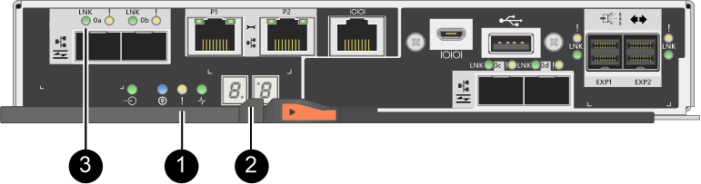

= Reemplazar tarjeta de interfaz del host E2800 (HIC)
:allow-uri-read: 
:experimental: 
:icons: font
:imagesdir: ../media/

[role="lead"]
Es posible reemplazar una tarjeta de interfaz del host (HIC) que tuvo errores.

.Acerca de esta tarea
Cuando sustituye una HIC, puede colocar la controladora en estado sin conexión, quitar el contenedor de controladoras, instalar la nueva HIC, sustituir el contenedor de controladoras y conectar la controladora.

.Antes de empezar
* Revisar link:hics-overview-supertask-concept.html["Requisitos para reemplazar E2800 HIC"].
* Debe programar una ventana de mantenimiento de tiempo de inactividad para este procedimiento. La alimentación debe estar apagada al instalar HIC, por lo que no puede acceder a los datos de la cabina de almacenamiento hasta que haya completado correctamente este procedimiento. (En una configuración doble, esto se debe a que ambas controladoras deben tener la misma configuración de HIC cuando están encendidas.)
* Asegúrese de que no existan volúmenes en uso o que exista un controlador multivía instalado en todos los hosts que utilizan estos volúmenes.
* Asegúrese de tener lo siguiente:
+
** Una o dos HIC, según si hay una o dos controladoras en la cabina de almacenamiento. Las HIC deben ser compatibles con las controladoras. Si existen dos controladoras, cada controladora debe tener HIC idénticas.
** Las etiquetas para identificar cada cable que está conectado al compartimento de controladoras.
** Una muñequera ESD, o usted ha tomado otras precauciones antiestáticas.
** Un destornillador Phillips número 1.
** Una estación de gestión con un explorador que puede acceder a System Manager de SANtricity para la controladora. (Para abrir la interfaz de System Manager, apunte el explorador al nombre de dominio o la dirección IP de la controladora.)

== Paso 1: Coloque la controladora en estado sin conexión

Los pasos para colocar una controladora en estado sin conexión dependen de si tiene una controladora (simple) o dos controladoras (doble). Vaya a las instrucciones correspondientes para:

* <<Duplex: Coloque la controladora en estado sin conexión>>
* <<Simplex: Apague la bandeja de controladoras>>

=== Duplex: Coloque la controladora en estado sin conexión

Si tiene una configuración doble, siga este paso para colocar la controladora en estado sin conexión para poder quitar de forma segura la HIC con errores.

NOTE: Realice esta tarea solo si la cabina de almacenamiento tiene dos controladoras (configuración doble).

.Pasos
. En el área Detalles de Recovery Guru, determine qué contenedores de la controladora tienen la HIC con errores.
. Realice un backup de la base de datos de configuración de la cabina de almacenamiento con SANtricity System Manager.
+
Si se produce un problema durante este procedimiento, puede utilizar el archivo guardado para restaurar la configuración. El sistema guardará el estado actual de la base de datos de configuración RAID, que incluye todos los datos de los grupos de volúmenes y pools de discos en la controladora.

+
** De System Manager:
+
... Seleccione menú:Soporte[Centro de soporte > Diagnóstico].
... Seleccione *recopilar datos de configuración*.
... Haga clic en *recoger*.
+
El archivo se guarda en la carpeta de descargas del explorador con el nombre *configurationData-<arrayName>-<dateTime>.7z*.

** También puede hacer un backup de la base de datos de configuración con el siguiente comando CLI:
+
`save storageArray dbmDatabase sourceLocation=onboard contentType=all file="filename";`

. Recoja datos de soporte para la cabina de almacenamiento mediante SANtricity System Manager.
+
Si se produce un problema durante este procedimiento, puede utilizar el archivo guardado para solucionar el problema. El sistema guardará los datos de inventario, Estados y rendimiento acerca de la cabina de almacenamiento en un único archivo.

+
.. Seleccione menú:Soporte[Centro de soporte > Diagnóstico].
.. Seleccione *recopilar datos de soporte*.
.. Haga clic en *recoger*.
+
El archivo se guarda en la carpeta de descargas del explorador con el nombre *support-data.7z*.

. Si la controladora aún no está desconectada, desconectarla ahora mediante System Manager de SANtricity.
+
** Desde SANtricity System Manager:
+
... Seleccione *hardware*.
... Si el gráfico muestra las unidades, seleccione *Mostrar parte posterior de la bandeja* para mostrar las controladoras.
... Seleccione la controladora que desea colocar en estado sin conexión.
... En el menú contextual, seleccione *colocar fuera de línea* y confirme que desea realizar la operación.
+

NOTE: Si accede a System Manager de SANtricity con la controladora que intenta desconectar, se muestra un mensaje de SANtricity System Manager no disponible. Seleccione *conectarse a una conexión de red alternativa* para acceder automáticamente al Administrador del sistema de SANtricity utilizando el otro controlador.

** Como alternativa, puede desconectar las controladoras utilizando los siguientes comandos de la CLI:
+
*Para el controlador A:* `set controller [a] availability=offline`

+
*Para el controlador B:* `set controller [b] availability=offline`

. Espere a que System Manager de SANtricity actualice el estado de la controladora a sin conexión.

CAUTION: No inicie ninguna otra operación hasta que se haya actualizado el estado.

=== Simplex: Apague la bandeja de controladoras

Si tiene una configuración simple, apague la bandeja de controladoras para que pueda quitar de forma segura la HIC con errores.

NOTE: Realice esta tarea solo si la cabina de almacenamiento tiene una controladora (configuración simple).

.Pasos
. En SANtricity System Manager, revise los detalles en Recovery Guru para confirmar que tiene una HIC con errores y para garantizar que no tenga que solucionar otros elementos antes de poder quitar y reemplazar la HIC.
. Realice un backup de la base de datos de configuración de la cabina de almacenamiento con SANtricity System Manager.
+
Si se produce un problema durante este procedimiento, puede utilizar el archivo guardado para restaurar la configuración. El sistema guardará el estado actual de la base de datos de configuración RAID, que incluye todos los datos de los grupos de volúmenes y pools de discos en la controladora.

+
** De System Manager:
+
... Seleccione menú:Soporte[Centro de soporte > Diagnóstico].
... Seleccione *recopilar datos de configuración*.
... Haga clic en *recoger*.
+
El archivo se guarda en la carpeta de descargas del explorador con el nombre *configurationData-<arrayName>-<dateTime>.7z*.

** También puede hacer un backup de la base de datos de configuración con el siguiente comando CLI:
+
`save storageArray dbmDatabase sourceLocation=onboard contentType=all file="filename";`

. Recoja datos de soporte para la cabina de almacenamiento mediante SANtricity System Manager.
+
Si se produce un problema durante este procedimiento, puede utilizar el archivo guardado para solucionar el problema. El sistema guardará los datos de inventario, Estados y rendimiento acerca de la cabina de almacenamiento en un único archivo.

+
.. Seleccione menú:Soporte[Centro de soporte > Diagnóstico].
.. Seleccione *recopilar datos de soporte*.
.. Haga clic en *recoger*.
+
El archivo se guarda en la carpeta de descargas del explorador con el nombre *support-data.7z*.

. Asegúrese de que no se producen operaciones de I/o entre la cabina de almacenamiento y todos los hosts conectados. Por ejemplo, puede realizar estos pasos:
+
** Detenga todos los procesos que implican las LUN asignadas del almacenamiento a los hosts.
** Asegúrese de que no hay aplicaciones que escriban datos en ninguna LUN asignada del almacenamiento a los hosts.
** Desmonte todos los sistemas de archivos asociados con volúmenes en la cabina.
+

NOTE: Los pasos exactos para detener las operaciones de I/o del host dependen del sistema operativo del host y de la configuración, que están más allá del alcance de estas instrucciones. Si no está seguro de cómo detener las operaciones de I/o del host en el entorno, considere apagar el host.

+

CAUTION: *Posible pérdida de datos* -- Si continúa este procedimiento mientras se realizan operaciones de E/S, puede perder datos.

. Espere a que se escriban en las unidades todos los datos de la memoria caché.
+
El LED verde de caché activa de la parte posterior de la controladora está encendido cuando los datos en caché deben escribirse en las unidades. Debe esperar a que se apague este LED.

. En la página de inicio del Administrador del sistema de SANtricity, seleccione *Ver operaciones en curso*.
. Confirme que todas las operaciones se han completado antes de continuar con el siguiente paso.
. Apague ambos switches de alimentación de la bandeja de controladoras.
. Espere a que se apagen todos los LED de la bandeja de controladoras.

== Paso 2: Quite el contenedor de la controladora

Quite el contenedor de la controladora para poder añadir la nueva tarjeta de interfaz del host (HIC).

.Pasos
. Etiquete cada cable conectado al compartimento de controladoras.
. Desconecte todos los cables del compartimento de controladoras.
+

CAUTION: Para evitar un rendimiento degradado, no gire, pliegue, pellizque ni pellizque los cables.

. Confirme que el LED Cache Active de la parte posterior de la controladora está apagado.
+
El LED verde de caché activa de la parte posterior de la controladora está encendido cuando los datos en caché deben escribirse en las unidades. Debe esperar a que este LED se apague antes de quitar el compartimento de controladoras.

+
image::../media/28_dwg_2800_controller_attn_led_maint-e2800.gif[LED activo de caché en el controlador E2800]

+
*(1)* _Cache Active LED_

. Apriete el pestillo de la palanca de leva hasta que se suelte y, a continuación, abra la palanca de leva a la derecha para liberar el contenedor del controlador de la bandeja.
+
La siguiente figura es un ejemplo de bandeja de controladoras E2812, bandeja de controladoras E2824 o una cabina flash EF280:

+
image::../media/28_dwg_e2824_remove_controller_canister_maint-e2800.gif[Quite el contenedor de la controladora]

+
*(1)* _Controller canister_

+
*(2)* _Cam handle_

+
La siguiente figura es un ejemplo de una bandeja de controladoras E2860:

+
image::../media/28_dwg_e2860_add_controller_canister_maint-e2800.gif[Quite el contenedor de la controladora]

+
*(1)* _Controller canister_

+
*(2)* _Cam handle_

. Con dos manos y el asa de leva, deslice el recipiente del controlador para sacarlo del estante.
+

CAUTION: Utilice siempre dos manos para admitir el peso de un compartimento de controladoras.

+
Si va a quitar el compartimento de controladoras de una bandeja de controladoras E2812, una bandeja de controladoras E2824 o una cabina flash EF280, un solapa se acerca a bloquear la bahía vacía, lo que ayuda a mantener el flujo de aire y la refrigeración.

. Gire el contenedor del controlador de manera que la cubierta extraíble quede orientada hacia arriba.
. Coloque el contenedor del controlador sobre una superficie plana y libre de estática.

== Paso 3: Instale una HIC

Instale una HIC para reemplazar el que ha fallado con una HIC nueva.

CAUTION: *Posible pérdida de acceso a los datos*: No instale nunca una HIC en un contenedor de controladora E2800 si esa HIC estaba diseñada para otra controladora E-Series. Además, si tiene una configuración doble, ambas controladoras y ambas HIC deben ser idénticas. La presencia de HIC incompatible o con discrepancias hará que las controladoras se bloqueen cuando aplique alimentación.

.Pasos
. Desembale la nueva HIC y la nueva placa frontal de HIC.
. Pulse el botón de la cubierta del compartimento del controlador y deslice la cubierta hacia fuera.
. Confirme que el LED verde dentro del controlador (por los DIMM) está apagado.
+
Si este LED verde está encendido, el controlador sigue utilizando la batería. Debe esperar a que este LED se apague antes de quitar los componentes.

+
image::../media/28_dwg_e2800_internal_cache_active_led_maint-e2800.gif[LED activo de caché interna]

+
*(1)* _Internal Cache Active LED_

+
*(2)* _Battery_

. Con un destornillador Phillips del número 1, quite los cuatro tornillos que fijan la placa frontal vacía al compartimento de la controladora y quite la placa frontal.
. Alinee los tres tornillos de ajuste manual de la HIC con los orificios correspondientes de la controladora y alinee el conector de la parte inferior de la HIC con el conector de la interfaz HIC de la tarjeta controladora.
+
Tenga cuidado de no arañar ni golpear los componentes en la parte inferior de la HIC o en la parte superior de la tarjeta de la controladora.

. Baje con cuidado la HIC en su lugar y coloque el conector de la HIC presionando suavemente en la HIC.
+

CAUTION: *Posible daño en el equipo* -- tenga mucho cuidado de no pellizcar el conector de la cinta de oro para los LED del controlador entre la HIC y los tornillos de mariposa.

+
image::../media/28_dwg_e2800_hic_thumbscrews_maint-e2800.gif[Vuelva a instalar HIC en la tarjeta del controlador]

+
*(1)* _Tarjeta de interfaz del host_

+
*(2)* _thumbtornillos_

. Apriete a mano los tornillos de mariposa HIC.
+
No utilice un destornillador, o puede apretar los tornillos en exceso.

. Con un destornillador Phillips del número 1, conecte la nueva placa frontal de la HIC al compartimento de la controladora con los cuatro tornillos que quitó anteriormente.
+
image::../media/28_dwg_e2800_hic_faceplace_screws_maint-e2800.gif[Vuelva a instalar la placa frontal en el controlador]

== Paso 4: Vuelva a instalar el compartimento de la controladora

Después de instalar la HIC, vuelva a instalar el compartimento de controladoras en la bandeja de controladoras.

.Pasos
. Gire el contenedor del controlador de manera que la cubierta extraíble quede orientada hacia abajo.
. Con el asa de leva en la posición abierta, deslice completamente el contenedor del controlador en la bandeja del controlador.
+
La siguiente figura es un ejemplo de una bandeja de controladoras E2824 o una cabina flash EF280:

+
image::../media/28_dwg_e2824_remove_controller_canister_maint-e2800.gif[Vuelva a instalar el compartimento de controladoras]

+
*(1)* _Controller canister_

+
*(2)* _Cam handle_

+
La siguiente figura es un ejemplo de una bandeja de controladoras E2860:

+
image::../media/28_dwg_e2860_add_controller_canister_maint-e2800.gif['Vuelva a instalar el compartimento de controladoras']

+
*(1)* _Controller canister_

+
*(2)* _Cam handle_

. Mueva la palanca de leva hacia la izquierda para bloquear el contenedor del controlador en su lugar.
. Vuelva a conectar todos los cables que quitó.
+

NOTE: No conecte los cables de datos a los puertos HIC nuevos en este momento.

. (Opcional) Si va a añadir HIC a una configuración doble, repita todos los pasos para quitar el segundo compartimento de controladora, instale la segunda HIC y vuelva a instalar el segundo compartimento de controladora.

== Paso 5: Coloque la controladora en línea

Los pasos para colocar una controladora en línea dependen de si tiene una controladora (simple) o dos controladoras (doble).

=== Duplex: Coloque la controladora en línea

Para una configuración doble, conectar la controladora a la red, recoger datos de soporte y reanudar las operaciones.

NOTE: Realice esta tarea solo si la cabina de almacenamiento tiene dos controladoras.

.Pasos
. Cuando se arranque la controladora, compruebe los LED de la controladora y la pantalla de siete segmentos.
+

NOTE: La figura muestra un contenedor de controladora de ejemplo. La controladora puede tener un número diferente y otro tipo de puertos de host.

+
Cuando se restablece la comunicación con otra controladora:

+
** La pantalla de siete segmentos muestra la secuencia de repetición *OS*, *OL*, *_blank_* para indicar que el controlador está sin conexión.
** El LED de atención ámbar permanece encendido.
** Los LED Host Link pueden estar encendidos, parpadeando o apagados, según la interfaz del host. 
+
*(1)* _LED de atención (ámbar)_

+
*(2)* _pantalla de siete segmentos_

+
*(3)* _Host Link LEDs_

. Utilice System Manager de SANtricity para conectar la controladora.
+
** Desde SANtricity System Manager:
+
... Seleccione *hardware*.
... Si el gráfico muestra las unidades, seleccione *Mostrar parte posterior de la bandeja*.
... Seleccione la controladora que desea colocar en línea.
... Seleccione *colocar en línea* en el menú contextual y confirme que desea realizar la operación.
+
El sistema coloca la controladora en línea.

** Como alternativa, puede utilizar los siguientes comandos de la CLI:
+
*Para el controlador A:* `set controller [a] availability=online;`

+
*Para el controlador B:* `set controller [b] availability=online;`

. Compruebe los códigos de la pantalla de siete segmentos de la controladora cuando vuelva a estar online. Si la pantalla muestra una de las siguientes secuencias de repetición, extraiga inmediatamente el controlador.
+
** *OE*, *L0*, *_blank_* (controladores que no coinciden)
** *OE*, *L6*, *_blank_* (HIC no admitida)
+

CAUTION: *Posible pérdida de acceso a datos* -- Si el controlador que acaba de instalar muestra uno de estos códigos, y el otro controlador se restablece por cualquier razón, el segundo controlador también podría bloquearse.

. Cuando la controladora vuelva a estar en línea, confirme que su estado es óptimo y compruebe los LED de atención de la bandeja de controladoras.
+
Si el estado no es óptimo o si alguno de los LED de atención está encendido, confirme que todos los cables están conectados correctamente y compruebe que la HIC y el compartimento de controladoras estén instalados correctamente. Si es necesario, quite y vuelva a instalar el compartimento de controladoras y la HIC.

+

NOTE: Si no puede resolver el problema, póngase en contacto con el soporte técnico.

. Recoja datos de soporte para la cabina de almacenamiento mediante SANtricity System Manager.
+
.. Seleccione menú:Soporte[Centro de soporte > Diagnóstico].
.. Seleccione *recopilar datos de soporte*.
.. Haga clic en *recoger*.
+
El archivo se guarda en la carpeta de descargas del explorador con el nombre *support-data.7z*.

. Devuelva la pieza que ha fallado a NetApp, como se describe en las instrucciones de RMA que se suministran con el kit.
+
Póngase en contacto con el soporte técnico en http://mysupport.netapp.com["Soporte de NetApp"^], 888-463-8277 (América del Norte), 00-800-44-638277 (Europa), o +800-800-80-800 (Asia/Pacífico) si necesita el número RMA.

=== Simplex: Encienda la bandeja de controladoras

En el caso de una configuración simple, aplique alimentación a la bandeja de controladoras, recoja datos de soporte y reanude operaciones.

NOTE: Realice esta tarea solo si la cabina de almacenamiento tiene una controladora.

.Pasos
. Encienda los dos switches de alimentación que se encuentran en la parte posterior de la bandeja de controladoras.
+
** No apague los interruptores de alimentación durante el proceso de encendido, que normalmente tarda 90 segundos o menos en completarse.
** Los ventiladores de cada bandeja son muy altos cuando se inician por primera vez. El ruido fuerte durante el arranque es normal.

. Cuando se arranca la controladora, compruebe los LED de la controladora y la pantalla de siete segmentos.
+
** La pantalla de siete segmentos muestra la secuencia de repetición *OS*, *SD*, *_blank_* para indicar que el controlador está realizando el procesamiento de comienzo del día (SOD). Una vez que se inició correctamente una controladora, su pantalla de siete segmentos debe mostrar el ID de soporte.
** El LED de atención ámbar del controlador se enciende y se apaga, a menos que se produzca un error.
** Se encienden los indicadores LED verdes de Host Link.
+

NOTE: La figura muestra un contenedor de controladora de ejemplo. La controladora puede tener un número diferente y otro tipo de puertos de host.

+

+
*(1)* _LED de atención (ámbar)_

+
*(2)* _pantalla de siete segmentos_

+
*(3)* _Host Link LEDs_

. Confirmar que el estado de la controladora es óptimo y comprobar los LED de atención de la bandeja de controladoras.
+
Si el estado no es óptimo o si alguno de los LED de atención está encendido, confirme que todos los cables están conectados correctamente y compruebe que la HIC y el compartimento de controladoras estén instalados correctamente. Si es necesario, quite y vuelva a instalar el compartimento de controladoras y la HIC.

+

NOTE: Si no puede resolver el problema, póngase en contacto con el soporte técnico.

. Recoja datos de soporte para la cabina de almacenamiento mediante SANtricity System Manager.
+
.. Seleccione menú:Soporte[Centro de soporte > Diagnóstico].
.. Seleccione *recopilar datos de soporte*.
.. Haga clic en *recoger*.
+
El archivo se guarda en la carpeta de descargas del explorador con el nombre *support-data.7z*.

. Devuelva la pieza que ha fallado a NetApp, como se describe en las instrucciones de RMA que se suministran con el kit.
+
Póngase en contacto con el soporte técnico en http://mysupport.netapp.com["Soporte de NetApp"^], 888-463-8277 (América del Norte), 00-800-44-638277 (Europa), o +800-800-80-800 (Asia/Pacífico) si necesita el número RMA.

.El futuro
Se completó el reemplazo de HIC. Es posible reanudar las operaciones normales.
