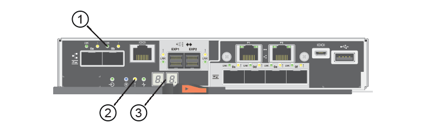

= Sustituya la batería E5700
:allow-uri-read: 
:experimental: 
:icons: font
:imagesdir: ../media/

[role="lead"]
Es posible sustituir una batería con errores en un sistema de almacenamiento E5700.

.Acerca de esta tarea
Cada contenedor de controladora E5700 incluye una batería que conserva los datos en caché si falla la alimentación de CA. Si Recovery Guru en System Manager de SANtricity informa de un estado error de batería o se requiere reemplazo de batería, debe reemplazar la batería afectada.

.Antes de empezar
* Verifique que no existan volúmenes en uso o que exista un controlador multivía instalado en todos los hosts que utilizan estos volúmenes.
* Revisar link:batteries-intro-concept.html["Requisitos para reemplazar la batería de E5700"].
* Asegúrese de tener lo siguiente:
+
** Una batería de repuesto.
** Una muñequera ESD, o usted ha tomado otras precauciones antiestáticas.
** Las etiquetas para identificar cada cable que está conectado al compartimento de controladoras.
** Una estación de gestión con un explorador que puede acceder a System Manager de SANtricity para la controladora. (Para abrir la interfaz de System Manager, apunte el explorador al nombre de dominio o la dirección IP de la controladora.)

== Paso 1: Colocar la controladora en estado sin conexión (dúplex)

Si tiene una configuración doble, coloque a la controladora afectada en estado sin conexión para poder quitar de forma segura la batería con errores. La controladora que no se coloca en estado sin conexión debe estar en línea (en el estado óptimo).

NOTE: Realice esta tarea solo si la cabina de almacenamiento tiene dos controladoras (configuración doble).

.Pasos
. En SANtricity System Manager, revise los detalles en Recovery Guru para confirmar que hay un problema con una batería y para garantizar que no primero no tenga que resolver otros elementos.
. En el área Detalles de Recovery Guru, determine qué batería desea reemplazar.
. Realice un backup de la base de datos de configuración de la cabina de almacenamiento con SANtricity System Manager.
+
Si se produce un problema al quitar una controladora, puede usar el archivo guardado para restaurar la configuración. El sistema guardará el estado actual de la base de datos de configuración RAID, que incluye todos los datos de los grupos de volúmenes y pools de discos en la controladora.

+
** Desde SANtricity System Manager:
+
... Seleccione menú:Soporte[Centro de soporte > Diagnóstico].
... Seleccione *recopilar datos de configuración*.
... Haga clic en *recoger*.
+
El archivo se guarda en la carpeta de descargas del explorador con el nombre *configurationData-<arrayName>-<dateTime>.7z*.

** También puede hacer un backup de la base de datos de configuración con el siguiente comando CLI:
+
`save storageArray dbmDatabase sourceLocation=onboard contentType=all file="filename";`

. Recoja datos de soporte para la cabina de almacenamiento mediante SANtricity System Manager.
+
Si se produce un problema al quitar una controladora, es posible utilizar el archivo guardado para solucionar el problema. El sistema guardará los datos de inventario, Estados y rendimiento acerca de la cabina de almacenamiento en un único archivo.

+
.. Seleccione menú:Soporte[Centro de soporte > Diagnóstico].
.. Seleccione *recopilar datos de soporte*.
.. Haga clic en *recoger*.
+
El archivo se guarda en la carpeta de descargas del explorador con el nombre *support-data.7z*.

. Si la controladora aún no está desconectada, desconectarla ahora mediante System Manager de SANtricity.
+
** Desde SANtricity System Manager:
+
... Seleccione *hardware*.
... Si el gráfico muestra las unidades, seleccione *Mostrar parte posterior de la bandeja* para mostrar las controladoras.
... Seleccione la controladora que desea colocar en estado sin conexión.
... En el menú contextual, seleccione *colocar fuera de línea* y confirme que desea realizar la operación.
+

NOTE: Si accede a System Manager de SANtricity con la controladora que intenta desconectar, se muestra un mensaje de SANtricity System Manager no disponible. Seleccione *conectarse a una conexión de red alternativa* para acceder automáticamente al Administrador del sistema de SANtricity utilizando el otro controlador.

** Como alternativa, puede desconectar las controladoras utilizando los siguientes comandos de la CLI:
+
*Para el controlador A:* `set controller [a] availability=offline`

+
*Para el controlador B:* `set controller [b] availability=offline`

. Espere a que System Manager de SANtricity actualice el estado de la controladora a sin conexión.
+

CAUTION: No inicie ninguna otra operación hasta que se haya actualizado el estado.

== Paso 2: Quite el contenedor de la controladora

Para poder quitar la batería con errores, debe quitar el compartimento de controladoras.

.Pasos
. Coloque una muñequera ESD o tome otras precauciones antiestáticas.
. Etiquete cada cable conectado al compartimento de controladoras.
. Desconecte todos los cables del compartimento de controladoras.
+

CAUTION: Para evitar un rendimiento degradado, no gire, pliegue, pellizque ni pellizque los cables.

. Si los puertos de host en el contenedor de controladora utilizan transceptores SFP+, déjelo instalados.
. Confirme que el LED Cache Active de la parte posterior de la controladora está apagado.
. Apriete el pestillo de la palanca de leva hasta que se suelte y, a continuación, abra la palanca de leva a la derecha para liberar el contenedor del controlador de la bandeja.
+
La siguiente figura muestra un ejemplo de una bandeja de controladoras E5724:

+
image::../media/28_dwg_e2824_remove_controller_canister_maint-e5700.gif[28 dwg e2824 retire la mant. del contenedor de la controladora e5700]

+
*(1)* _Controller canister_

+
*(2)* _Cam handle_

+
En la siguiente figura, se muestra un ejemplo de bandeja de controladoras E5760:

+
image::../media/28_dwg_e2860_add_controller_canister_maint-e5700.gif[28 dwg e2860 añada la mant del contenedor de controladora e5700]

+
*(1)* _Controller canister_

+
*(2)* _Cam handle_

. Con dos manos y el asa de leva, deslice el recipiente del controlador para sacarlo del estante.
+

CAUTION: Utilice siempre dos manos para admitir el peso de un compartimento de controladoras.

+
Si va a retirar el compartimento de controladoras de una bandeja de controladoras E5724, una solapa se balancea hasta bloquearlo para ayudar a mantener el flujo de aire y la refrigeración.

. Gire el contenedor del controlador de manera que la cubierta extraíble quede orientada hacia arriba.
. Coloque el contenedor del controlador sobre una superficie plana y libre de estática.

== Paso 3: Retire la batería que ha fallado

Después de quitar el compartimento de controladoras de la bandeja de controladoras, quite la batería.

.Pasos
. Retire la cubierta del contenedor del controlador presionando el botón hacia abajo y deslizando la cubierta hacia fuera.
. Confirme que el LED verde dentro del controlador (entre la batería y los DIMM) está apagado.
+
Si este LED verde está encendido, el controlador sigue utilizando la batería. Debe esperar a que este LED se apague antes de quitar los componentes.

+
image::../media/28_dwg_e2800_internal_cache_active_led_maint-e5700.gif[28 dwg e2800 caché interna activa led maint e5700]

+
*(1)* _Internal Cache Active LED_

+
*(2)* _Battery_

. Localice el pestillo de liberación azul de la batería.
. Para quitar el pestillo de liberación de la batería, empuje el pestillo de liberación hacia abajo y hacia fuera del compartimento de la controladora.
+
image::../media/28_dwg_e2800_remove_battery_maint-e5700.gif[28 dwg e2800 retire la número de batería de e5700]

+
*(1)* _pestillo de liberación de la batería_

+
*(2)* _Battery_

. Levante la batería y sáquela del compartimento de la controladora.
. Siga los procedimientos apropiados para que su ubicación pueda reciclar o eliminar la batería que ha fallado.
+

CAUTION: Para cumplir con las normativas de la Asociación Internacional de Transporte aéreo (IATA), no envíe nunca una batería de litio por aire a menos que esté instalada en la bandeja del controlador.

== Paso 4: Instale la batería nueva

Después de extraer la batería que ha fallado, instale una nueva.

.Pasos
. Desembale la nueva batería y configúrela en una superficie plana y sin estática.
+

NOTE: Para cumplir con las normativas de seguridad de la IATA, las baterías de reemplazo se envían con un estado de carga (SoC) del 30 por ciento o menos. Cuando vuelva a aplicar la alimentación, tenga en cuenta que el almacenamiento en caché de escritura no se reanudará hasta que se completen la carga de la batería de reemplazo y el ciclo de aprendizaje inicial.

. Oriente el compartimento de la controladora de manera que la ranura de la batería esté orientada hacia usted.
. Inserte la batería en el compartimento del controlador ligeramente hacia abajo.
+
Debe insertar la brida metálica en la parte frontal de la batería en la ranura de la parte inferior del compartimento del controlador y deslizar la parte superior de la batería por debajo del pasador de alineación pequeño en el lado izquierdo del contenedor.

. Mueva el pestillo de la batería hacia arriba para fijar la batería.
+
Cuando el pestillo hace clic en su lugar, la parte inferior del pestillo se engancha a una ranura metálica del chasis.

+
image::../media/28_dwg_e2800_insert_battery_maint-e5700.gif[28 dwg e2800 insertar la batería más en e5700]

+
*(1)* _pestillo de liberación de la batería_

+
*(2)* _Battery_

. Gire el compartimento de controladoras para confirmar que la batería se ha instalado correctamente.
+

CAUTION: *Posible daño de hardware* -- la brida metálica de la parte frontal de la batería debe estar completamente insertada en la ranura del contenedor del controlador (como se muestra en la primera figura). Si la batería no está instalada correctamente (como se muestra en la segunda figura), la brida metálica podría entrar en contacto con la placa del controlador, causando daños al controlador cuando se aplica alimentación.

+
** *Correcto* -- la brida metálica de la batería está completamente insertada en la ranura del controlador:
+
image:../media/28_dwg_e2800_battery_flange_ok_maint-e5700.gif[""]

** *Incorrecto* -- la brida metálica de la batería no está insertada en la ranura del controlador:
+
image:../media/28_dwg_e2800_battery_flange_not_ok_maint-e5700.gif[""]

== Paso 5: Vuelva a instalar el compartimento de controladoras

Después de instalar la batería nueva, vuelva a instalar el compartimento de controladoras en la bandeja de controladoras.

.Pasos
. Para volver a instalar la cubierta en el compartimento del controlador, deslice la cubierta de atrás hacia delante hasta que el botón haga clic.
. Gire el contenedor del controlador de manera que la cubierta extraíble quede orientada hacia abajo.
. Con el asa de leva en la posición abierta, deslice completamente el contenedor del controlador en la bandeja del controlador.
+
image::../media/28_dwg_e2824_remove_controller_canister_maint-e5700.gif[28 dwg e2824 retire la mant. del contenedor de la controladora e5700]

+
*(1)* _Controller canister_

+
*(2)* _Cam handle_

+
image::../media/28_dwg_e2860_add_controller_canister_maint-e5700.gif[28 dwg e2860 añada la mant del contenedor de controladora e5700]

+
*(1)* _Controller canister_

+
*(2)* _Cam handle_

. Mueva la palanca de leva hacia la izquierda para bloquear el contenedor del controlador en su lugar.
. Vuelva a conectar todos los cables.

== Paso 6: Colocar la controladora en línea (dúplex)

Para una configuración doble, coloque la controladora en línea, recoja datos de soporte y reanude operaciones.

NOTE: Realice esta tarea solo si la cabina de almacenamiento tiene dos controladoras.

.Pasos
. Cuando se arranque la controladora, compruebe los LED de la controladora y la pantalla de siete segmentos.
+

NOTE: La figura muestra un contenedor de controladora de ejemplo. La controladora puede tener un número diferente y otro tipo de puertos de host.

+
Cuando se restablece la comunicación con otra controladora:

+
** La pantalla de siete segmentos muestra la secuencia de repetición *OS*, *OL*, *_blank_* para indicar que el controlador está sin conexión.
** El LED de atención ámbar permanece encendido.
** Es posible que los LED del enlace de host estén encendidos, parpadeantes o apagados, según la interfaz del host.
+
*(1)* _Host Link LEDs_

+
*(2)* _LED de atención (ámbar)_

+
*(3)* _pantalla de siete segmentos_

. Utilice System Manager de SANtricity para conectar la controladora.
+
** Desde SANtricity System Manager:
+
... Seleccione *hardware*.
... Si el gráfico muestra las unidades, seleccione *Mostrar parte posterior de la bandeja*.
... Seleccione la controladora que desea colocar en línea.
... Seleccione *colocar en línea* en el menú contextual y confirme que desea realizar la operación.
+
El sistema coloca la controladora en línea.

** Como alternativa, puede conectar las controladoras utilizando los siguientes comandos de CLI:
+
*Para el controlador A:* `set controller [a] availability=online;`

+
*Para el controlador B:* `set controller [b] availability=online;`

. Cuando la controladora vuelva a estar en línea, confirme que su estado es óptimo y compruebe los LED de atención de la bandeja de controladoras.
+
Si el estado no es óptimo o si alguno de los LED de atención está encendido, confirme que todos los cables están conectados correctamente y compruebe que la batería y el compartimento de controladoras estén instalados correctamente. Si es necesario, retire y vuelva a instalar el compartimento de la controladora y la batería.

+

NOTE: Si no puede resolver el problema, póngase en contacto con el soporte técnico.

. Si es necesario, recoja datos de soporte para la cabina de almacenamiento mediante System Manager de SANtricity.
+
.. Seleccione *Soporte* > *Centro de soporte* > *Diagnóstico*.
.. Seleccione *recopilar datos de soporte*.
.. Haga clic en *recoger*.
+
El archivo se guarda en la carpeta de descargas del explorador con el nombre *support-data.7z*.

.El futuro
Se ha completado el reemplazo de la batería. Es posible reanudar las operaciones normales.
