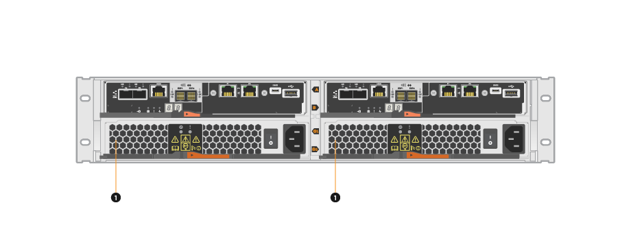

= Requisitos para reemplazar el compartimento de E5700
:allow-uri-read: 
:icons: font
:imagesdir: ../media/

[role="lead"]
Antes de sustituir un compartimento de E5700, revise los requisitos y las consideraciones.

Los contenedores constan de tres tipos distintos: Contenedores de alimentación/ventilador (fuentes de alimentación) que proporcionan una fuente de alimentación redundante y una refrigeración adecuada en una bandeja de controladoras o de 24 unidades de 12 o de unidades; contenedores de alimentación que se usan para la redundancia de alimentación en una bandeja de controladoras o bandeja de unidades de 60 unidades; y los contenedores de ventiladores que se usan para refrigerar la bandeja de controladoras de 60 unidades o la bandeja de unidades.

== Suministro de alimentación

NOTE: El procedimiento de reemplazo de suministro de alimentación se aplica a sustituciones IOM. Para sustituir el IOM, realice el procedimiento de reemplazo de suministro de alimentación.

Cada bandeja de controladoras o bandeja de unidades de 24 unidades incluye dos fuentes de alimentación con ventiladores integrados. Estos se denominan _power-fan cans_ en SANtricity System Manager. Si un compartimento de alimentación/ventiladores falla, debe reemplazarlo Lo antes posible. para garantizar que la bandeja tenga una fuente de alimentación redundante y una refrigeración adecuada.

=== Tipos de bandejas para un suministro de alimentación

Es posible sustituir un suministro de alimentación en las siguientes bandejas:

* Bandeja de controladoras E5724
* Bandeja de unidades DE224C

En la siguiente figura, se muestra un ejemplo de bandeja de controladoras E5724 con dos fuentes de alimentación (contenedores de alimentación/ventilador). Las bandejas de unidades DE224C son idénticas, pero incluyen módulos de I/o (IOM) en lugar de contenedores de controladoras.

*(1)* _Bandeja de controladoras con dos fuentes de alimentación (contenedores de alimentación/ventilador) debajo de los contenedores del controlador._

Los temas __Replace power Supply___ no describen cómo reemplazar un contenedor de alimentación-ventilador con fallos en un soporte de unidades DE1600 o DE5600, que puede estar conectado a las bandejas de controladoras E5700 o E2800. Para obtener instrucciones sobre los modelos de bandeja de unidades, consulte link:https://library.netapp.com/ecm/ecm_download_file/ECMP1140874["Reemplazar un contenedor de alimentación de ventiladores en el soporte de unidades DE1600 o el soporte de unidades DE5600"].

=== Requisitos para sustituir un suministro de alimentación

Si planea sustituir una fuente de alimentación, tenga en cuenta los siguientes requisitos.

* Debe tener un suministro de alimentación (contenedor de alimentación-ventilador) de reemplazo compatible con el modelo de bandeja de controladoras o bandeja de unidades.
* Debe tener una muñequera ESD o ha tomado otras precauciones antiestáticas.
* Es posible sustituir un suministro de alimentación (contenedor de alimentación/ventilador) mientras la cabina de almacenamiento está encendida y realizar operaciones de I/o del host, siempre que se cumplan las siguientes condiciones:
+
** El segundo suministro de alimentación (contenedor de alimentación/ventilador) de la bandeja tiene un estado óptimo.
** El campo *Aceptar para eliminar* del área Detalles de Recovery Guru en el Administrador del sistema de SANtricity muestra *Sí*, lo que indica que es seguro quitar este componente.
+

NOTE: Si el segundo suministro de alimentación (contenedor de alimentación/ventilador) de la bandeja no tiene estado óptimo o si Recovery Guru indica que no es correcto quitar el contenedor de alimentación/ventilador, póngase en contacto con el soporte técnico.

== Contenedor de alimentación

Cada bandeja de controladoras o bandeja de unidades de 60 unidades incluye dos contenedores de alimentación para redundancia de alimentación.

=== Tipos de bandejas para un contenedor de alimentación

Es posible sustituir un contenedor de alimentación en las siguientes bandejas:

* Bandejas de controladoras E5760
* Bandeja de unidades DE460C

Los temas _sustituir compartimento de alimentación_ no describen cómo reemplazar un contenedor de alimentación con errores en un soporte de unidades DE6600, que podría estar conectado a la bandeja de controladoras.

En la siguiente figura, se muestra la parte posterior de una bandeja de unidades DE460C con los dos contenedores de alimentación:

image::../media/28_dwg_de460c_rear_no_callouts_maint-e5700.gif[28 dwg de460c trasero sin anotaciones a la altura de e5700]

En la siguiente figura se muestra un contenedor de alimentación:

image::../media/28_dwg_e2860_de460c_psu_maint-e5700.gif[28 dwg e2860 de460c psu base e5700]

=== Requisitos para sustituir un compartimento de alimentación

Si planea sustituir un compartimento de alimentación, tenga en cuenta los siguientes requisitos.

* Debe contar con un contenedor de alimentación de reemplazo compatible con la bandeja de controladoras o el modelo de bandeja de unidades.
* Tiene un contenedor de alimentación que está instalado y en ejecución.
* Tiene una muñequera ESD o ha tomado otras precauciones antiestáticas.
* Es posible sustituir un contenedor de alimentación mientras la cabina de almacenamiento está encendida y realiza operaciones de I/o del host, siempre que se cumplan las siguientes condiciones:
* El otro contenedor de alimentación de la bandeja tiene el estado óptimo.
+

NOTE: Mientras realiza el procedimiento, el otro contenedor de alimentación proporciona alimentación a ambos ventiladores para garantizar que el equipo no se sobrecaliente.

* El campo *Aceptar para eliminar* del área Detalles de Recovery Guru en el Administrador del sistema de SANtricity muestra *Sí*, lo que indica que es seguro quitar este componente.
+

NOTE: Si el segundo contenedor de alimentación de la bandeja no tiene el estado óptima o si Recovery Guru indica que no es correcto quitar el compartimento de alimentación, póngase en contacto con el soporte técnico.

== Contenedor de ventilador

Cada bandeja de controladoras o bandeja de unidades de 60 unidades incluye dos contenedores de ventilador.

=== Tipos de bandejas para un contenedor de ventilador

Es posible sustituir un contenedor de ventilador en las siguientes bandejas:

* Bandejas de controladoras E5760
* Bandeja de unidades DE460C

Los temas _Replace fan canister_ no describen cómo reemplazar un contenedor de ventilador con error en un soporte de unidades DE6600, que puede estar conectado a la bandeja de controladoras.

En la siguiente figura se muestra un contenedor de ventilador:

image::../media/28_dwg_e2860_de460c_single_fan_canister_no_callouts_maint-e5700.gif[28 dwg e2860 de460c un único contenedor de ventilador sin anotaciones que marta e5700]

En la siguiente figura, se muestra la parte posterior de una bandeja DE460C con dos contenedores de ventilador:

image::../media/28_dwg_de460c_rear_no_callouts_maint-e5700.gif[28 dwg de460c trasero sin anotaciones a la altura de e5700]

CAUTION: *Posible daño en el equipo* -- Si sustituye un contenedor de ventilador con la alimentación encendida, debe completar el procedimiento de sustitución en un plazo de 30 minutos para evitar la posibilidad de sobrecalentamiento del equipo.

=== Requisitos para reemplazar un contenedor de ventilador

Si planea sustituir un compartimento de ventiladores, tenga en cuenta los siguientes requisitos.

* Tiene un contenedor de ventilador (ventilador) de reemplazo que es compatible con el modelo de bandeja de controladoras o de bandeja de unidades.
* Tiene un contenedor de ventilador instalado y en ejecución.
* Tiene una muñequera ESD o ha tomado otras precauciones antiestáticas.
* Si realiza este procedimiento con la alimentación encendida, deberá terminarlo en un plazo de 30 minutos para evitar que se sobrecaliente el equipo.
* Es posible sustituir un contenedor de ventilador mientras la cabina de almacenamiento está encendida y realiza operaciones de I/o del host, siempre que se cumplan las siguientes condiciones:
+
** El segundo contenedor de ventilador de la bandeja tiene el estado Optimal.
** El campo *Aceptar para eliminar* del área Detalles de Recovery Guru en el Administrador del sistema de SANtricity muestra *Sí*, lo que indica que es seguro quitar este componente.
+

NOTE: Si el segundo contenedor de ventilador de la bandeja no tiene el estado óptima o si Recovery Guru indica que no es correcto quitar el compartimento de ventiladores, póngase en contacto con el soporte técnico.

