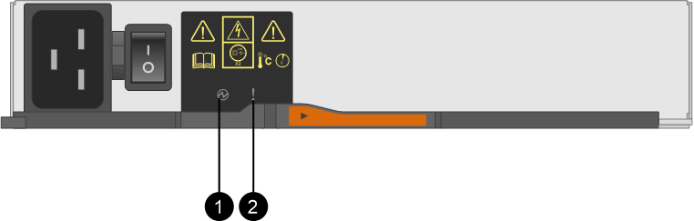

= Reemplazar contenedor de alimentación E5700 (60 unidades)
:allow-uri-read: 
:experimental: 
:icons: font
:imagesdir: ../media/

[role="lead"]
Es posible sustituir un suministro de alimentación en una cabina E5700 por una bandeja de 60 unidades, que incluye los siguientes tipos de bandeja:

* Bandeja de controladoras E5760
* Bandeja de unidades DE460C

.Acerca de esta tarea
Cada bandeja de controladoras o bandeja de unidades de 60 unidades incluye dos contenedores de alimentación para redundancia de alimentación. Si un contenedor de alimentación presenta errores, debe reemplazarlo Lo antes posible. para garantizar que la bandeja tenga un origen de alimentación redundante.

Es posible sustituir un contenedor de alimentación mientras la cabina de almacenamiento está encendida y realizar operaciones de I/o del host, Siempre que el segundo contenedor de alimentación de la bandeja tenga un estado óptimo y que el campo *Aceptar para quitar* en el área Detalles de Recovery Guru en el Administrador del sistema SANtricity muestre *Sí*.

Mientras realiza esta tarea, el otro contenedor de alimentación proporciona alimentación a ambos ventiladores para garantizar que el equipo no se sobrecaliente.

.Antes de empezar
* Revisar link:canisters-overview-supertask-concept.html["Requisitos para reemplazar el compartimento de E5700"].
* Revise los detalles en Recovery Guru para confirmar que hay un problema con una batería y para asegurarse de que no sea necesario tratar primero otros elementos.
* Compruebe que el LED de alerta ámbar del contenedor de alimentación esté encendido, lo que indica que el contenedor tiene un fallo. Póngase en contacto con el soporte técnico para obtener ayuda si los dos compartimentos de alimentación de la bandeja tienen encendidos los LED de atención ámbar.
* Asegúrese de tener lo siguiente:
+
** Un contenedor de alimentación que está instalado y en ejecución.
** Un contenedor de alimentación de repuesto que es compatible con la bandeja de controladoras o el modelo de bandeja de unidades.
** Una muñequera ESD, o usted ha tomado otras precauciones antiestáticas.
** Una estación de gestión con un explorador que puede acceder a System Manager de SANtricity para la controladora. (Para abrir la interfaz de System Manager, apunte el explorador al nombre de dominio o la dirección IP de la controladora.)

== Paso 1: Prepararse para sustituir el compartimento de alimentación

Prepare para sustituir un contenedor de alimentación en una bandeja de controladoras de 60 unidades o una bandeja de unidades.

.Pasos
. Recoja datos de soporte para la cabina de almacenamiento mediante SANtricity System Manager.
+
Si se produce un problema durante este procedimiento, puede utilizar el archivo guardado para solucionar el problema. El sistema guardará los datos de inventario, Estados y rendimiento acerca de la cabina de almacenamiento en un único archivo.

+
.. Seleccione menú:Soporte[Centro de soporte > Diagnóstico].
.. Seleccione *recopilar datos de soporte*.
.. Haga clic en *recoger*.
+
El archivo se guarda en la carpeta de descargas del explorador con el nombre *support-data.7z*.

. En SANtricity System Manager, determine qué contenedor de alimentación ha fallado.
+
.. Seleccione *hardware*.
.. Mira la potencia image:../media/sam1130_ss_hardware_power_icon_maint-e5700.gif[""] Icono situado a la derecha de las listas desplegables * Shelf* para determinar qué bandeja tiene el contenedor de alimentación con error.
+
Si un componente falla, este icono está en rojo.

.. Cuando encuentre la bandeja con un icono rojo, seleccione *Mostrar parte posterior de la bandeja*.
.. Seleccione el compartimento de alimentación o el icono de alimentación rojo.
.. En la ficha *fuentes de alimentación*, observe los Estados de los contenedores de alimentación para determinar qué contenedor de alimentación debe sustituirse.
+
Es necesario sustituir un componente con un estado *fallido*.

+

CAUTION: Si el segundo compartimento de alimentación de la bandeja no tiene el estado *óptimo*, no intente intercambiar en caliente el compartimento de alimentación con errores. En su lugar, póngase en contacto con el soporte técnico para obtener ayuda.

+

NOTE: También se proporciona información sobre el contenedor de alimentación con errores en el área Detalles de Recovery Guru, o bien se puede revisar la información que se muestra en la bandeja, o bien se puede revisar el registro de eventos en Soporte y filtrar por tipo de componente.

. Desde la parte posterior de la cabina de almacenamiento, observe los LED de atención para localizar el contenedor de alimentación que debe quitar.
+
Debe sustituir el contenedor de alimentación que tiene encendido el LED de atención.

+

+
*(1)* _Power LED_. Si es *verde fijo*, el contenedor de alimentación funciona correctamente. Si está *apagado*, el contenedor de alimentación ha fallado, el interruptor de CA está apagado, el cable de alimentación de CA no está instalado correctamente o la tensión de entrada del cable de alimentación de CA no está dentro del margen (hay un problema en el extremo de la fuente del cable de alimentación de CA).

+
*(2)* _LED de atención_. Si se trata de *ámbar fijo*, el contenedor de alimentación tiene un fallo o no hay alimentación de entrada a este contenedor de alimentación, pero el otro contenedor de alimentación está funcionando.

== Paso 2: Quite el contenedor de alimentación con errores

Quite un contenedor de alimentación con errores para que pueda reemplazarlo por uno nuevo.

.Pasos
. Póngase protección antiestática.
. Desembale el nuevo contenedor de alimentación y configúrelo en una superficie nivelada cerca de la bandeja.
+
Guarde todos los materiales de embalaje para usarlos cuando devuelva el compartimento de alimentación con errores.

. Apague el interruptor de alimentación en el contenedor de alimentación que deba quitar.
. Abra el retenedor del cable de alimentación del contenedor de alimentación que necesita quitar y, a continuación, desenchufe el cable de alimentación del contenedor de alimentación.
. Presione el pestillo naranja del asa de la leva del contenedor de alimentación y, a continuación, abra el asa de la leva para liberar completamente el contenedor de alimentación del plano medio.
. Use el tirador de la leva para sacar el compartimento de alimentación de la bandeja.
+

CAUTION: Al extraer un contenedor de alimentación, utilice siempre dos manos para sostener su peso.

== Paso 3: Instale un nuevo compartimento de alimentación

Instale un compartimento de alimentación nuevo para sustituir el que presenta errores.

.Pasos
. Asegúrese de que el interruptor de encendido/apagado del nuevo contenedor de alimentación esté en la posición de apagado.
. Con ambas manos, sujete y alinee los bordes del contenedor de alimentación con la abertura del chasis del sistema y, a continuación, empuje suavemente el contenedor de alimentación hacia el chasis con el asa de leva hasta que encaje en su sitio.
+

CAUTION: No ejerza una fuerza excesiva al deslizar el contenedor de alimentación hacia el sistema, ya que puede dañar el conector.

. Cierre el asa de leva de forma que el pestillo encaje en la posición de bloqueo y el contenedor de alimentación esté completamente asentado.
. Vuelva a conectar el cable de alimentación al compartimento de alimentación y fije el cable de alimentación al contenedor de alimentación con el retenedor del cable de alimentación.
. Encienda el compartimento de alimentación nuevo.

== Paso 4: Sustitución completa del contenedor de alimentación

Confirme que el contenedor de alimentación nuevo funciona correctamente, recopile datos de soporte y reanude las operaciones normales.

.Pasos
. En el nuevo contenedor de alimentación, compruebe que el LED verde de alimentación está encendido y que el LED de atención ámbar está APAGADO.
. En Recovery Guru en SANtricity System Manager, seleccione *Volver a comprobar* para verificar que se haya resuelto el problema.
. Si aún se notifica un contenedor de alimentación con errores, repita los pasos del <<Paso 2: Quite el contenedor de alimentación con errores>> y en <<Paso 3: Instale un nuevo compartimento de alimentación>>. Si el problema persiste, póngase en contacto con el soporte técnico.
. Retire la protección antiestática.
. Recoja datos de soporte para la cabina de almacenamiento mediante SANtricity System Manager.
+
Si se produce un problema durante este procedimiento, puede utilizar el archivo guardado para solucionar el problema. El sistema guardará los datos de inventario, Estados y rendimiento acerca de la cabina de almacenamiento en un único archivo.

+
.. Seleccione menú:Soporte[Centro de soporte > Diagnóstico].
.. Seleccione *recopilar datos de soporte*.
.. Haga clic en *recoger*.
+
El archivo se guarda en la carpeta de descargas del explorador con el nombre *support-data.7z*.

. Devuelva la pieza que ha fallado a NetApp, como se describe en las instrucciones de RMA que se suministran con el kit.

.El futuro
Se completó la sustitución del compartimento de alimentación. Es posible reanudar las operaciones normales.
