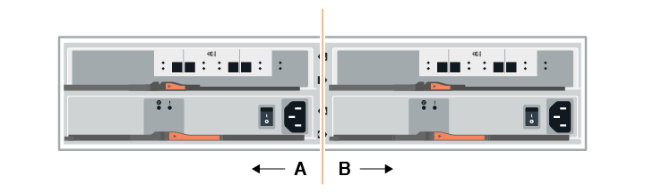
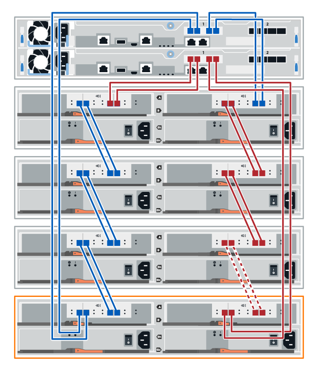
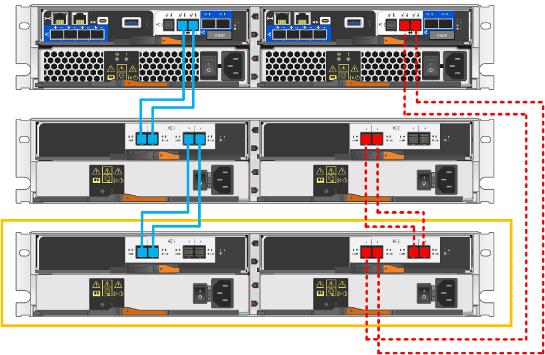

= Función de adición de una bandeja de unidades en caliente
:allow-uri-read: 
:icons: font
:imagesdir: ../media/

[role="lead"]
Es posible añadir una nueva bandeja de unidades mientras se sigue aplicando la alimentación a los otros componentes del sistema de almacenamiento. Puede configurar, reconfigurar, añadir o reubicar la capacidad del sistema de almacenamiento sin interrumpir el acceso de los usuarios a los datos.

.Antes de empezar
Debido a la complejidad de este procedimiento, se recomienda lo siguiente:

* Lea todos los pasos antes de comenzar el procedimiento.
* Compruebe que la función de adición de una bandeja de unidades en caliente es el procedimiento necesario.

.Acerca de esta tarea
Este procedimiento se aplica a la adición en caliente de una bandeja de unidades DE212C, DE224C o DE460C a una bandeja de controladoras E2800, E5700B, EF570, EF300, E2800B, EF280, E5700, EF600, EF300C, EF600C o E4000.

Este procedimiento se aplica a las bandejas de mando IOM12 e IOM12B.

NOTE: Los módulos IOM12B sólo se admiten en SANtricity OS 11.70.2 en adelante. Asegúrese de que el firmware de la controladora se haya actualizado antes de instalar o actualizar a un IOM12B.

NOTE: Este procedimiento se aplica a intercambios o sustituciones similares de IOM en caliente. Esto significa que sólo puede sustituir un módulo IOM12 por otro módulo IOM12 o sustituir un módulo IOM12B por otro módulo IOM12B. (Su bandeja puede tener dos módulos IOM12 o dos IOM12B).

Si va a cablear una bandeja de controladoras anterior a DE212C, DE224C o DE460, consulte https://mysupport.netapp.com/ecm/ecm_download_file/ECMLP2859057["Adición de bandejas de unidades IOM a una bandeja de controladoras E27XX, Safari o EF560 existente"^].

NOTE: Para mantener la integridad del sistema, debe seguir el procedimiento exactamente en el orden que se presenta.

== Paso 1: Prepárese para añadir la bandeja de unidades

Para prepararse para añadir una bandeja de unidades en caliente, debe comprobar los eventos críticos y comprobar el estado de los IOM.

.Antes de empezar
* La fuente de alimentación del sistema de almacenamiento debe poder adaptarse a los requisitos de alimentación de la nueva bandeja de unidades. Para conocer las especificaciones de alimentación de la bandeja de unidades, consulte https://hwu.netapp.com/Controller/Index?platformTypeId=2357027["Hardware Universe"^].
* El patrón de cableado del sistema de almacenamiento existente debe coincidir con una de las combinaciones aplicables que se muestran en este procedimiento.

.Pasos
. En el Administrador del sistema de SANtricity, seleccione *Soporte* > *Centro de soporte* > *Diagnóstico*.
. Seleccione *recopilar datos de soporte*.
+
Se muestra el cuadro de diálogo recoger datos de soporte.

. Haga clic en *recoger*.
+
El archivo se guarda en la carpeta de descargas del explorador con el nombre support-data.7z. Los datos no se envían automáticamente al soporte técnico.

. Seleccione *Soporte* > *Registro de sucesos*.
+
La página Event Log muestra los datos de eventos.

. Seleccione el encabezado de la columna *prioridad* para ordenar los eventos críticos al principio de la lista.
. Revise los eventos críticos del sistema para ver si se han producido en las últimas dos o tres semanas, y compruebe que se han resuelto o tratado cualquier evento crítico reciente.
+

NOTE: Si se han producido eventos críticos sin resolver en las dos o tres semanas anteriores, detenga el procedimiento y póngase en contacto con el soporte técnico. Continúe el procedimiento solo cuando se resuelva el problema.

. Si tiene IOM conectados al hardware, lleve a cabo los siguientes pasos. De lo contrario, vaya a. <<step2_install_drive_shelf,Paso 2: Instale la bandeja de unidades y aplique energía.>>
+
.. Seleccione *hardware*.
.. Seleccione el icono *IOM (ESM)*.
+
image::../media/sam1130_ss_hardware_iom_icon.gif[Icono de IOM (ESM)]

+
Aparece el cuadro de diálogo Configuración de componentes de bandeja con la ficha *IOM (ESM)* seleccionada.

.. Asegúrese de que el estado mostrado para cada IOM/ESM sea _Optimal_.
.. Haga clic en *Mostrar más valores*.
.. Confirme que existen las siguientes condiciones:
+
*** La cantidad de ESM/IOM detectados coincide con la cantidad de ESM/IOM instalados en el sistema y con la de cada bandeja de unidades.
*** Los dos ESM/IOM muestran que la comunicación está bien.
*** La velocidad de datos es de 12 GB/s para bandejas de unidades DE212C, DE224C y DE460C, o de 6 GB/s para otras bandejas de unidades.

== Paso 2: Instale la bandeja de unidades y aplique alimentación

Debe instalar una bandeja de unidades nueva o una bandeja de unidades instalada previamente, encender la alimentación y comprobar si existen LED que requieran atención.

.Pasos
. Si va a instalar una bandeja de unidades que se instaló anteriormente en un sistema de almacenamiento, quite las unidades. Se deben instalar las unidades de una en una versión posterior de este procedimiento.
+
Si el historial de instalación de la bandeja de unidades que va a instalar es desconocido, debe suponer que se ha instalado previamente en un sistema de almacenamiento.

. Instale la bandeja de unidades en el rack que contiene los componentes del sistema de almacenamiento.
+

NOTE: Consulte las instrucciones de instalación de su modelo para obtener el procedimiento completo para la instalación física y el cableado de alimentación. Las instrucciones de instalación de su modelo incluyen notas y advertencias que debe tener en cuenta para instalar una bandeja de unidades de forma segura.

. Encienda la bandeja de unidades nueva y confirme que no se ilumina ningún LED de atención ámbar en la bandeja de unidades. Si es posible, resuelva cualquier condición de falla antes de continuar con este procedimiento.

== Paso 3: Conecte los cables del sistema

Si va a cablear una bandeja de controladoras anterior a DE212C, DE224C o DE460, consulte https://mysupport.netapp.com/ecm/ecm_download_file/ECMLP2859057["Adición de bandejas de unidades IOM a una bandeja de controladoras E27XX, Safari o EF560 existente"^].

[role="tabbed-block"]
====
.Conecte la bandeja de unidades de E2800 o E5700
--
La bandeja de unidades se conecta a la controladora A, confirme el estado del IOM y luego conecte la bandeja de unidades a la controladora B.

.Pasos
. Conecte la bandeja de unidades a la controladora A.
+
En la siguiente figura, se muestra un ejemplo de conexión entre una bandeja de unidades adicional y una controladora A. Para localizar los puertos del modelo, consulte https://hwu.netapp.com/Controller/Index?platformTypeId=2357027["Hardware Universe"^].

+
image::../media/hot_e5700_0.png[Conecte la bandeja de unidades a la controladora]

+
image::../media/hot_e5700_1.png[Conecte la bandeja de unidades a la controladora]

. En el Administrador del sistema de SANtricity, haga clic en *hardware*.
+

NOTE: En este punto del procedimiento, solo hay una ruta activa a la bandeja de controladoras.

. Desplácese hacia abajo, según sea necesario, para ver todas las bandejas de unidades del nuevo sistema de almacenamiento. Si no se muestra la nueva bandeja de unidades, resuelva el problema de conexión.
. Seleccione el icono *ESM/IOM* de la nueva bandeja de unidades.
+
image::../media/sam1130_ss_hardware_iom_icon.gif[Icono de ESM/IOM]

+
Aparece el cuadro de diálogo *Configuración de componentes de bandeja*.

. Seleccione la ficha *ESM/IOM* del cuadro de diálogo *Configuración de componentes de bandeja*.
. Seleccione *Mostrar más opciones* y compruebe lo siguiente:
+
** El IOM/ESM a aparece en la lista.
** La tasa de datos actual es de 12 Gbps para una bandeja de unidades SAS-3.
** Comunicaciones de tarjeta OK.

. Desconecte todos los cables de expansión de la controladora B.
. Conecte la bandeja de unidades a la controladora B.
+
La siguiente figura muestra un ejemplo de conexión entre una bandeja de unidades adicional y una controladora B. Para localizar los puertos del modelo, consulte https://hwu.netapp.com/Controller/Index?platformTypeId=2357027["Hardware Universe"^].

+
image::../media/hot_e5700_2.png[Ejemplo de conexión de bandeja de unidades]

. Si aún no está seleccionada, seleccione la ficha *ESM/IOM* en el cuadro de diálogo *Configuración de componente de bandeja* y, a continuación, seleccione *Mostrar más opciones*. Compruebe que las comunicaciones con la tarjeta son *SÍ*.
+

NOTE: El estado óptima indica que se resolvió la pérdida de error de redundancia asociada con la bandeja de unidades nueva y el sistema de almacenamiento está estabilizado.

--
.Conecte la bandeja de unidades de EF300 o EF600
--
La bandeja de unidades se conecta a la controladora A, confirme el estado del IOM y luego conecte la bandeja de unidades a la controladora B.

.Antes de empezar
* Ha actualizado el firmware a la última versión. Para actualizar el firmware, siga las instrucciones de link:../upgrade-santricity/index.html["Actualizar el sistema operativo SANtricity"].

.Pasos
. Desconecte los dos cables de la controladora del lado A de los puertos IOM12 uno y dos de la última bandeja anterior del paquete y, a continuación, conéctelos a los puertos IOM12 de la nueva bandeja uno y dos.
+

. Conecte los cables a los puertos IOM12 Del lado A tres y cuatro de la nueva bandeja a los últimos puertos IOM12 de la bandeja anterior uno y dos.
+
En la siguiente figura, se muestra un ejemplo de conexión para un lado entre una bandeja de unidades adicional y la última bandeja anterior. Para localizar los puertos del modelo, consulte https://hwu.netapp.com/Controller/Index?platformTypeId=2357027["Hardware Universe"^].

+
image::../media/hot_ef_0.png[Ejemplo de cableado de la bandeja de unidades]

+
image::../media/hot_ef_1.png[Ejemplo de cableado de la bandeja de unidades]

. En el Administrador del sistema de SANtricity, haga clic en *hardware*.
+

NOTE: En este punto del procedimiento, solo hay una ruta activa a la bandeja de controladoras.

. Desplácese hacia abajo, según sea necesario, para ver todas las bandejas de unidades del nuevo sistema de almacenamiento. Si no se muestra la nueva bandeja de unidades, resuelva el problema de conexión.
. Seleccione el icono *ESM/IOM* de la nueva bandeja de unidades.
+
image::../media/sam1130_ss_hardware_iom_icon.gif[Icono de ESM/IOM]

+
Aparece el cuadro de diálogo *Configuración de componentes de bandeja*.

. Seleccione la ficha *ESM/IOM* del cuadro de diálogo *Configuración de componentes de bandeja*.
. Seleccione *Mostrar más opciones* y compruebe lo siguiente:
+
** El IOM/ESM a aparece en la lista.
** La tasa de datos actual es de 12 Gbps para una bandeja de unidades SAS-3.
** Comunicaciones de tarjeta OK.

. Desconecte los cables de la controladora B de los puertos IOM12 uno y dos de la última bandeja anterior del paquete y, a continuación, conéctelos a los puertos IOM12 de la nueva bandeja.
. Conecte los cables a los puertos IOM12 del lado B tres y cuatro de la nueva bandeja a los puertos IOM12 de la última bandeja anterior uno y dos.
+
En la siguiente figura, se muestra un ejemplo de conexión para el lado B entre una bandeja de unidades adicional y la última bandeja anterior. Para localizar los puertos del modelo, consulte https://hwu.netapp.com/Controller/Index?platformTypeId=2357027["Hardware Universe"^].

+

. Si aún no está seleccionada, seleccione la ficha *ESM/IOM* en el cuadro de diálogo *Configuración de componente de bandeja* y, a continuación, seleccione *Mostrar más opciones*. Compruebe que las comunicaciones con la tarjeta son *SÍ*.
+

NOTE: El estado óptima indica que se resolvió la pérdida de error de redundancia asociada con la bandeja de unidades nueva y el sistema de almacenamiento está estabilizado.

--
.Conecte la bandeja de unidades de E4000
--
La bandeja de unidades se conecta a la controladora A, confirme el estado del IOM y luego conecte la bandeja de unidades a la controladora B.

.Pasos
. Conecte la bandeja de unidades a la controladora A.
+
image::../media/hot_e4000_cabling_1.png[Cableado de la bandeja de unidades]

. En el Administrador del sistema de SANtricity, haga clic en *hardware*.
+

NOTE: En este punto del procedimiento, solo hay una ruta activa a la bandeja de controladoras.

. Desplácese hacia abajo, según sea necesario, para ver todas las bandejas de unidades del nuevo sistema de almacenamiento. Si no se muestra la nueva bandeja de unidades, resuelva el problema de conexión.
. Seleccione el icono *ESM/IOM* de la nueva bandeja de unidades.
+
image::../media/sam1130_ss_hardware_iom_icon.gif[Icono de hardware IOM]

+
Aparece el cuadro de diálogo *Configuración de componentes de bandeja*.

. Seleccione la ficha *ESM/IOM* del cuadro de diálogo *Configuración de componentes de bandeja*.
. Seleccione *Mostrar más opciones* y compruebe lo siguiente:
+
** El IOM/ESM a aparece en la lista.
** La tasa de datos actual es de 12 Gbps para una bandeja de unidades SAS-3.
** Comunicaciones de tarjeta OK.

. Desconecte todos los cables de expansión de la controladora B.
. Conecte la bandeja de unidades a la controladora B.
+

. Si aún no está seleccionada, seleccione la ficha *ESM/IOM* en el cuadro de diálogo *Configuración de componente de bandeja* y, a continuación, seleccione *Mostrar más opciones*. Compruebe que las comunicaciones con la tarjeta son *SÍ*.
+

NOTE: El estado óptima indica que se resolvió la pérdida de error de redundancia asociada con la bandeja de unidades nueva y el sistema de almacenamiento está estabilizado.

--
====

== Paso 4: Complete la adición activa

La función de adición de activos se completa comprobando si hay errores y confirmando que la bandeja de unidades recién añadida utiliza el firmware más reciente.

.Pasos
. En el Administrador del sistema de SANtricity, haga clic en *Inicio*.
. Si el enlace con la etiqueta *recuperar de problemas* aparece en la parte superior central de la página, haga clic en el vínculo y resuelva cualquier problema que se indique en Recovery Guru.
. En el Administrador del sistema de SANtricity, haga clic en *hardware* y desplácese hacia abajo, según sea necesario, para ver la bandeja de unidades recién añadida.
. En el caso de las unidades que se hayan instalado previamente en otro sistema de almacenamiento, añada una unidad a la bandeja de unidades recién instalada. Espere a que se reconozca cada unidad antes de insertar la siguiente unidad.
+
Cuando el sistema de almacenamiento reconoce una unidad, la representación de la ranura de la unidad en la página *hardware* se muestra como un rectángulo azul.

. Seleccione *Soporte* > *Centro de soporte* > *ficha Recursos de soporte*.
. Haga clic en el enlace *Inventario de software y firmware* y compruebe qué versiones del firmware de IOM/ESM y de la unidad están instaladas en la nueva bandeja de unidades.
+

NOTE: Puede que deba desplazarse hacia abajo por la página para localizar este enlace.

. Si es necesario, actualice el firmware de la unidad.
+
El firmware de IOM/ESM se actualiza automáticamente a la versión más reciente a menos que se haya deshabilitado la función de actualización.

El procedimiento de adición en caliente ha finalizado. Es posible reanudar las operaciones normales.
