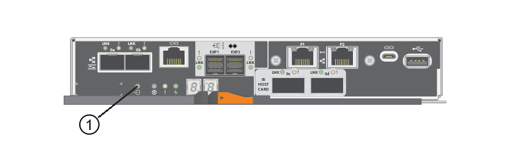

= Cambie el protocolo del host E5700
:allow-uri-read: 
:experimental: 
:icons: font
:imagesdir: ../media/

[role="lead"]
Para una cabina de almacenamiento E5700, es posible convertir puertos de host en placa base de la siguiente manera:

* Fibre Channel (FC) a iSCSI
* De iSCSI a FC
* Iser a InfiniBand (IB)
* SRP a IB
* NVMe a IB
* NVMe para roce

== Paso 1: Determinar si tiene SFP con doble protocolo

Utilice System Manager de SANtricity para determinar qué tipo de transceptores SFP posee. Como estos SFP se pueden utilizar con protocolos FC e iSCSI, se denominan SFP _dual-protocol_ o _Unified_.

Si sus SFP actuales admiten tasas de datos de 16 Gbps y 10 Gbps, puede seguir usándolos después de convertir el protocolo de puerto de host.

.Pasos
. En el Administrador del sistema de SANtricity, seleccione *Soporte*.
. Seleccione el mosaico *Centro de soporte*.
. En la ficha Recursos de soporte, busque y seleccione el enlace *Perfil de matriz de almacenamiento*.
. Escriba *SFP* en el cuadro de texto y haga clic en *Buscar*.
. Para cada SFP incluido en el perfil de matriz de almacenamiento, busque la entrada para *velocidad de datos admitida*.
+
image::../media/sam1130_ss_e2800_unified_spf_maint-e5700.gif[Tasas de datos admitidas]

. Consulte la tabla para determinar si puede reutilizar los SFP, como se muestra a continuación:
+
|===
| Tasas de datos admitidas | Tipo de SFP | Protocolo compatible 

 a| 
16 Gbps, 10 Gbps, 4 Gbps
 a| 
Protocolo dual
 a| 
** *FC:* 16 Gbps, 4 Gbps
** ** ISCSI:**10 Gbps

 a| 
10 Gbps
 a| 
10 Gbps
 a| 
Solo iSCSI

 a| 
16 Gbps, 8 Gbps, 4 Gbps
 a| 
16 Gbps
 a| 
Solo FC

|===
+
** Si dispone de SFP de protocolo dual, puede continuar usándolos después de convertir el protocolo.
+

NOTE: Los SFP de protocolo doble no admiten iSCSI de 1 GB. Si se convierten puertos de host a iSCSI, tenga en cuenta que los SFP de protocolo doble solo admiten un enlace de 10 GB al puerto conectado.

** Si tiene SFP 16 Gbps y está convirtiendo puertos de host en iSCSI, debe quitar los SFP y sustituirlos por SFP con doble protocolo o 10 Gbps después de convertir el protocolo. Según sea necesario, también puede utilizar cobre iSCSI de 10 Gbps utilizando un cable especial Twin-Ax con SFP.
+

NOTE: Los SFP de FC de 8 Gbps NO son compatibles con las controladoras E28xx o E57xx. SOLO se admiten SFP FC de 16 Gbps y 32 Gbps.

** Si tiene SFP 10 Gbps y está convirtiendo puertos de host a FC, debe quitar los SFP de estos puertos y sustituirlos por SFP 16 Gbps con protocolo doble o "SFP" después de convertir el protocolo.

== Paso 2: Obtenga el paquete de funciones

Para obtener el paquete de funciones, se necesita el número de serie de la bandeja de controladoras, un código de activación de la función y el identificador de habilitación de funciones de la cabina de almacenamiento.

.Pasos
. Busque el número de serie.
+
.. En SANtricity System Manager, seleccione MENU:Support[Support Center].
.. Con la ficha *Recursos de soporte* seleccionada, desplácese a la sección *Ver propiedades* de la matriz de almacenamiento superior.
.. Localice *número de serie del chasis* y copie este valor en un archivo de texto.
+
image::../media/sam1130_ss_e2800_storage_array_profile_sn_smid_copy_maint-e5700.gif[Número de serie del chasis]

. Busque el *identificador de submodelo del paquete de funciones*.
+
.. En el Administrador del sistema de SANtricity, seleccione *Soporte*.
.. Seleccione el mosaico *Centro de soporte*.
.. En la ficha Recursos de soporte, busque y seleccione el enlace *Perfil de matriz de almacenamiento*.
.. Escriba *Id. De submodelo del paquete de funciones* en el cuadro de texto y haga clic en *Buscar*.
+

NOTE: “Submodelo” también puede ser escrito como “sub-modelo”.

.. Busque el identificador de submodelo del paquete de funciones para la configuración de inicio.
+
image::../media/storage_array_profile2_maint-e5700.gif[Identificador de submodelo de paquete de funciones]

. El identificador de submodelo del paquete de funciones es el identificador de submodelo de la controladora correspondiente de la configuración inicial y busque el código de activación de la función para la configuración de finalización deseada en la tabla siguiente. A continuación, copie esa función Activation Code en un archivo de texto.
+

NOTE: Los puertos en placa base están deshabilitados cuando se ejecuta un protocolo NVMe en la HIC.

+

NOTE: Si no está utilizando la HIC IB, puede ignorar la columna _HIC Ports_ en las tablas siguientes:

+
|===
5+| Función de cifrado: Códigos de activación (sólo conversiones de puerto de la placa base) 

2+| Iniciando configuración 3+| Finalización de la configuración 

| Identificador del submodelo de la controladora | Puertos que se van a convertir | Identificador del submodelo de la controladora | Puertos convertidos a. | Código de activación de la función 

 a| 
360
 a| 
Puertos FC base
 a| 
362
 a| 
Puertos de placa base iSCSI
 a| 
SGL-2SB-ZEX13

 a| 
362
 a| 
Puertos de placa base iSCSI
 a| 
360
 a| 
Puertos FC base
 a| 
5GI-4TB-ZW3HL

|===
+
|===
7+| Códigos de activación de funciones con capacidad de cifrado 

3+| Iniciando configuración 4+| Finalización de la configuración 

| Identificador del submodelo de la controladora | Puertos de placa base | Puertos HIC | Identificador del submodelo de la controladora | Puertos de placa base | Puertos HIC | Código de activación de la función 

 a| 
360
 a| 
FC
 a| 
Iser
 a| 
361
 a| 
FC
 a| 
SRP
 a| 
UGG-XSB-ZCZKU

 a| 
362
 a| 
ISCSI
 a| 
Iser
 a| 
SGL-2SB-ZEX13

 a| 
363
 a| 
ISCSI
 a| 
SRP
 a| 
VGN-LTB-ZGFCT

 a| 
382
 a| 
No disponible
 a| 
NVMe/IB
 a| 
KGI-ISB-ZDHQF

 a| 
403
 a| 
No disponible
 a| 
NVMe/roce o NVMe/FC
 a| 
YGH-BHK-Z8EKB

 a| 
361
 a| 
FC
 a| 
SRP
 a| 
360
 a| 
FC
 a| 
Iser
 a| 
JGS-0TB-ZID1V

 a| 
362
 a| 
ISCSI
 a| 
Iser
 a| 
UGX-RTB-ZLBPV

 a| 
363
 a| 
ISCSI
 a| 
SRP
 a| 
2G1-BTB-ZMRYN

 a| 
382
 a| 
No disponible
 a| 
NVMe/IB
 a| 
TGV-8TB-ZKTH6

 a| 
403
 a| 
No disponible
 a| 
NVMe/roce o NVMe/FC
 a| 
JGM-EIK-ZAC6Q

 a| 
362
 a| 
ISCSI
 a| 
Iser
 a| 
360
 a| 
FC
 a| 
Iser
 a| 
5GI-4TB-ZW3HL

 a| 
361
 a| 
FC
 a| 
SRP
 a| 
EGL-NTB-ZXKQ4

 a| 
363
 a| 
ISCSI
 a| 
SRP
 a| 
HGP-QUB-Z1CIJ

 a| 
383
 a| 
No disponible
 a| 
NVMe/IB
 a| 
BGS-AUB-Z2YNG

 a| 
403
 a| 
No disponible
 a| 
NVMe/roce o NVMe/FC
 a| 
1GW-LIK-ZG9HN

 a| 
363
 a| 
ISCSI
 a| 
SRP
 a| 
360
 a| 
FC
 a| 
Iser
 a| 
SGU-CUBA-Z3G2U

 a| 
361
 a| 
FC
 a| 
SRP
 a| 
FGX-DUB-Z5WF7

 a| 
362
 a| 
ISCSI
 a| 
SRP
 a| 
LG3-GUB-Z7V17

 a| 
383
 a| 
No disponible
 a| 
NVMe/IB
 a| 
NG5-ZUB-Z8C8J

 a| 
403
 a| 
No disponible
 a| 
NVMe/roce o NVMe/FC
 a| 
WG2-0IK-ZI75U

 a| 
382
 a| 
No disponible
 a| 
NVMe/IB
 a| 
360
 a| 
FC
 a| 
Iser
 a| 
QG6-ETB-ZPPPT

 a| 
361
 a| 
FC
 a| 
SRP
 a| 
XG8-XTB-ZQ7XS

 a| 
362
 a| 
ISCSI
 a| 
Iser
 a| 
SGB-HTB-ZS0AH

 a| 
363
 a| 
ISCSI
 a| 
SRP
 a| 
TGD-1TB-ZT5TL

 a| 
403
 a| 
No disponible
 a| 
NVMe/roce o NVMe/FC
 a| 
IGR-IIK-ZDBRB

 a| 
383
 a| 
No disponible
 a| 
NVMe/IB
 a| 
360
 a| 
FC
 a| 
Iser
 a| 
LG8-JUB-ZATLD

 a| 
361
 a| 
FC
 a| 
SRP
 a| 
LGA-3UB-ZBAX1

 a| 
362
 a| 
ISCSI
 a| 
Iser
 a| 
NGF-7UB-ZE8KX

 a| 
363
 a| 
ISCSI
 a| 
SRP
 a| 
3GI-QUB-ZFP1Y

 a| 
403
 a| 
No disponible
 a| 
NVMe/roce o NVMe/FC
 a| 
5G7-RIK-ZL5PE

 a| 
403
 a| 
No disponible
 a| 
NVMe/roce o NVMe/FC
 a| 
360
 a| 
FC
 a| 
Iser
 a| 
BGC-UIK-Z03GR

 a| 
361
 a| 
FC
 a| 
SRP
 a| 
LGF-EIK-ZPJRX

 a| 
362
 a| 
ISCSI
 a| 
Iser
 a| 
PGJ-HIK-ZSIDZ

 a| 
363
 a| 
ISCSI
 a| 
SRP
 a| 
1 GM-1JK-ZTYQX

 a| 
382
 a| 
No disponible
 a| 
NVMe/IB
 a| 
JGH-XIK-ZQ142

|===
+
|===
5+| Códigos de activación de la función sin cifrado (sólo conversiones de puerto de la placa base) 

2+| Iniciando configuración 3+| Finalización de la configuración 

| Identificador del submodelo de la controladora | Puertos que se van a convertir | Identificador del submodelo de la controladora | Puertos convertidos a. | Código de activación de la función 

 a| 
365
 a| 
Puertos FC base
 a| 
367
 a| 
Puertos de placa base iSCSI
 a| 
BGU-GVB-ZM3KW

 a| 
367
 a| 
Puertos de placa base iSCSI
 a| 
366
 a| 
Puertos FC base
 a| 
9GU-2WB-Z503D

|===
+
|===
7+| Códigos de activación de la función sin cifrado 

3+| Iniciando configuración 4+| Finalización de la configuración 

| Identificador del submodelo de la controladora | Puertos de placa base | Puertos HIC | Identificador del submodelo de la controladora | Puertos de placa base | Puertos HIC | Código de activación de la función 

 a| 
365
 a| 
FC
 a| 
Iser
 a| 
366
 a| 
FC
 a| 
SRP
 a| 
BGP-DVB-ZJ4YC

 a| 
367
 a| 
ISCSI
 a| 
Iser
 a| 
BGU-GVB-ZM3KW

 a| 
368
 a| 
ISCSI
 a| 
SRP
 a| 
4GX-ZVB-ZNJVD

 a| 
384
 a| 
No disponible
 a| 
NVMe/IB
 a| 
TGS-WVB-ZKL9T

 a| 
405
 a| 
No disponible
 a| 
NVMe/roce o NVMe/FC
 a| 
WGC-GJK-Z7PU2

 a| 
366
 a| 
FC
 a| 
SRP
 a| 
365
 a| 
FC
 a| 
Iser
 a| 
WG2-3VB-ZQHLF

 a| 
367
 a| 
ISCSI
 a| 
Iser
 a| 
QG7-6VB-ZSF8M

 a| 
368
 a| 
ISCSI
 a| 
SRP
 a| 
PGA-PVB-ZUWMX

 a| 
384
 a| 
No disponible
 a| 
NVMe/IB
 a| 
CG5-MVB-ZRYW1

 a| 
405
 a| 
No disponible
 a| 
NVMe/roce o NVMe/FC
 a| 
3GH-JK-ZANJQ

 a| 
367
 a| 
ISCSI
 a| 
Iser
 a| 
365
 a| 
FC
 a| 
Iser
 a| 
PGR-IWB-Z48PC

 a| 
366
 a| 
FC
 a| 
SRP
 a| 
9GU-2WB-Z503D

 a| 
368
 a| 
ISCSI
 a| 
SRP
 a| 
SGJ-IWB-ZJFE4

 a| 
385
 a| 
No disponible
 a| 
NVMe/IB
 a| 
UGM-2XB-ZKV0B

 a| 
405
 a| 
No disponible
 a| 
NVMe/roce o NVMe/FC
 a| 
8GR-QKK-ZFJTP

 a| 
368
 a| 
ISCSI
 a| 
SRP
 a| 
365
 a| 
FC
 a| 
Iser
 a| 
YG0-LXB-ZLD26

 a| 
366
 a| 
FC
 a| 
SRP
 a| 
SGR-5XB-ZNTFB

 a| 
367
 a| 
ISCSI
 a| 
SRP
 a| 
PGZ-5WB-Z8M0N

 a| 
385
 a| 
No disponible
 a| 
NVMe/IB
 a| 
KG2-0WB-Z9477

 a| 
405
 a| 
No disponible
 a| 
NVMe/roce o NVMe/FC
 a| 
2GV-TKK-ZIHI6

 a| 
384
 a| 
No disponible
 a| 
NVMe/IB
 a| 
365
 a| 
FC
 a| 
Iser
 a| 
SGF-SVB-ZWU9M

 a| 
366
 a| 
FC
 a| 
SRP
 a| 
7GH-CVB-ZYBGV

 a| 
367
 a| 
ISCSI
 a| 
Iser
 a| 
6GK-VVB-ZZSRN

 a| 
368
 a| 
ISCSI
 a| 
SRP
 a| 
RGM-FWB-Z195H

 a| 
405
 a| 
No disponible
 a| 
NVMe/roce o NVMe/FC
 a| 
VGM-NKK-ZDLDK

 a| 
385
 a| 
No disponible
 a| 
NVMe/IB
 a| 
365
 a| 
FC
 a| 
Iser
 a| 
GG5-8WB-ZBKEM

 a| 
366
 a| 
FC
 a| 
SRP
 a| 
KG7-RWB-ZC2RZ

 a| 
367
 a| 
ISCSI
 a| 
Iser
 a| 
NGC-VWB-ZFZEN

 a| 
368
 a| 
ISCSI
 a| 
SRP
 a| 
4GE-FWB-ZGGQJ

 a| 
405
 a| 
No disponible
 a| 
NVMe/roce o NVMe/FC
 a| 
NG1-WKK-ZLFAI

 a| 
405
 a| 
No disponible
 a| 
NVMe/roce o NVMe/FC
 a| 
365
 a| 
FC
 a| 
Iser
 a| 
MG6-ZKK-ZNDVC

 a| 
366
 a| 
FC
 a| 
SRP
 a| 
WG9-JKK-ZPUAR

 a| 
367
 a| 
ISCSI
 a| 
Iser
 a| 
NGE-MKK-ZRSW9

 a| 
368
 a| 
ISCSI
 a| 
SRP
 a| 
TGG-6KK-ZT9BU

 a| 
384
 a| 
No disponible
 a| 
NVMe/IB
 a| 
AGB-3KK-ZQBLR

|===
+

NOTE: Si el identificador de submodelo de la controladora no es el, comuníquese con http://mysupport.netapp.com["Soporte de NetApp"^].

. En System Manager, busque Identificador de habilitación de funciones.
+
.. Vaya a MENU:Settings[System].
.. Desplácese hacia abajo hasta *Complementos*.
.. En *Cambiar paquete de funciones*, busque *Identificador de habilitación de funciones*.
.. Copie y pegue este número de 32 dígitos en un archivo de texto.
+
image::../media/sam1130_ss_e2800_change_feature_pack_feature_enable_identifier_copy_maint-e5700.gif[Cambie el paquete de funciones]

. Vaya a. http://partnerspfk.netapp.com["Activación de licencias de NetApp: Activación de funciones prémium de matriz de almacenamiento"^], e introduzca la información necesaria para obtener el paquete de funciones.
+
** Número de serie del chasis
** Código de activación de la función
** Identificador de habilitación de la función
+

NOTE: El sitio web de activación de funciones Premium incluye un enlace a «'instrucciones para la activación de funciones Premium». No intente utilizar estas instrucciones para este procedimiento.

. Elija si desea recibir el archivo de claves del paquete de funciones en un correo electrónico o descargarlo directamente desde el sitio.

== Paso 3: Detener la actividad de I/o del host

Detenga todas las operaciones de I/o del host antes de convertir el protocolo de los puertos de host. No es posible acceder a los datos en la cabina de almacenamiento hasta que se complete correctamente la conversión.

Esta tarea se aplica solo si se convierte una cabina de almacenamiento que ya se encuentra en uso.

.Pasos
. Asegúrese de que no se producen operaciones de I/o entre la cabina de almacenamiento y todos los hosts conectados. Por ejemplo, puede realizar estos pasos:
+
** Detenga todos los procesos que implican las LUN asignadas del almacenamiento a los hosts.
** Asegúrese de que no hay aplicaciones que escriban datos en ninguna LUN asignada del almacenamiento a los hosts.
** Desmonte todos los sistemas de archivos asociados con volúmenes en la cabina.
+

NOTE: Los pasos exactos para detener las operaciones de I/o del host dependen del sistema operativo del host y de la configuración, que están más allá del alcance de estas instrucciones. Si no está seguro de cómo detener las operaciones de I/o del host en el entorno, considere apagar el host.

+

CAUTION: *Posible pérdida de datos* -- Si continúa este procedimiento mientras se realizan operaciones de E/S, la aplicación host podría perder datos porque no se podrá acceder a la matriz de almacenamiento.

. Si la cabina de almacenamiento participa en una relación de mirroring, detenga todas las operaciones de I/o del host en la cabina de almacenamiento secundaria.
. Espere a que se escriban en las unidades todos los datos de la memoria caché.
+
El LED de caché verde *(1)* de la parte posterior de cada controlador está encendido cuando los datos en caché necesitan ser escritos en las unidades. Debe esperar a que se apague este LED. 

. En la página Inicio del Administrador del sistema de SANtricity, seleccione *Ver operaciones en curso*.
. Espere a que se completen todas las operaciones antes de continuar con el siguiente paso.

== Paso 4: Cambie el paquete de funciones

Cambie el paquete de funciones para convertir el protocolo de host de los puertos de host de la placa base, los puertos HIC IB o ambos tipos de puertos.

.Pasos
. En SANtricity System Manager, seleccione MENU:Configuración[sistema].
. En *Complementos*, seleccione *Cambiar paquete de funciones*.
+
image::../media/sam1130_ss_system_change_feature_pack_maint-e5700.gif[Cambie el paquete de funciones]

. Haga clic en *examinar* y, a continuación, seleccione el paquete de funciones que desee aplicar.
. Escriba *CHANGE* en el campo.
. Haga clic en *Cambiar*.
+
Comienza la migración del paquete de funciones. Las dos controladoras se reinician automáticamente dos veces para permitir que el nuevo paquete de funciones entre en vigencia. La cabina de almacenamiento vuelve a responder cuando se completa el reinicio.

. Confirme que los puertos de host tienen el protocolo esperado.
+
.. En el Administrador del sistema de SANtricity, seleccione *hardware*.
.. Haga clic en *Mostrar parte posterior de la bandeja*.
.. Seleccione el gráfico de la controladora a o de la controladora B.
.. Seleccione *Ver ajustes* en el menú contextual.
.. Seleccione la ficha *interfaces de host*.
.. Haga clic en *Mostrar más valores*.
.. Revise los detalles mostrados para los puertos de la placa base y los puertos HIC (con el rótulo "lote 1") y confirme que cada tipo de puerto tiene el protocolo que espera.

.El futuro
Vaya a. link:hpp-complete-protocol-conversion-task.html["Conversión de protocolo de host completa"].
