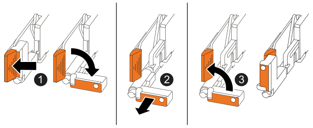

= Reemplaza la batería NV - EF50 y EF80
:allow-uri-read: 
:icons: font
:imagesdir: ../media/

[role="lead"]
Reemplaza la batería NV de tu sistema de almacenamiento EF50 o EF80 cuando la batería empiece a perder carga o falle, ya que es la responsable de preservar los datos críticos del sistema durante los cortes de energía.

.Acerca de esta tarea
* Sustituye la batería del NV preparando, poniendo el controlador averiado fuera de línea, quitando el controlador, cambiando la batería, reinstalando el controlador, poniéndolo en línea, completando la sustitución y devolviendo la pieza fallada a NetApp.
* Debes poner el controlador dañado en modo offline antes de desenchufar cualquiera de sus cables.
* Puedes encender los LED de localización (azules) del sistema de almacenamiento (en la parte frontal del sistema de almacenamiento y en ambos controladores) para ayudarte a localizar físicamente el sistema de almacenamiento afectado. Usando SANtricity System Manager, selecciona *Hardware* > *Controllers and components*, selecciona la pestaña *Controller shelf* y, en el menú contextual, selecciona *Turn on locator light*.

== Paso 1: prepárate para reemplazar la batería NV

Prepárate para reemplazar la batería NV confirmando que la batería NV necesita ser reemplazada, asegurándote de que no hay otros problemas en el sistema de almacenamiento que debas solucionar, asegurándote de que los volúmenes estén en el estado correcto, reuniendo las herramientas y el equipo necesarios, y haciendo una copia de seguridad de la base de datos de configuración del sistema de almacenamiento.

.Pasos
. Confirma que el Recovery Guru en SANtricity System Manager informa un estado de _Battery Failed_ o un estado de _Battery Replacement Required_. Si se informa cualquiera de estos estados, debes reemplazar la batería NV afectada.
. Soluciona cualquier otro problema del sistema de almacenamiento.
+
Usando SANtricity System Manager, revisa los detalles en el Recovery Guru para ver si hay algún otro problema.

. Asegúrese de que no existan volúmenes en uso o que exista un controlador multivía instalado en todos los hosts que utilizan estos volúmenes.
. Asegúrese de tener lo siguiente:
+
** La batería NV de repuesto.
** Una pulsera ESD u otras precauciones antiestáticas.
** Una superficie de trabajo plana y sin electricidad estática.
** Etiquetas para identificar cada cable que está conectado al controlador deteriorado.
** Una estación de gestión con un navegador que puede acceder a SANtricity System Manager para el controlador con problemas.
+
Para abrir la interfaz de System Manager, dirige el navegador al nombre de dominio o la dirección IP del controlador deteriorado.

. Haz una copia de seguridad de la base de datos de configuración del sistema de almacenamiento usando SANtricity System Manager:
+
Si se produce un problema al retirar una controladora, puedes usar el archivo guardado para restaurar tu configuración. El sistema guarda el estado actual de la base de datos de configuración RAID, que incluye todos los datos de los grupos de volúmenes y conjuntos de discos de la controladora dañada.

+
.. Seleccione *Soporte* > *Centro de soporte* > *Diagnóstico*.
.. Seleccione *recopilar datos de configuración*.
.. Selecciona *Collect*.
+
El archivo se guarda en la carpeta de descargas del explorador con el nombre *configurationData-<arrayName>-<dateTime>.7z*.

== Paso 2: pon el controlador fuera de línea

Coloca el controlador deteriorado fuera de línea para que puedas realizar con seguridad el resto de este procedimiento.

.Acerca de esta tarea
Siempre que pongas un controlador fuera de línea, necesitas esperar al menos un minuto antes de volver a poner el controlador en línea. Este período de espera permite que el sistema de almacenamiento actualice el estado del controlador y asegure que todos los datos almacenados en caché se escriban en las unidades.

.Pasos
. Si el controlador dañado aún no está fuera de línea, ponlo fuera de línea usando SANtricity System Manager:
+
.. Selecciona *Hardware* > *Controladores y componentes* para mostrar los controladores.
.. Selecciona el controlador que quieres poner fuera de línea para mostrar su menú de contenido.
.. Selecciona *Colocar fuera de línea* y luego confirma que quieres realizar la operación.
+

NOTE: Si estás accediendo a SANtricity System Manager usando el controlador que intentas poner fuera de línea, se muestra un mensaje de SANtricity System Manager no disponible. Selecciona *Connect to an alternate network connection* para acceder automáticamente a SANtricity System Manager usando el otro controlador.

. Espere a que System Manager de SANtricity actualice el estado de la controladora a sin conexión.
+

CAUTION: No inicie ninguna otra operación hasta que se haya actualizado el estado.

. Confirma que es seguro retirar el componente defectuoso usando el Recovery Guru:
+
.. Selecciona *Revisar*.
.. Confirma que el campo *OK to remove* en el área Detalles muestra *Yes*.
+

CAUTION: Si en el campo *OK to remove* no aparece *Yes*, no sigas con la retirada del componente defectuoso. En su lugar, soluciona el problema usando el Recovery Guru.

== Paso 3: quitar el controlador

Verifica que todos los datos de la memoria caché se hayan escrito en las unidades, desconecta todos los cables del controlador dañado y luego retira el controlador dañado del chasis.

.Pasos
. En el controlador dañado, asegúrate de que el LED NV Caching Active (verde) esté apagado.
+
Cuando el LED NV Caching Active (verde) está apagado, cualquier dato en la memoria caché ya se ha escrito en las unidades y es seguro quitar el controlador dañado.

+

NOTE: Si el LED NV Caching Active (verde) está encendido, los datos almacenados en caché se están escribiendo en las unidades. Debes esperar a que el proceso termine y el LED NV Caching Active se apague. Sin embargo, si el LED permanece encendido durante más de cinco minutos, contacta con https://mysupport.netapp.com/site/global/dashboard["Soporte de NetApp"] antes de seguir con este procedimiento.

+
El LED NV Caching Active (verde) está ubicado junto al icono NV en el controlador.

+
image::../media/drw_g_nvmem_led_ieops-1839.svg[Ubicación del LED de estado NV]

+
[cols="1,4"]
|===

 a| 
image::../media/icon_round_1.png[Llamada número 1]
 a| 
Icono NV y LED NV Caching Active en el controlador

|===

. Coloque una muñequera ESD o tome otras precauciones antiestáticas.
. Etiqueta cada cable que esté conectado al controlador deteriorado.
. Desconecta el cable de alimentación de la fuente de alimentación en el controlador deteriorado.
+

NOTE: La fuente de alimentación (PSU) no tiene un interruptor de encendido.

. Desconecta todos los cables del controlador deteriorado.
. Quita el controlador dañado:
+
La siguiente ilustración muestra el funcionamiento de las asas del controlador (desde el lado izquierdo del controlador) cuando se extrae un controlador

+

+
[cols="1,4"]
|===

 a| 
image::../media/icon_round_1.png[Llamada número 1]
 a| 
En ambos extremos del controlador, empuja las lengüetas de bloqueo verticales hacia afuera para liberar las asas a su posición horizontal.

 a| 
image::../media/icon_round_2.png[Llamada número 2]
 a| 
** Tira de las asas hacia ti para separar el controlador del plano medio.
+
Al tirar, las asas se extienden hacia fuera del controlador y entonces sientes cierta resistencia, sigue tirando.

** Desliza el controlador fuera del chasis mientras sostienes la parte inferior del controlador y colócalo sobre una superficie de trabajo plana y libre de electricidad estática.

 a| 
image::../media/icon_round_3.png[Llamada número 3]
 a| 
Si es necesario, gira las asas hacia arriba (junto a las lengüetas) para apartarlas.

|===
. Abre la tapa del controlador girando el tornillo de mariposa en sentido antihorario para aflojarlo y luego abre la tapa.

== Paso 4: reemplaza la batería NV

Localiza la batería NV defectuosa dentro del controlador deteriorado y reemplázala.

.Pasos
. Si usted no está ya conectado a tierra, correctamente tierra usted mismo.
. Ubica la batería NV.
. Quita la batería NV:
+
image::../media/drw_g_nv_battery_replace_ieops-1864.svg[Reemplaza la batería NV]

+
[cols="1,4"]
|===

 a| 
image::../media/icon_round_1.png[Llamada número 1]
 a| 
Levanta la batería NV y sáquela de su compartimento.

 a| 
image::../media/icon_round_2.png[Llamada número 2]
 a| 
Quita el mazo de cables de su soporte.

 a| 
image::../media/icon_round_3.png[Llamada número 3]
 a| 
.. Empuja y mantén presionada la lengüeta del conector.
.. Tira del conector hacia arriba y sácalo de la toma.
+
Mientras tiras hacia arriba, mueve suavemente el conector de un extremo a otro (a lo largo) para soltarlo.

|===
. Desempaqueta la batería NV de repuesto y colócala sobre una superficie plana libre de estática cerca del sistema de almacenamiento.
+
Guarda el material de embalaje para usarlo cuando devuelvas la batería NV defectuosa.

. Instala la batería NV de repuesto:
+
.. Conecta el conector de cableado en su toma.
.. Lleva el cableado por el lateral de la fuente de alimentación, dentro de su soporte y luego por el canal que está delante del compartimento de la batería NV.
.. Coloca la batería NV en su compartimento.
+
La batería NV debe quedar al ras en su compartimento.

== Paso 5: reinstalar el controlador

Vuelve a instalar el controlador en el chasis, vuelve a conectar su cable de alimentación y todos sus cables.

.Acerca de esta tarea
La siguiente ilustración muestra el funcionamiento de las asas del controlador (desde el lado izquierdo de un controlador) al reinstalar el controlador y puede usarse como referencia para los pasos de reinstalación del controlador.

image::../media/drw_g_and_t_handles_reinstall_ieops-1838.svg[operación del asa del controlador para instalar un controlador]

[cols="1,4"]
|===

 a| 
image::../media/icon_round_1.png[Llamada número 1]
 a| 
Si giraste las asas del controlador hacia arriba (junto a las lengüetas) para apartarlas mientras hacías el mantenimiento del controlador, gíralas hacia abajo hasta la posición horizontal.

 a| 
image::../media/icon_round_2.png[Llamada número 2]
 a| 
Empuja las asas para volver a insertar el controlador en el chasis.

 a| 
image::../media/icon_round_3.png[Llamada número 3]
 a| 
Gira las asas hasta la posición vertical y bloquéalas en su sitio con las lengüetas de bloqueo.

|===
.Pasos
. Cierra la tapa del controlador y gira el tornillo de mariposa en el sentido de las agujas del reloj hasta que quede apretado.
. Inserta el controlador en el chasis:
+
.. Alinea la parte trasera del controlador con la abertura del chasis y empuja suavemente pero con firmeza las asas hasta que el controlador toque el plano medio y quede completamente asentado.
+

NOTE: No uses demasiada fuerza al deslizar el controlador en el chasis; podría dañar los conectores.

.. Gira las asas del mando hacia arriba y bloquéalas en su sitio con las lengüetas.

. Vuelve a conectar el cable de alimentación a la fuente de alimentación y asegúralo con el retén del cable de alimentación.
+
Una vez que se restablezca la alimentación a la fuente de alimentación, el LED de estado debería estar verde.

. Vuelve a conectar todos los cables al controlador.
+

NOTE: La reconexión de los cables debe realizarse antes de poner el controlador en línea. Esto es especialmente importante para las conexiones de los cables de mirroring, ya que garantizan la redundancia total del sistema y se utilizan para el mirroring de caché y el envío de I/O.

== Paso 6: pon el controlador en línea

Vuelve a poner en línea el controlador deteriorado.

.Pasos
. Pon el controlador en línea usando SANtricity System Manager:
+
.. Selecciona *Hardware* > *Controladores y componentes* para mostrar los controladores.
.. Selecciona el controlador que quieres poner en línea para mostrar su menú contextual.
.. Selecciona *Poner en línea* y luego confirma que quieres realizar la operación.
+
El sistema coloca la controladora en línea.

. Cuando se arranque la controladora, compruebe los LED de la controladora.
+
Cuando se restablece la comunicación con otra controladora:

+
** El LED de atención ámbar permanece encendido.
** Es posible que los LED del enlace de host estén encendidos, parpadeantes o apagados, según la interfaz del host.

. Cuando el controlador vuelva a estar en línea:
+
.. Confirma que su estado es óptimo.
.. Confirma que el LED de Atención del controlador está apagado.
+
Si el estado no es Óptimo o si alguno de los LEDs de Atención está encendido, confirma que todos los cables están correctamente asentados y que el controlador está instalado correctamente. Si es necesario, quita y vuelve a instalar el controlador.

+

NOTE: Si no puedes resolver el problema, contacta con https://mysupport.netapp.com/site/global/dashboard["Soporte de NetApp"^] antes de continuar con este procedimiento. Si es necesario, recopila datos de soporte para tu sistema de almacenamiento usando SANtricity System Manager.

== Paso 7: Completa el reemplazo de la batería NV

Usando SANtricity System Manager, asegúrate de que la última versión de SANtricity OS está instalada, verifica que todos los volúmenes se han devuelto a sus controladores propietarios y recopila los datos de soporte para que puedas reanudar las operaciones.

.Pasos
. Asegúrate de que la última versión de SANtricity OS está instalada en el sistema de almacenamiento:
+
.. Selecciona *Support* > *Upgrade Center*
.. Si es necesario, instale la versión más reciente.

. Verifica que todos los volúmenes se devuelvan a sus controladores propietarios:
+
[cols="1,2"]
|===
| Si... | Entonces... 

 a| 
Recovery Guru está presente e indica que los volúmenes no están en su ruta preferida (no se han devuelto a sus controladores propietarios)
 a| 
.. Redistribuye los volúmenes a sus controladores propietarios, seleccionando *Almacenamiento* > *Volúmenes* > *Más* y en el menú desplegable, selecciona *Redistribuir volúmenes*.
.. Verifica que todos los volúmenes se redistribuyan a sus controladores propietarios comprobando si Recovery Guru está presente y sigue indicando que los volúmenes no están en su ruta preferida.

NOTE: Si los volúmenes siguen sin devolverse a sus controladores propietarios, contacta con https://mysupport.netapp.com/site/global/dashboard["Soporte de NetApp"].

 a| 
Recovery Guru no está presente (parece que todos los volúmenes se han devuelto a sus controladores propietarios)
 a| 
Verifica que todos los volúmenes se hayan devuelto a sus controladores propietarios seleccionando *Storage* > *Volumes* > *More* y, en el menú desplegable, selecciona *Change volume ownership* para ver los propietarios de los volúmenes.

|===
. Recopila datos de soporte para tu sistema de almacenamiento:
+
.. Seleccione *Soporte* > *Centro de soporte* > *Diagnóstico*.
.. Seleccione *recopilar datos de soporte*.
.. Selecciona *Collect*.
+
El archivo se guarda en la carpeta de descargas del explorador con el nombre *support-data.7z*.

== Paso 8: devuelve la pieza defectuosa a NetApp

Devuelve la pieza defectuosa a NetApp, como se describe en las instrucciones de RMA enviadas con el kit. Consulta la  https://mysupport.netapp.com/site/info/rma["Devolución y reemplazo de piezas"] página para más información.
