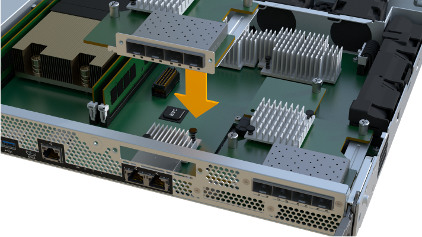

= Sustituya las controladoras EF300 o EF600
:allow-uri-read: 
:experimental: 
:icons: font
:imagesdir: ../media/

[role="lead"]
Puede sustituir una sola controladora en la bandeja de controladoras EF300 o EF600.

.Acerca de esta tarea
Cuando se reemplaza un contenedor de controladoras con errores, es necesario quitar la batería, el suministro de alimentación, los DIMM, los ventiladores y la tarjeta de interfaz del host (HIC) del compartimento de controladoras original y, a continuación, instalarlas en el compartimento de controladoras de reemplazo.

.Antes de empezar
* Revisar link:controllers-overview-supertask-concept.html["Requisitos para la sustitución de la controladora EF300 o EF600"].
* Determine si tiene un contenedor de controladora con errores de una de estas dos formas:
+
** Recovery Guru en System Manager de SANtricity le dirige reemplazar el compartimento de controladoras.
** El LED de alerta ámbar del compartimento de controladoras está encendido, lo que indica que la controladora tiene un fallo.
+
[]
====

NOTE: El LED de atención ámbar del controlador se apagará siempre que se produzcan las siguientes condiciones de sustitución:

*** Error de fuente de alimentación alternativa
*** Error en la ruta de la unidad alternativa
*** El cajón está abierto o ausente
*** El ventilador presenta errores o está ausente
*** Falta el suministro de alimentación

====

* Asegúrese de tener lo siguiente:
+
** Un compartimento de controladoras de reemplazo con el mismo número de pieza que el compartimento de controladoras que se desea sustituir.
** Una muñequera ESD, o usted ha tomado otras precauciones antiestáticas.
** Un área de trabajo plana y estática libre.
** Un destornillador Phillips número 1
** Las etiquetas para identificar cada cable que está conectado al compartimento de controladoras.
** Una estación de gestión con un explorador que puede acceder a System Manager de SANtricity para la controladora. (Para abrir la interfaz de System Manager, apunte el explorador al nombre de dominio o la dirección IP de la controladora.)

== Paso 1: Preparar la sustitución de la controladora

Prepare para sustituir un compartimento de controladoras con errores. Para ello, compruebe que el compartimento de controladoras de reemplazo tiene el número de pieza de FRU correcto, respalde la configuración y recoja datos de soporte.

.Pasos
. Desembale el nuevo contenedor del controlador y configúrelo en una superficie plana y sin estática.
+
Guarde los materiales de empaque que se deben usar para enviar el compartimento de controladoras con errores.

. Localice las etiquetas de dirección MAC y número de pieza de FRU en la parte posterior del compartimento de controladoras.
. En SANtricity System Manager, busque el número de pieza de repuesto del compartimento de controladoras que desea sustituir.
+
Cuando una controladora tiene un error y se debe sustituir, el número de pieza de repuesto se muestra en el área Detalles de Recovery Guru. Si necesita encontrar este número manualmente, siga estos pasos:

+
.. Seleccione *hardware*.
.. Localice la bandeja de controladoras, que se Marca con el icono de la controladora image:../media/sam1130_ss_hardware_controller_icon_maint-ef600.gif[""].
.. Haga clic en el icono de la controladora.
.. Seleccione el controlador y haga clic en *Siguiente*.
.. En la pestaña *base*, anote el *número de pieza de repuesto* del controlador.

. Confirmar que el número de pieza de repuesto de la controladora con errores es el mismo que el número de pieza de FRU de la controladora de reemplazo.
+

CAUTION: *Posible pérdida de acceso a datos* -- Si los números de dos partes no son los mismos, no intente este procedimiento. Además, si el contenedor de controladora con errores incluye una tarjeta de interfaz del host (HIC), debe instalar esa HIC en el nuevo contenedor de controladora. La presencia de controladoras o HIC no coincidentes provoca el bloqueo de la nueva controladora cuando la conecta.

. Realice un backup de la base de datos de configuración de la cabina de almacenamiento con SANtricity System Manager.
+
Si se produce un problema al quitar una controladora, puede usar el archivo guardado para restaurar la configuración. El sistema guardará el estado actual de la base de datos de configuración RAID, que incluye todos los datos de los grupos de volúmenes y pools de discos en la controladora.

+
** De System Manager:
+
... Seleccione menú:Soporte[Centro de soporte > Diagnóstico].
... Seleccione *recopilar datos de configuración*.
... Haga clic en *recoger*.
+
El archivo se guarda en la carpeta de descargas del explorador con el nombre *configurationData-<arrayName>-<dateTime>.7z*.

. Si la controladora aún no está desconectada, desconectarla ahora mediante System Manager de SANtricity.
+
.. Seleccione *hardware*.
.. Si el gráfico muestra las unidades, seleccione *Mostrar parte posterior de la bandeja* para mostrar las controladoras.
.. Seleccione la controladora que desea colocar en estado sin conexión.
.. En el menú contextual, seleccione *colocar fuera de línea* y confirme que desea realizar la operación.

+

NOTE: Si accede a System Manager de SANtricity con la controladora que intenta desconectar, se muestra un mensaje de SANtricity System Manager no disponible. Seleccione *conectarse a una conexión de red alternativa* para acceder automáticamente al Administrador del sistema de SANtricity utilizando el otro controlador.

. Espere a que System Manager de SANtricity actualice el estado de la controladora a sin conexión.
+

CAUTION: No inicie ninguna otra operación hasta que se haya actualizado el estado.

. Seleccione *Volver a comprobar* en Recovery Guru y confirme que el campo *Aceptar para eliminar* en el área Detalles muestra *Sí*, lo que indica que es seguro eliminar este componente.

== Paso 2: Quitar una controladora que ha fallado

Quite un compartimento de controladoras para sustituir el compartimento con errores por uno nuevo.

Se trata de un procedimiento de varios pasos que requiere la extracción de los siguientes componentes: Batería, tarjeta de interfaz del host, fuente de alimentación, DIMM y ventiladores.

=== Paso 2a: Retire el contenedor del controlador

Quite el compartimento de controladoras con errores para poder reemplazarlo por un nuevo.

.Pasos
. Coloque una muñequera ESD o tome otras precauciones antiestáticas.
. Etiquete cada cable conectado al compartimento de controladoras.
. Desconecte todos los cables del compartimento de controladoras.
+

CAUTION: Para evitar un rendimiento degradado, no gire, pliegue, pellizque ni pellizque los cables.

. Si el contenedor de controladoras tiene una HIC que utiliza transceptores SFP+, quite los SFP.
+
Como debe quitar la HIC del compartimento de controladoras con errores, debe quitar todos los SFP de los puertos HIC. Cuando vuelva a conectar los cables, puede mover esos SFP al nuevo compartimento de controladoras.

. Apriete las asas de cada lado de la controladora y tire hacia atrás hasta que se suelte de la bandeja.
+
image::../media/remove_controller_5.png[Apriete las asas para extraer el controlador]

. Con dos manos y las asas, deslice el compartimento de controladoras para sacarlo de la bandeja. Cuando la parte frontal del controlador esté libre del gabinete, utilice dos manos para extraerlo por completo.
+

CAUTION: Utilice siempre dos manos para admitir el peso de un compartimento de controladoras.

+
image::../media/remove_controller_6.png[Utilice dos manos para sostener el peso del controlador cuando retire]

. Coloque el contenedor del controlador sobre una superficie plana y libre de estática.

=== Paso 2b: Retirar la batería

Quite la batería del compartimento de controladoras con errores para que pueda instalarla en el compartimento de controladoras nuevo.

.Pasos
. Retire la cubierta del contenedor del controlador desenroscando el tornillo de mariposa único y levantando la tapa para abrirla.
. Localice la pestaña "Press" en el lateral del controlador.
. Desenganche la batería presionando la lengüeta y apretando la carcasa de la batería.
+
image::../media/batt_3.png[Presione la pestaña para desbloquear la batería]

. Apriete suavemente el conector que aloja el cableado de la batería. Tire hacia arriba, desconectando la batería de la placa.image:../media/batt_2.png["Retire el conector del alojamiento del cableado de la batería"]
. Saque la batería del controlador y colóquela sobre una superficie plana y libre de estática.image:../media/batt_4.png["Levante la batería del controlador"]

=== Paso 2c: Quite la HIC

Si el contenedor de controladoras incluye una HIC, es necesario quitar la HIC del contenedor de controladora original. De lo contrario, puede omitir este paso.

.Pasos
. Con un destornillador Phillips, quite los dos tornillos que conectan la placa frontal de la HIC al compartimento de la controladora.
+
image::../media/hic_2.png[Retire la placa frontal de la HIC]

+

NOTE: La imagen anterior es un ejemplo, el aspecto de la HIC puede ser diferente.

. Quite la placa frontal de HIC.
. Con los dedos o un destornillador Phillips, afloje el tornillo de ajuste manual único que fija la HIC a la tarjeta controladora.
+
image::../media/hic_3.png[Afloje los tornillos de mariposa de la HIC]

+

NOTE: La HIC viene con tres ubicaciones de tornillo en la parte superior pero está fijada con una sola.

. Separe con cuidado la HIC de la tarjeta controladora levantando la tarjeta hacia arriba y hacia fuera de la controladora.
+

CAUTION: Tenga cuidado de no arañar ni golpear los componentes en la parte inferior de la HIC o en la parte superior de la tarjeta de la controladora.

+
image::../media/hic_4.png[Quite HIC de la tarjeta de la controladora]

. Coloque la HIC en una superficie plana y sin estática.

=== Paso 2d: Retire la fuente de alimentación

Retire la fuente de alimentación para que pueda instalarla en la nueva controladora.

.Pasos
. Desconecte los cables de alimentación:
+
.. Abra el retenedor del cable de alimentación y desconecte el cable de alimentación de la fuente de alimentación.
.. Desenchufe el cable de alimentación de la fuente de alimentación.

. Localice la pestaña situada a la derecha de la fuente de alimentación y presiónela hacia la unidad de fuente de alimentación.
+
image::../media/psup_2.png[Pulse la pestaña situada junto a la fuente de alimentación]

. Localice el mango en la parte frontal de la fuente de alimentación.
. Utilice el asa para sacar la fuente de alimentación directamente del sistema.
+
image::../media/psup_3.png[Deslice la fuente de alimentación hacia afuera]

+

CAUTION: Al extraer una fuente de alimentación, utilice siempre dos manos para soportar su peso.

=== Paso 2e: Retire los módulos DIMM

Extraiga los módulos DIMM para que pueda instalarlos en el nuevo controlador.

.Pasos
. Ubique los DIMM en el controlador.
. Tenga en cuenta la orientación del módulo DIMM en el zócalo para que pueda insertar el módulo DIMM de repuesto en la orientación adecuada.
+

NOTE: Una muesca en la parte inferior del DIMM ayuda a alinear el DIMM durante la instalación.

. Empuje lentamente las dos lengüetas expulsoras del DIMM a ambos lados del módulo DIMM para expulsar el módulo DIMM de su ranura y, a continuación, deslícelo fuera de la ranura.
+

NOTE: Sujete con cuidado el módulo DIMM por los bordes para evitar la presión sobre los componentes de la placa de circuitos DIMM.

+
image::../media/dimm_2.png[Presione la lengüeta del expulsor hacia abajo en la ranura DIMM]

+
image::../media/dimim_3.png[Retire la DIMM]

=== Paso 2f: Retire los ventiladores

Extraiga los ventiladores para que pueda instalarlos en la nueva controladora.

.Pasos
. Levante suavemente el ventilador del controlador.
+
image::../media/fan_2.png[Retire el ventilador]

. Repita el proceso hasta que se hayan quitado todos los ventiladores.

== Paso 3: Instale una nueva controladora

Instale un compartimento de controladoras nuevo para sustituir el que presenta errores.

Se trata de un procedimiento de varios pasos que requiere la instalación de los siguientes componentes desde la controladora original: Batería, tarjeta de interfaz del host, fuente de alimentación, DIMM y ventiladores.

=== Paso 3a: Instale la batería

Instale la batería en el compartimento de controladoras de reemplazo.

.Pasos
. Asegúrese de que dispone de:
+
** La batería del compartimento de controladoras original o una batería nueva que haya pedido.
** El compartimento de las controladoras de reemplazo.

. Inserte la batería en el controlador alineando la carcasa de la batería con los pestillos metálicos del lateral del controlador.
+
image::../media/batt_5.png[Instale la batería]

+
La batería hace clic en su sitio.

. Vuelva a enchufar el conector de la batería a la placa.

=== Paso 3b: Instale la HIC

Si quitó una HIC del contenedor de controladora original, debe instalar esa HIC en el contenedor de controladora nuevo. De lo contrario, puede omitir este paso.

.Pasos
. Con un destornillador Phillips del número 1, quite los dos tornillos que fijan la placa frontal vacía al compartimento de la controladora de repuesto y quite la placa frontal.
. Alinee el tornillo de mariposa único de la HIC con el orificio correspondiente de la controladora y alinee el conector de la parte inferior de la HIC con el conector de la interfaz HIC de la tarjeta controladora.
+
Tenga cuidado de no arañar ni golpear los componentes en la parte inferior de la HIC o en la parte superior de la tarjeta de la controladora.

+

+

NOTE: La imagen anterior es un ejemplo; el aspecto de la HIC puede ser diferente.

. Baje con cuidado la HIC en su lugar y coloque el conector de la HIC presionando suavemente en la HIC.
+

CAUTION: *Posible daño en el equipo* -- tenga mucho cuidado de no pellizcar el conector de la cinta de oro para los LED del controlador entre la HIC y el tornillo de mariposa.

. Apriete a mano el tornillo de mariposa HIC.
+
No utilice un destornillador, o bien podría apretar el tornillo en exceso.

+
image::../media/hic_3.png[Apriete a mano los tornillos de mariposa HIC en la controladora]

+

NOTE: La imagen anterior es un ejemplo; el aspecto de la HIC puede ser diferente.

. Con un destornillador Phillips del número 1, conecte la placa frontal de la HIC que quitó del compartimento de controladoras original al nuevo compartimento de controladoras con los dos tornillos.

=== Paso 3c: Instale la fuente de alimentación

Instale el suministro de alimentación en el compartimento de controladoras de reemplazo.

.Pasos
. Con ambas manos, sujete y alinee los bordes de la fuente de alimentación con la abertura del chasis del sistema y, a continuación, empuje suavemente la fuente de alimentación hacia el chasis con el asa de leva.
+
Las fuentes de alimentación están codificadas y sólo se pueden instalar de una manera.

+

CAUTION: No ejerza demasiada fuerza al deslizar la fuente de alimentación en el sistema, ya que puede dañar el conector.

+
image::../media/psup_4.png[Instale la fuente de alimentación en el controlador]

=== Paso 3d: Instalar DIMM

Instale los DIMM en el nuevo compartimento de controladoras.

.Pasos
. Sujete el módulo DIMM por las esquinas y alinéelo con la ranura.
+
La muesca entre las patillas del DIMM debe alinearse con la lengüeta del zócalo.

. Inserte el módulo DIMM directamente en la ranura.
+
image::../media/dimm_4.png[Instale DIMM en la ranura de la controladora]

+
El módulo DIMM encaja firmemente en la ranura, pero debe entrar fácilmente. Si no es así, realinee el DIMM con la ranura y vuelva a insertarlo.

+

NOTE: Inspeccione visualmente el módulo DIMM para comprobar que está alineado de forma uniforme y completamente insertado en la ranura.

. Empuje con cuidado, pero firmemente, en el borde superior del DIMM hasta que los pestillos encajen en su lugar sobre las muescas de los extremos del DIMM.
+

NOTE: Los DIMM se ajustan firmemente. Es posible que tenga que presionar suavemente un lado a la vez y fijarlo con cada pestaña individualmente.

+
image::../media/dimm_5.png[Presione los pestillos hacia arriba en la ranura DIMM para asegurarlos]

=== Paso 3e: Instale los ventiladores

Instale los ventiladores en el compartimento de controladoras de reemplazo.

.Pasos
. Deslice el ventilador por completo en el controlador de recambio.
+
image::../media/fan_3.png[Instale el ventilador en el controlador]

+
image::../media/fan_3_a.png[Instale el ventilador en el controlador]

. Repita el proceso hasta que todos los ventiladores estén instalados.

=== Paso 3f: Instale el nuevo compartimento de controladoras

Por último, instale el compartimento de controladoras nuevo en la bandeja de controladoras.

.Pasos
. Baje la cubierta del receptáculo del controlador y fije el tornillo de apriete manual.
. Al apretar las asas de las controladoras, deslice suavemente el compartimento de controladoras hasta llegar a la bandeja de controladoras.
+

NOTE: El controlador hace un clic audible cuando está instalado correctamente en el estante.

+
image::../media/remove_controller_7.png[Instale la controladora en la bandeja]

. Instale los SFP desde la controladora original en los puertos de host de la nueva controladora, si se instalaron en la controladora original y vuelva a conectar todos los cables.
+
Si está usando más de un protocolo de host, asegúrese de instalar los SFP en los puertos de host correctos.

. Si la controladora original utilizó DHCP para la dirección IP, busque la dirección MAC en la etiqueta ubicada en la parte posterior de la controladora de reemplazo. Solicite al administrador de red que asocie la red DNS y la dirección IP de la controladora que quitó con la dirección MAC de la controladora de reemplazo.
+

NOTE: Si la controladora original no utilizó DHCP para la dirección IP, la nueva controladora adopta la dirección IP de la controladora que quitó.

== Paso 4: Sustitución completa de la controladora

Coloque la controladora en línea, recoja datos de soporte y reanude operaciones.

.Pasos
. Coloque una controladora en línea.
+
.. En System Manager, desplácese hasta la página hardware.
.. Seleccione *Mostrar parte posterior del controlador*.
.. Seleccione la controladora sustituida.
.. Seleccione *colocar en línea* en la lista desplegable.

. Cuando se arranque la controladora, compruebe los LED de la controladora.
+
Cuando se restablece la comunicación con otra controladora:

+
** El LED de atención ámbar permanece encendido.
** Es posible que los LED del enlace de host estén encendidos, parpadeantes o apagados, según la interfaz del host.

. Cuando la controladora vuelva a estar en línea, compruebe si se notificó una discrepancia NVSRAM en Recovery Guru.
+
.. Si se informa de una discrepancia de NVSRAM, actualice NVSRAM con el siguiente comando SMcli:
+
[listing]
----
SMcli <controller A IP> <controller B IP> -u admin -p <password> -k -c "download storageArray NVSRAM file=\"C:\Users\testuser\Downloads\NVSRAM .dlp file>\" forceDownload=TRUE;"
----
+
La `-k` el parámetro se requiere si la cabina no es https segura.

+

NOTE: Si no se puede completar el comando SMcli, póngase en contacto con https://www.netapp.com/company/contact-us/support/["Asistencia técnica de NetApp"^] o inicie sesión en https://mysupport.netapp.com["Sitio de soporte de NetApp"^] para crear un caso.

. Confirme que el estado del sistema es óptimo y compruebe los LED de atención de la bandeja de controladoras.
+
Si el estado no es óptimo o si alguno de los LED de atención está encendido, confirme que todos los cables están correctamente asentados y que el compartimento de controladoras esté instalado correctamente. Si es necesario, quite y vuelva a instalar el compartimento de controladoras.

+

NOTE: Si no puede resolver el problema, póngase en contacto con el soporte técnico.

. Haga clic en menu:Hardware[Soporte > Centro de actualización] para asegurarse de que las versiones de firmware y NVSRAM del sistema estén en los niveles deseados.
+
Si es necesario, instale la versión más reciente.

. Verifique que todos los volúmenes se hayan devuelto al propietario preferido.
+
.. Seleccione MENU:Storage[Volumes]. En la página *todos los volúmenes*, compruebe que los volúmenes se distribuyen a sus propietarios preferidos. Seleccione MENU:More[Cambiar propiedad] para ver los propietarios del volumen.
.. Si todos los volúmenes son propiedad del propietario preferido, continúe con el paso 6.
.. Si ninguno de los volúmenes se devuelve, debe devolver manualmente los volúmenes. Vaya al menú:más[redistribuir volúmenes].
.. Si solo algunos de los volúmenes se devuelven a sus propietarios preferidos tras la distribución automática o la distribución manual, debe comprobar Recovery Guru para encontrar problemas de conectividad de host.
.. Si no hay Recovery Guru presente o si sigue los pasos de Recovery Guru, los volúmenes aún no vuelven a sus propietarios preferidos, póngase en contacto con el soporte de.

. Recoja datos de soporte para la cabina de almacenamiento mediante SANtricity System Manager.
+
.. Seleccione menú:Soporte[Centro de soporte > Diagnóstico].
.. Seleccione *recopilar datos de soporte*.
.. Haga clic en *recoger*.
+
El archivo se guarda en la carpeta de descargas del explorador con el nombre *support-data.7z*.

.El futuro
Se completó el reemplazo de una controladora. Es posible reanudar las operaciones normales.
