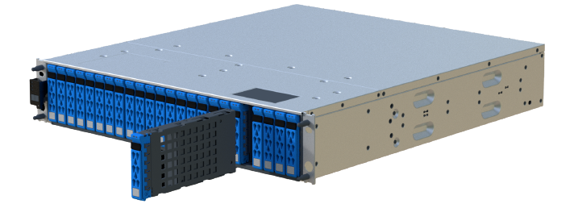

= Sustituya la unidad en una cabina EF600
:allow-uri-read: 
:icons: font
:imagesdir: ../media/

[role="lead"]
Es posible sustituir una unidad en una cabina EF600.

.Acerca de esta tarea
Recovery Guru en SANtricity System Manager supervisa las unidades en la cabina de almacenamiento y puede notificar un error de unidad inminente o un fallo de unidad real. Cuando se produce un fallo en una unidad, el LED de atención ámbar se enciende. Es posible intercambiar en caliente una unidad con error mientras la cabina de almacenamiento recibe I/O.

.Antes de empezar
* Revisar link:drives-overview-supertask-concept.html["Requisitos para la sustitución de unidades EF300 o EF600"].
* Asegúrese de tener lo siguiente:
+
** Una unidad de reemplazo que admite NetApp para su bandeja de controladoras o bandeja de unidades.
** Una muñequera ESD, o usted ha tomado otras precauciones antiestáticas.
** Una superficie de trabajo plana y sin estática.
** Una estación de gestión con un explorador que puede acceder a System Manager de SANtricity para la controladora. (Para abrir la interfaz de System Manager, apunte el explorador al nombre de dominio o la dirección IP de la controladora.)

== Paso 1: Preparar la sustitución de la unidad

Prepare la sustitución de la unidad. Para ello, compruebe Recovery Guru en SANtricity System Manager y complete los pasos de requisitos previos. A continuación, puede localizar el componente con errores.

.Pasos
. Si Recovery Guru en SANtricity System Manager le notificó un _error inminente de unidad_, pero la unidad aún no falló, siga las instrucciones en Recovery Guru para conmutar la unidad.
. Si es necesario, use System Manager de SANtricity para confirmar que tiene una unidad de reemplazo adecuada.
+
.. Seleccione *hardware*.
.. Seleccione la unidad con error en el gráfico de bandeja.
.. Haga clic en la unidad para mostrar el menú contextual y, a continuación, seleccione *Ver configuración*.
.. Confirme que la unidad de sustitución tiene una capacidad igual o mayor que la unidad que desea reemplazar y que tiene las funciones que espera.
+
Por ejemplo, no intente sustituir una unidad de disco duro (HDD) por un disco de estado sólido (SSD). Del mismo modo, si va a reemplazar una unidad compatible con la función de seguridad, asegúrese de que la unidad de reemplazo también sea compatible con la función de seguridad.

. Si es necesario, use System Manager de SANtricity para localizar la unidad dentro de la cabina de almacenamiento: En el menú contextual de la unidad, seleccione *encender luz localizadora*.
+
El LED de atención de la unidad (ámbar) parpadea para que pueda identificar qué unidad debe sustituirse.

+

NOTE: Si va a sustituir una unidad de una bandeja que tiene un panel frontal, debe quitar el panel frontal para ver los LED de la unidad.

== Paso 2: Quitar la unidad

Quite una unidad con error para reemplazarla por una nueva.

.Pasos
. Desembale la unidad de repuesto y configúrela en una superficie plana y sin estática cerca de la bandeja.
+
Guarde todos los materiales de embalaje.

. Pulse el botón de liberación negro de la unidad con error.
+
El pestillo de los muelles de unidad se abre parcialmente y, a continuación, la unidad se libera de la controladora.

. Abra la palanca de leva y deslice ligeramente hacia fuera la unidad.
. Espere 60 segundos.
. Con ambas manos, retire la unidad de la bandeja.
+

. Coloque la unidad sobre una superficie antiestática y amortiguada lejos de los campos magnéticos.
. Espere 60 segundos hasta que el software reconozca que la unidad se ha quitado.
+

NOTE: Si quita accidentalmente una unidad activa, espere al menos 60 segundos y, a continuación, vuelva a instalarla. Para el procedimiento de recuperación, consulte el software de administración del almacenamiento.

== Paso 3: Instale una nueva unidad

Instale una unidad nueva para reemplazar la que presenta errores. Debe instalar la unidad Lo antes posible. de reemplazo después de quitar la unidad con error.

.Pasos
. Abra la palanca de leva.
. Con dos manos, inserte la unidad de repuesto en el compartimento abierto y empuje firmemente hasta que la unidad se detenga.
. Cierre lentamente el asa de leva hasta que la unidad esté completamente asentada en el plano medio y el asa encaje en su sitio.
+
El LED verde de la unidad se enciende cuando la unidad está insertada correctamente.

+

NOTE: Según la configuración, es posible que la controladora reconstruya automáticamente datos en la nueva unidad. Si la bandeja utiliza unidades de repuesto, es posible que la controladora tenga que realizar una reconstrucción completa en la pieza de repuesto para poder copiar los datos en la unidad reemplazada. Este proceso de reconstrucción aumenta el tiempo necesario para completar este procedimiento.

== Paso 4: Sustitución completa de la unidad

Complete la sustitución de la unidad para confirmar que la unidad nueva funciona correctamente.

.Pasos
. Compruebe el LED de encendido y el LED de atención de la unidad que ha sustituido. (Cuando inserte una unidad por primera vez, es posible que el LED de atención esté encendido. Sin embargo, el LED debería apagarse en un minuto.)
+
** El LED de alimentación está encendido o parpadeando y el LED de atención está apagado: Indica que la unidad nueva funciona correctamente.
** El LED de alimentación está apagado: Indica que la unidad podría no estar instalada correctamente. Retire la unidad, espere 60 segundos y vuelva a instalarla.
** El LED de atención está encendido: Indica que la unidad nueva puede tener defectos. Sustitúyalo por otra unidad nueva.

. Si Recovery Guru en SANtricity System Manager aún muestra un problema, seleccione *Volver a comprobar* para verificar que se haya resuelto el problema.
. Si Recovery Guru indica que la reconstrucción de la unidad no se inició automáticamente, inicie la reconstrucción de forma manual de la siguiente manera:
+

NOTE: Realice esta operación solo cuando el soporte técnico o Recovery Guru se lo indiquen.

+
.. Seleccione *hardware*.
.. Haga clic en la unidad que sustituyó.
.. En el menú contextual de la unidad, seleccione *reconstruir*.
.. Confirme que desea llevar a cabo esta operación.
+
Cuando se completa la reconstrucción de la unidad, el grupo de volúmenes tiene el estado óptima.

. Si es necesario, vuelva a instalar el bisel.
. Devuelva la pieza que ha fallado a NetApp, como se describe en las instrucciones de RMA que se suministran con el kit.

.El futuro
Se completó el reemplazo de su unidad. Es posible reanudar las operaciones normales.
