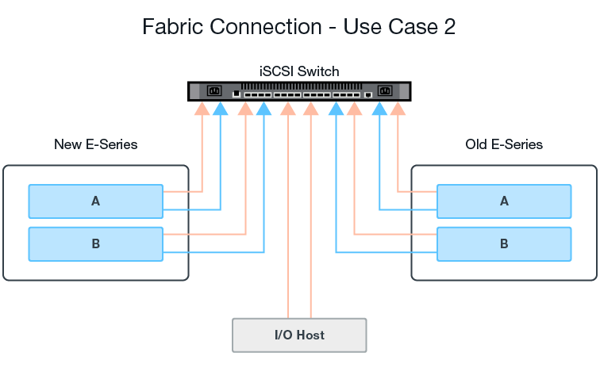

= Configure el hardware para Volúmenes de almacenamiento remoto de SANtricity
:allow-uri-read: 
:icons: font
:imagesdir: ../media/

[role="lead"]
El sistema de almacenamiento E-Series debe configurarse para comunicarse con el sistema de almacenamiento remoto a través del protocolo iSCSI compatible.

== Configuración del dispositivo de almacenamiento remoto y de la cabina E-Series

Antes de continuar con SANtricity System Manager para configurar la función almacenamiento remoto volúmenes, haga lo siguiente:

. Establecer manualmente una conexión por cable entre el sistema E-Series y el sistema de almacenamiento remoto, de modo que los dos sistemas se puedan configurar para comunicarse a través de iSCSI.
. Configure los puertos iSCSI de modo que el sistema E-Series y el sistema de almacenamiento remoto se puedan comunicar de forma correcta entre sí.
. Obtenga el IQN del sistema E-Series.
. Hacer que el sistema E-Series sea visible para el sistema de almacenamiento remoto. Si el sistema de almacenamiento remoto es un sistema E-Series, cree un host mediante el IQN del sistema E-Series de destino como información de conexión del puerto de host.
. Si un host/aplicación está utilizando el dispositivo de almacenamiento remoto:
+
** Detenga las operaciones de I/o en el dispositivo de almacenamiento remoto.
** Desasigne/desmonte el dispositivo de almacenamiento remoto.

. Asigne el dispositivo de almacenamiento remoto al host definido para el sistema de almacenamiento E-Series.
. Obtenga el número de LUN del dispositivo utilizado para la asignación.

NOTE: Recomendación: Realice un backup del volumen de origen remoto antes de iniciar el proceso de importación.

== Conecte los cables de las cabinas de almacenamiento

Como parte del proceso de configuración, las cabinas de almacenamiento y el host de I/o deben cablearse a la interfaz compatible con iSCSI.

Los diagramas siguientes proporcionan ejemplos de cómo conectar los sistemas de manera que realicen operaciones de volumen de almacenamiento remoto a través de una conexión iSCSI.

image:../media/remote_target_volumes_iscsi_use_case_1.png["Cableado de almacenamiento iSCSI"] 

== Configure los puertos iSCSI

Debe configurar los puertos iSCSI para garantizar la comunicación entre el destino (cabina de almacenamiento E-Series local) y el origen (cabina de almacenamiento remota).

Los puertos iSCSI pueden configurarse de varias maneras según la subred. A continuación, se muestran algunos ejemplos de cómo configurar los puertos iSCSI para su uso con la función volúmenes de almacenamiento remoto.

|===
| Origen A | Fuente B | Destino a | Objetivo B 

 a| 
10.10.1.100/22
 a| 
10.10.2.100/22
 a| 
10.10.1.101/22
 a| 
10.10.2.101/22

|===
|===
| Origen A | Fuente B | Destino a | Objetivo B 

 a| 
10.10.0.100/16
 a| 
10.10.0.100/16
 a| 
10.10.0.101/16
 a| 
10.10.0.101/16

|===